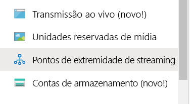
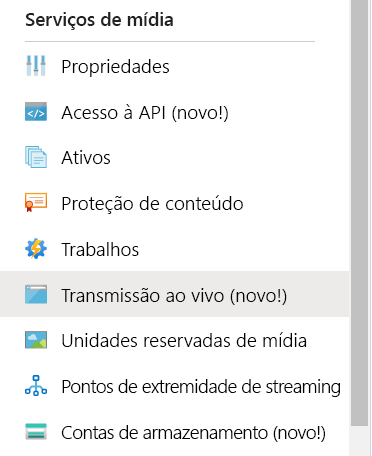
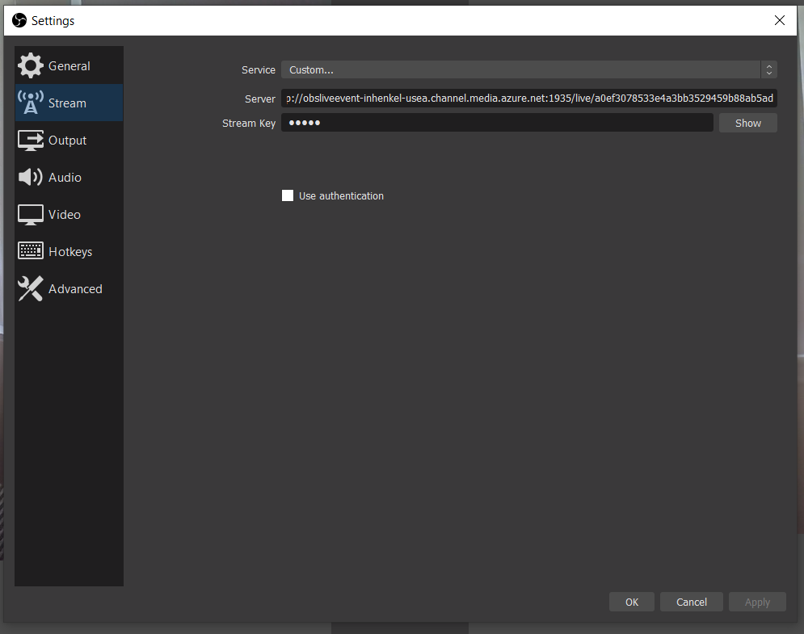
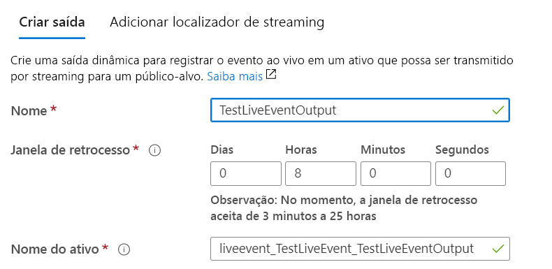

# Criar uma transmissão ao vivo dos Serviços de Mídia do Azure com o OBS

[!INCLUDE [media services api v3 logo](./includes/v3-hr.md)]

Este guia de início rápido ajudará você a criar uma transmissão ao vivo dos Serviços de Mídia do Azure usando o portal do Azure e o OBS (Open Broadcasting Studio). Ele pressupõe que você tenha uma assinatura do Azure e que tenha criado uma conta dos Serviços de Mídia.

Neste início rápido, abordaremos:

- Como configurar um codificador local com o OBS.
- Como configurar uma transmissão ao vivo.
- Como configurar saídas de transmissão ao vivo.
- Como executar um ponto de extremidade de streaming padrão.
- Como usar o Player de Mídia do Azure para ver a transmissão ao vivo e a saída sob demanda.

## Pré-requisitos

Se você não tiver uma assinatura do Azure, crie uma [conta gratuita](https://azure.microsoft.com/free/) antes de começar.

## Entre no Portal do Azure

Abra seu navegador da Web e vá até o [portal do Microsoft Azure](https://portal.azure.com/). Insira suas credenciais para entrar no portal. A exibição padrão é o painel de serviço.

## Configurar um codificador local usando o OBS

1. Baixe e instale o OBS para o seu sistema operacional no [site do Open Broadcaster Software](https://obsproject.com/).
1. Inicie o aplicativo e mantenha-o aberto.

## Executar o ponto de extremidade de streaming padrão

1. Selecione **Pontos de extremidade de streaming** na listagem dos Serviços de Mídia.

   
1. Se o status do ponto de extremidade de streaming padrão for parado, selecione-o. Essa etapa leva você à página desse ponto de extremidade.
1. Selecione **Iniciar**.

   

## Configurar uma transmissão ao vivo dos Serviços de Mídia do Azure

1. Vá até a conta dos Serviços de Mídia do Azure no portal e, em seguida, selecione **Transmissão ao vivo** na listagem dos **Serviços de Mídia**.

   
1. Selecione **Adicionar evento ao vivo** para criar um evento de transmissão ao vivo.

   
1. Insira um nome para o novo evento, como *TestLiveEvent*, na caixa **Nome do evento ao vivo**.

   
1. Insira uma descrição opcional do evento na caixa **Descrição**.
1. Selecione a opção **Passagem – sem codificação de nuvem**.

   
1. Selecione a opção **RTMP**.
1. Verifique se a opção **Não** está selecionada para **Iniciar evento ao vivo**, a fim de evitar a cobrança pelo evento ao vivo antes que ele esteja pronto. (A cobrança começará quando o evento ao vivo for iniciado.)

   
1. Selecione o botão **Examinar + criar** para examinar as configurações.
1. Selecione o botão **Criar** para criar o evento ao vivo. Você retornará à listagem do evento ao vivo.
1. Selecione o link para o evento ao vivo recém-criado. Observe que o evento está parado.
1. Mantenha esta página aberta no navegador. Voltaremos a ele mais tarde.

## Configurar uma transmissão ao vivo usando o OBS Studio

O OBS começa com uma cena padrão, mas sem entradas selecionadas.

   

### Adicionar uma fonte de vídeo

1. No painel **Fontes**, clique no ícone **Adicionar** para selecionar um novo dispositivo de origem. O menu **Fontes** será aberto.

1. Selecione **Dispositivo de Captura de Vídeo** no menu do dispositivo de origem. O menu **Criar/Selecionar Origem** será aberto.

   

1. Selecione o botão de opção **Adicionar Existente** e clique em **OK**. O menu **Propriedades do Dispositivo de Vídeo** será aberto.

   

1. Na lista suspensa **Dispositivo**, selecione a saída de vídeo que você deseja usar para a difusão. Deixe o restante das configurações por enquanto e clique em **OK**. A fonte de entrada será adicionada ao painel **Fontes** e a exibição de entrada de vídeo aparecerá na área **Visualização**.

   

### Adicionar uma fonte de áudio

1. No painel **Fontes**, clique no ícone **Adicionar** para selecionar um novo dispositivo de origem. O menu do dispositivo de origem será aberto.

1. Selecione **Captura de Entrada de Áudio** no menu do dispositivo de origem. O menu **Criar/Selecionar Origem** será aberto.

   

1. Selecione o botão de opção **Adicionar Existente** e clique em **OK**. O menu **Propriedades para Captura de Entrada de Áudio** será aberto.

   

1. Na lista suspensa **Dispositivo**, selecione o dispositivo de captura de áudio que você deseja usar para a difusão. Deixe o restante das configurações por enquanto e clique em OK. O dispositivo de captura de áudio será adicionado ao painel mixer de áudio.

   

### Configurar o streaming no OBS

No procedimento seguinte, você voltará aos Serviços de Mídia do Azure no navegador para copiar a URL de entrada a fim de inseri-la nas configurações de saída:

1. Na página dos Serviços de Mídia do Azure do portal, selecione **Iniciar** para iniciar o evento de transmissão ao vivo. (A cobrança será iniciada agora.)

   
1. Defina a alternância **RTMP** como **RTMPS**.
1. Na caixa **URL de Entrada**, copie a URL para sua área de transferência.

   

1. Alterne para o aplicativo OBS.

1. Clique no botão **Configurações** no painel **Controles**. As opções de Configurações serão abertas.

   

1. Selecione **Stream** no menu **Configurações**.

1. Na lista suspensa **Serviço**, selecione Mostrar tudo e, em seguida, selecione **Personalizado...** .

1. No campo **Servidor**, cole a URL RTMPS que você copiou para a área de transferência.

1. Insira algo no campo **Chave de stream**.  Não importa realmente o que é, mas precisa ter um valor.

    

1. Selecione **Saída** no menu **Configurações**.

1. Insira *2* no campo **Intervalo do quadro-chave**. Isso define o comprimento do fragmento como 2 segundos. Para entrega dinâmica de latência mais baixa, use o valor de 1 segundo.

1. OPCIONAL: Defina **Predefinição de uso da CPU** como *veryfast* se você estiver usando um computador com pouca capacidade de processamento. Opcionalmente, você poderá definir os kbps para algo menor se houver condições de rede indesejáveis.

   

1. Mantenha o restante das configurações inalterado e clique em **OK**.

### Iniciar o streaming

1. No painel **Controles**, clique em **Iniciar Streaming**.

    

2. Alterne para a tela de eventos ao vivo dos Serviços de Mídia do Azure no navegador e clique no link **Recarregar Player**. Agora você deve ver seu stream no player de visualização.

## Configurar saídas

Essa parte vai configurar as saídas e permitir que você salve uma gravação da transmissão ao vivo.  

> [!NOTE]
> Para transmitir essa saída, o ponto de extremidade de streaming precisa estar em execução. Confira a seção [Executar o ponto de extremidade de streaming padrão](#run-the-default-streaming-endpoint) posterior.

1. Selecione o link **Criar saídas** abaixo do visualizador de vídeo de **Saídas**.
1. Se desejar, edite o nome da saída na caixa **Nome** para algo mais amigável, de modo que seja fácil encontrá-la posteriormente.

   
1. Deixe todas as outras caixas inalteradas por enquanto.
1. Selecione **Avançar** para adicionar um localizador de streaming.
1. Se desejar, altere o nome do localizador para algo mais amigável.

   
1. Mantenha todos os outros campos desta tela inalterados por enquanto.
1. Selecione **Criar**.

## Reproduzir a difusão de saída usando o Player de Mídia do Azure

1. Copie a URL de streaming no player de vídeo de **Saída**.
1. Em um navegador da Web, abra a [Demonstração do Player de Mídia do Azure](https://ampdemo.azureedge.net/azuremediaplayer.html).
1. Cole a URL de streaming na caixa **URL** do Player de Mídia do Azure.
1. Selecione o botão **Atualizar Player**.
1. Selecione o ícone **Reproduzir** do vídeo para ver a transmissão ao vivo.

## Parar a difusão

Quando considerar que transmitiu conteúdo suficiente, pare a difusão.

1. No portal, selecione **Parar**.

1. No OBS, selecione o botão **Interromper Streaming** no painel **Controles**. Essa etapa interrompe a difusão do OBS.

## Reproduzir a saída sob demanda usando o Player de Mídia do Azure

A saída que você criou agora está disponível para streaming sob demanda, desde que o ponto de extremidade de streaming esteja em execução.

1. Vá até a listagem dos Serviços de Mídia e selecione **Ativos**.
1. Encontre a saída do evento que você criou anteriormente e selecione o link para o ativo. A página da saída do ativo é aberta.
1. Copie a URL de streaming no player de vídeo do ativo.
1. Volte para o Player de Mídia do Azure no navegador e cole a URL de streaming na caixa de URL.
1. Selecione **Atualizar Player**.
1. Selecione o ícone **Reproduzir** do vídeo para ver o ativo sob demanda.

## Limpar os recursos

> [!IMPORTANT]
> Pare os serviços. Após ter concluído as etapas deste início rápido, interrompa o evento ao vivo e o ponto de extremidade de streaming ou você continuará sendo cobrado pelo tempo em que eles permanecerem em execução. Para interromper o evento ao vivo, confira as etapas 2 e 3 do procedimento [Parar a difusão](#stop-the-broadcast).

Para interromper o ponto de extremidade de streaming:

1. Na listagem dos Serviços de Mídia, selecione **Pontos de extremidade de streaming**.
2. Selecione o ponto de extremidade de streaming padrão iniciado anteriormente. Essa etapa abre a página do ponto de extremidade.
3. Selecione **Interromper**.

> [!TIP]
> Caso não deseje manter os ativos desse evento, exclua-os para evitar a cobrança pelo armazenamento.

## Próximas etapas

> [!div class="nextstepaction"]
> [Eventos e saídas ao vivo nos Serviços de Mídia](./live-events-outputs-concept.md)
