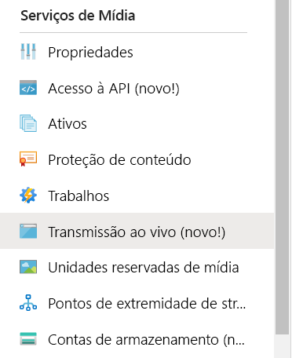
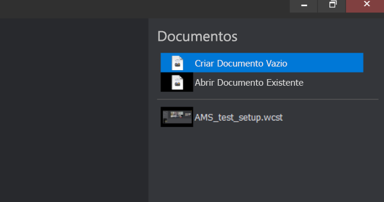
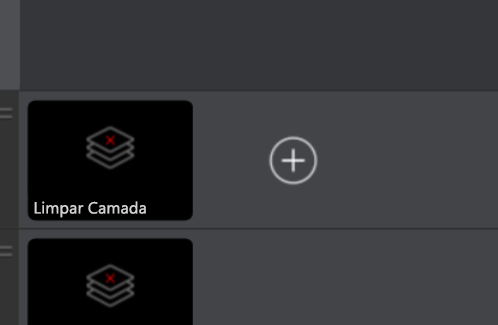
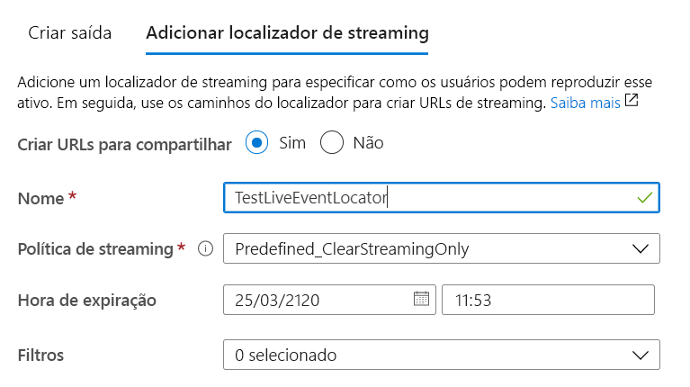
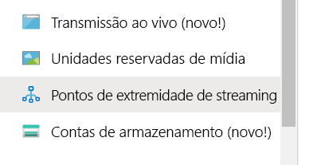

# Criar uma transmissão ao vivo dos Serviços de Mídia do Azure com o portal e o Wirecast

Este Guia de Introdução pressupõe que você tenha uma assinatura do Azure e que tenha criado uma conta dos Serviços de Mídia do Azure.

Se você não tiver uma assinatura do Azure, crie uma conta [gratuita](https://azure.microsoft.com/free/) antes de começar.

## Faça logon no Portal do Azure

Primeiro, abra seu navegador da Web e navegue até o [portal do Microsoft Azure](https://portal.azure.com/). Insira suas credenciais para entrar no portal. A exibição padrão é o painel de serviço.

Neste início rápido, abordaremos:

- Como configurar um codificador local com uma avaliação gratuita do Telestream Wirecast
- Como configurar uma transmissão ao vivo
- Como configurar saídas de transmissão ao vivo
- Como executar um ponto de extremidade de streaming padrão
- Como usar o Player de Mídia do Azure para exibir a transmissão ao vivo e a saída sob demanda

Para simplificar, usaremos uma predefinição de codificação para os Serviços de Mídia do Azure no Wirecast, uma codificação de nuvem de passagem e o RTMP.

## Como configurar um codificador local com o Wirecast

1. Baixe e instale o Wirecast para o seu sistema operacional em https://www.telestream.net
1. Inicie o aplicativo e use seu endereço de email favorito para registrar o produto.  Mantenha o aplicativo aberto.
1. Você receberá um email solicitando a confirmação do endereço de email e, em seguida, o aplicativo iniciará a avaliação gratuita.
1. RECOMENDADO: Assista ao tutorial em vídeo na tela de abertura do aplicativo.

## Como configurar uma transmissão ao vivo dos Serviços de Mídia do Azure

1. Depois de navegar até a conta dos Serviços de Mídia do Azure no portal, selecione **Transmissão ao vivo** na listagem dos Serviços de Mídia. 
 
1. Clique em **Adicionar evento ao vivo** para criar um evento de transmissão ao vivo. 
 
1. Insira um nome para o novo evento, como *TestLiveEvent* no campo **Nome** do evento ao vivo. 
 
1. Insira uma descrição opcional do evento no campo **Descrição**.
1. Selecione o botão de opção **Passagem – sem codificação de nuvem**. 

1. Selecione o botão de opção **RTMP**.
1. Verifique se o botão de opção **Não** está selecionado para iniciar o evento ao vivo, a fim de evitar a cobrança do evento ao vivo antes que ele esteja pronto.  (A cobrança será iniciada quando o evento ao vivo for iniciado.)  
1. Clique no botão **Examinar + criar** para examinar as configurações.
1. Clique no botão **Criar** para criar o evento ao vivo. Em seguida, você voltará à exibição de listagem de eventos ao vivo.
1. Clique no **link para o evento ao vivo** recém-criado. Observe que o evento está parado.
1. Mantenha esta página aberta no navegador.  Voltaremos a ela mais tarde.

## Como configurar uma transmissão ao vivo com o Wirecast Studio

1. Supondo que você ainda tenha o aplicativo Wirecast aberto, selecione **Criar Documento Vazio** no menu principal e, em seguida, clique em **Continuar**.

1. Posicione o cursor sobre a primeira camada na área de camadas do Wirecast.  Clique no ícone **Adicionar** exibido e selecione a entrada de vídeo que deseja transmitir.  A caixa de diálogo Camada Mestra 1 será aberta. 

1. Selecione **Captura de vídeo** no menu e, em seguida, selecione a câmera que deseja usar. Se você estiver selecionando uma câmera, a exibição da câmera será mostrada na área Visualização.

1. Posicione o cursor sobre a segunda camada na área de camadas do Wirecast. Clique no ícone **Adicionar** exibido e selecione a entrada de áudio que deseja transmitir.  A caixa de diálogo Camada Mestra 2 será aberta.
1. Selecione **Captura de áudio** no menu e, em seguida, selecione a entrada de áudio que deseja usar.

1. No menu principal, selecione **Configurações de saída**.  A caixa de diálogo Saída será exibida.
1. Selecione **Serviços de Mídia do Azure** na lista suspensa da saída.  A configuração de saída dos Serviços de Mídia do Azure preencherá automaticamente a *maioria* das configurações de saída. 

1. Na próxima seção, você voltará aos Serviços de Mídia do Azure no navegador para copiar a *URL de Entrada*, a fim de entrar nas configurações de saída.

### Copiar e colar a URL de entrada

1. De volta à página dos Serviços de Mídia do Azure do portal, clique em **Iniciar** para iniciar o evento de transmissão ao vivo. (A cobrança será iniciada agora.) 

2. Clique na alternância **Seguro/Não seguro** para defini-la como **Não seguro**.  Isso definirá o protocolo como RTMP em vez de RTMPS.
3. Copie a **URL de Entrada** para a área de transferência.

4. Alterne para o aplicativo do Wirecast e cole a **URL de Entrada** no campo **Endereço** nas Configurações de saída. 

5. Clique em **OK**.

## Como configurar saídas

Essa parte vai configurar as saídas e permitir que você salve uma gravação da transmissão ao vivo.  

> [!NOTE]
> Para transmitir essa saída, o ponto de extremidade de streaming precisará estar em execução.  Confira a seção Como executar o ponto de extremidade de streaming padrão abaixo.

1. Clique no link **Criar saídas** abaixo do visualizador de vídeo das saídas.
1. Se desejar, edite o nome da saída no campo **Nome** para algo mais amigável, de modo que seja fácil encontrá-lo posteriormente.

1. Mantenha todos os outros campos inalterados por enquanto.
1. Clique em **Avançar** para adicionar o localizador de streaming.
1. Altere o nome do localizador para algo mais amigável, se desejar.

1. Mantenha todos os outros campos desta tela inalterados por enquanto.
1. Clique em **Criar**.

## Como iniciar a difusão

1. No Wirecast, selecione **Saída > Iniciar/Parar difusão > Iniciar os Serviços de Mídia do Azure: Serviços de Mídia do Azure** no menu principal.  Quando o fluxo for enviado para o evento ao vivo, a janela Ao vivo no Wirecast será exibida no player de vídeo de eventos ao vivo na página do evento ao vivo nos Serviços de Mídia do Azure.

   

1. Clique no botão **Ir** na janela de visualização para começar a difundir o vídeo e o áudio selecionados para as camadas do Wirecast.

   

   > [!TIP]
   > Se houver um erro, tente recarregar o player clicando no link Recarregar player acima dele.

## Como executar o ponto de extremidade de streaming padrão

1. Verifique se o ponto de extremidade de streaming está em execução selecionando **Pontos de extremidades de streaming** na listagem dos Serviços de Mídia. Você será levado para a página dos pontos de extremidade de streaming. 

1. Se o status do ponto de extremidade de streaming padrão for parado, clique no ponto de extremidade de streaming **padrão**. Isso levará você à página desse ponto de extremidade.
1. Clique em **Iniciar**.  Isso iniciará o ponto de extremidade de streaming. 

## Reproduzir a difusão de saída com o Player de Mídia do Azure

1. Copie a **URL de Streaming** no player de vídeo da saída.
1. Em um navegador da Web, abra a demonstração do Player de Mídia do Azure https://ampdemo.azureedge.net/azuremediaplayer.html
1. Cole a **URL de Streaming** no campo URL do Player de Mídia do Azure.
1. Clique no botão **Atualizar Player**.
1. Clique no ícone **Reproduzir** do vídeo para ver a transmissão ao vivo.

## Como interromper a difusão

Quando considerar que transmitiu conteúdo suficiente, pare a transmissão.

1. No Wirecast, clique no botão **Difusão**.  Isso interromperá a difusão do Wirecast.
1. No portal, clique em **Parar**. Você receberá uma mensagem de aviso informando que a transmissão ao vivo será interrompida, mas a saída agora se tornará um ativo sob demanda.
1. Clique em **Parar** na mensagem de aviso. O Player de Mídia do Azure agora também mostrará um erro, pois a transmissão ao vivo não está mais disponível.

## Reproduzir a saída sob demanda com o Player de Mídia do Azure

A saída que você criou agora está disponível para streaming sob demanda, desde que o ponto de extremidade de streaming esteja em execução.

1. Navegue até a listagem dos Serviços de Mídia e selecione **Ativos**.
1. Encontre a saída do evento que você criou anteriormente e clique no **link para o ativo**. A página da saída do ativo será aberta.
1. Copie a **URL de Streaming** no player de vídeo do ativo.
1. Volte ao Player de Mídia do Azure no navegador e cole a **URL de Streaming** no campo URL do Player de Mídia do Azure.
1. Clique em **Atualizar Player**.
1. Clique no ícone **Reproduzir** do vídeo para ver o ativo sob demanda.

## Limpar os recursos

> [!IMPORTANT]
> Pare os serviços. Depois de concluir as etapas deste início rápido, interrompa o evento ao vivo e o ponto de extremidade de streaming ou você continuará sendo cobrado pelo tempo durante o qual eles permanecerem em execução. Para interromper o evento ao vivo, confira Como interromper a difusão, etapas 2 e 3 acima.

### Como interromper o ponto de extremidade de streaming

1. Na listagem dos Serviços de Mídia, selecione **Pontos de extremidade de streaming**.
2. Clique no ponto de extremidade de streaming **padrão** iniciado anteriormente. Isso abrirá a página do ponto de extremidade.
3. Clique em **Parar**.  Isso interromperá o ponto de extremidade de streaming.

> [!TIP]
> Caso não deseje manter os ativos desse evento, exclua-os para evitar a cobrança pelo armazenamento.

## Próximas etapas
> [!div class="nextstepaction"]
> [Qual artigo é o próximo na sequência](./live-events-outputs-concept.md)
