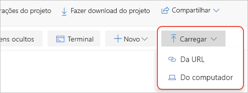

# Início Rápido: Migrar um Jupyter notebook local na versão prévia do Azure Notebooks

Neste início rápido, você migrará um Jupyter notebook do computador local ou de outra URL de arquivo acessível para o Azure Notebooks. 

Os Jupyter notebooks no próprio computador são acessíveis apenas para você. Você pode compartilhar seus arquivos, mas os destinatários têm as respectivas cópias locais do notebook, e é difícil incorporar as alterações deles. Mesmo que você armazene notebooks em um repositório online compartilhado, como o GitHub, cada colaborador precisa ter uma instalação local do Jupyter configurada como a sua.

Ao migrar seus notebooks locais ou baseados em repositório para o Azure Notebooks, você pode compartilhá-los instantaneamente com seus colaboradores, que precisam apenas de um navegador para ver e executar os notebooks. Se eles entrarem no Azure Notebooks, também poderão fazer alterações.

## Pré-requisitos

- Um [Jupyter notebook](https://jupyter-notebook.readthedocs.io) no computador local ou em outra URL de arquivo acessível. 

## Criar um projeto no Azure Notebooks

Este início rápido demonstra a migração de um notebook do computador local ou de outra URL de arquivo acessível. Para migrar os notebooks de um repositório GitHub, consulte o [Guia de Início Rápido: Clonar um notebook](quickstart-clone-jupyter-notebook.md).

[!INCLUDE [notebooks-status](../../includes/notebooks-status.md)]

1. Vá até [Azure Notebooks](https://notebooks.azure.com) e entre. (Para obter mais detalhes, consulte [Início Rápido – Entrar no Azure Notebooks](quickstart-sign-in-azure-notebooks.md)).

1. Em sua página de perfil público, selecione **Meus Projetos** na parte superior da página:

    

1. Na página **Meus Projetos**, selecione **Novo Projeto** (atalho de teclado: n). O botão poderá ser exibido somente como **+** se a janela do navegador for estreita:

    

1. Na janela pop-up **Criar novo projeto** que aparece, insira os valores apropriados para o bloco de anotações que você está migrando nos campos **Nome do projeto** e **ID do projeto**, desmarque as opções para **Projeto público** e **Criar um README.md**, em seguida, selecione **Criar**.

## Carregar o notebook local

1. Na página do projeto, selecione **carregar** (que pode ser exibido com uma seta para cima apenas se a janela do navegador for pequena), em seguida, selecione 1. No popup que aparece, selecione **Do computador** se o seu notebook estiver localizado no sistema de arquivos local, ou **Da URL** se o bloco de anotações estiver localizado online:

    

   Novamente, se o notebook estiver em um repositório GitHub, siga as etapas do [Início Rápido: Clonar um notebook](quickstart-clone-jupyter-notebook.md).

   - Se estiver usando **Do computador**, arraste e solte seus arquivos *ipynb* para o pop-up ou selecione **Escolher arquivos**, em seguida, navegue e selecione os arquivos que você deseja importar. Depois selecionar **Carregar**. Os arquivos carregados recebem o mesmo nome que os arquivos locais. Você não precisa carregar o conteúdo de nenhuma pasta *.ipynb_checkpoints*.

     

   - Se usar **Da URL**, insira o endereço de origem no campo **URL do Arquivo** e o nome do arquivo para atribuir ao bloco de anotações do projeto no campo **Nome do Arquivo**. Depois selecionar **Carregar**. Se você tiver vários arquivos com URLs separadas, use o comando **Adicionar Arquivo** para verificar a primeira URL que você inseriu, após o qual o pop-up fornecerá novos campos para outro arquivo.

     

1. Abra e execute o notebook recentemente carregado para verificar seu conteúdo e a operação. Quando terminar, selecione **Arquivo** > **Halt e fechar** para fechar o notebook.

1. Para compartilhar um link para o notebook, clique no arquivo no projeto e selecione **Copiar Link** (atalho de teclado: y), em seguida, cole o link na mensagem apropriada. Como alternativa, você pode compartilhar o projeto como um todo usando o controle **Compartilhar** na página do projeto.

1. Para editar arquivos que não sejam notebooks, clique com o botão direito do mouse no projeto e selecione **Editar arquivo** (atalho de teclado: i). A ação padrão, **Executar** (atalho de teclado: r), apenas mostra o conteúdo do arquivo e não permite a edição.

## Próximas etapas

> [!div class="nextstepaction"]
> [Tutorial: criar e executar um Jupyter notebook para fazer uma regressão linear](tutorial-create-run-jupyter-notebook.md)
