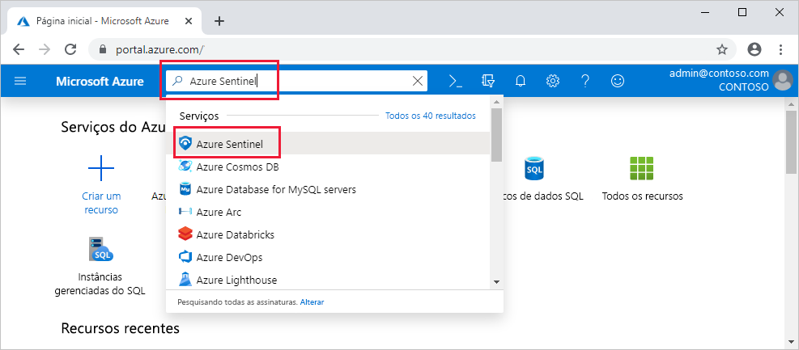

# Início Rápido: Integração do Azure Sentinel

Neste início rápido, saiba como integrar o Azure Sentinel. 

Para a integração do Azure Sentinel, primeiro você precisa habilitar o Azure Sentinel e depois conectar suas fontes de dados. O Azure Sentinel vem com uma série de conectores para soluções da Microsoft, disponíveis prontas para o uso e fornecendo integração em tempo real, incluindo soluções de Proteção contra Ameaças da Microsoft 365, fontes do Microsoft 365, tais como Office 365, Azure AD, Azure ATP, Microsoft Cloud App Security e muito mais. Além disso, existem conectores internos no ecossistema de segurança mais amplo para soluções que não são da Microsoft. Você também pode usar formato comum de eventos, Syslog ou API REST para conectar suas fontes de dados ao Azure Sentinel.  

Depois de conectar suas fontes de dados, escolha em uma galeria de pastas de trabalho criadas por especialistas que mostram insights com base em seus dados. Essas pastas de trabalho podem ser facilmente personalizadas de acordo com suas necessidades.

>[!IMPORTANT] 
> Para obter informações sobre os encargos incorridos ao usar o Azure Sentinel, confira [preços do Azure Sentinel](https://azure.microsoft.com/pricing/details/azure-sentinel/).
  

## Pré-requisitos globais

- Assinatura ativa do Azure, se você não tiver uma, crie uma [conta gratuita](https://azure.microsoft.com/free/?WT.mc_id=A261C142F) antes de começar.

- Workspace do Log Analytics. Saiba como [criar um espaço de trabalho do Log Analytics](../log-analytics/log-analytics-quick-create-workspace.md). Para saber mais sobre workspaces do Log Analytics, confira [Criar sua implantação de logs do Azure Monitor](../azure-monitor/platform/design-logs-deployment.md).

- Para habilitar o Azure Sentinel, você precisa de permissões de colaborador na assinatura na qual reside o workspace do Azure Sentinel. 
- Para usar o Azure Sentinel, você precisa de permissões de colaborador ou leitor no grupo de recursos ao qual o workspace pertence.
- Talvez você precise de permissões adicionais para conectar fontes de dados específicas.
- O Azure Sentinel é um serviço pago. Para saber mais sobre preços, confira [Sobre o Azure Sentinel](https://go.microsoft.com/fwlink/?linkid=2104058).
 
## Habilitar o Azure Sentinel 

1. Entre no portal do Azure. Verifique se a assinatura na qual o Azure Sentinel foi criado está selecionada.

1. Pesquise e selecione o **Azure Sentinel**.

   

1. Selecione **Adicionar**.

1. Selecione o workspace que você quer usar ou crie um novo. Você pode executar o Azure Sentinel em mais de um workspace, mas os dados são isolados em um único workspace.

   

   >[!NOTE] 
   > - Os workspaces padrão criados pela Central de Segurança do Azure não serão exibidos na lista. Você não pode instalar o Azure Sentinel neles.
   > - O Azure Sentinel pode ser executado em workspace em qualquer [região de DG do Log Analytics](https://azure.microsoft.com/global-infrastructure/services/?products=monitor), exceto nas regiões China, Alemanha e Azure Governamental. Os dados gerados pelo Azure Sentinel (como incidentes, indicadores e regras de alerta, que podem conter alguns dados de clientes provenientes desses workspaces) são salvos em Oeste da Europa (para workspaces localizados na Europa) ou Leste dos EUA (para todos os workspaces baseados nos EUA, bem como qualquer outra região, exceto Europa).

1. Selecione **Adicionar o Azure Sentinel**.
  

## Conectar fontes de dados

O Azure Sentinel cria a conexão com serviços e aplicativos, conectando-se ao serviço e encaminhando os eventos e logs ao Azure Sentinel. Para computadores e máquinas virtuais, você pode instalar o agente do Azure Sentinel que coleta os logs e os encaminha para o Azure Sentinel. Para firewalls e proxies, o Azure Sentinel utiliza um servidor Syslog Linux. O agente é instalado nele e coleta os arquivos de log e os encaminha para o Azure Sentinel. 
 
1. Clique em **Coleta de dados**.
2. Há um bloco para cada fonte de dados a qual você pode se conectar. 
Por exemplo, clique em **Azure Active Directory**. Se você conectar essa fonte de dados, transmitirá todos os logs do Azure AD para o Azure Sentinel. É possível selecionar quais tipos de log você quer obter: logs de entrada e/ou logs de auditoria.  
Na parte inferior, o Azure Sentinel fornece recomendações das pastas de trabalho que você deve instalar para cada conector, assim você obtém imediatamente informações interessantes sobre seus dados.   Siga as instruções de instalação ou [consulte o guia de conexão relevante](connect-data-sources.md) para saber mais. Para saber mais sobre conectores de dados, confira [Conectar serviços da Microsoft](connect-data-sources.md).

Após a conexão das fontes de dados, seus dados começarão a ser transmitidos para o Azure Sentinel e estarão prontos para você começar a trabalhar com eles. Você pode exibir os logs nos [dashboards internos](quickstart-get-visibility.md) e começar a criar consultas no Log Analytics para [investigar os dados](tutorial-investigate-cases.md).

## Próximas etapas
Neste documento, você aprendeu a conectar fontes de dados ao Azure Sentinel. Para saber mais sobre o Azure Sentinel, consulte os seguintes artigos:
- Saiba como [obter visibilidade dos seus dados e possíveis ameaças](quickstart-get-visibility.md).
- Comece a [detectar ameaças com o Azure Sentinel](tutorial-detect-threats-built-in.md).
- Transmita dados de [dispositivos com Formato Comum de Evento](connect-common-event-format.md) para o Azure Sentinel.
