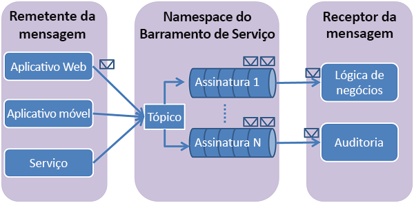

# Início Rápido: Usar o portal do Azure para criar um tópico do Barramento de Serviço e assinaturas para o tópico
Neste Início Rápido, você usará o portal do Azure para criar um tópico do Barramento de Serviço e, em seguida, criará assinaturas para esse tópico. 

## O que são os tópicos e as assinaturas do Barramento de Serviço?
Os tópicos e assinaturas do Barramento de Serviço dão suporte a um modelo de comunicação de mensagens de *publicação/assinatura* . Durante o uso de tópicos e assinaturas, os componentes de um aplicativo distribuído não se comunicam diretamente uns com os outros, eles trocam mensagens por meio de um tópico, que atua como um intermediário.

Ao contrário do que ocorre com as filas do Barramento de Serviço, em que cada mensagem é processada por um único consumidor, tópicos e assinaturas fornecem uma forma de comunicação de um para muitos usando um padrão de publicação/assinatura. É possível registrar várias assinaturas para um tópico. Quando uma mensagem é enviada a um tópico, é disponibilizada para cada assinatura para ser manipulada/processada de forma independente. Uma assinatura de tópico é semelhante a uma fila virtual que recebe cópias das mensagens enviadas para o tópico. Outra opção é registrar regras de filtro para um tópico por assinatura, o que permite que você filtre ou restrinja quais mensagens para um tópico são recebidas por quais assinaturas de tópico.

As assinaturas e os tópicos do Barramento de Serviço permitem o dimensionamento para processar um grande número de mensagens entre muitos usuários e aplicativos.

[!INCLUDE [service-bus-create-namespace-portal](../../includes/service-bus-create-namespace-portal.md)]

[!INCLUDE [service-bus-create-topics-three-subscriptions-portal](../../includes/service-bus-create-topics-three-subscriptions-portal.md)]

> [!NOTE]
> É possível gerenciar os recursos do Barramento de Serviço com o [Gerenciador de Barramento de Serviço](https://github.com/paolosalvatori/ServiceBusExplorer/). O Gerenciador de Barramento de Serviço permite que usuários se conectem a um namespace de serviço do Barramento de Serviço e administrem entidades de mensagens de uma maneira fácil. A ferramenta fornece recursos avançados, como a funcionalidade de importação/exportação ou a capacidade de testar tópicos, filas, assinaturas, serviços de retransmissão, hubs de notificação e hubs de eventos. 

## Próximas etapas
Para saber como enviar mensagens para um tópico e receber essas mensagens por meio de uma assinatura, confira o seguinte artigo: selecione a linguagem de programação no sumário. 

> [!div class="nextstepaction"]
> [Publicar e assinar mensagens](service-bus-dotnet-how-to-use-topics-subscriptions.md)
