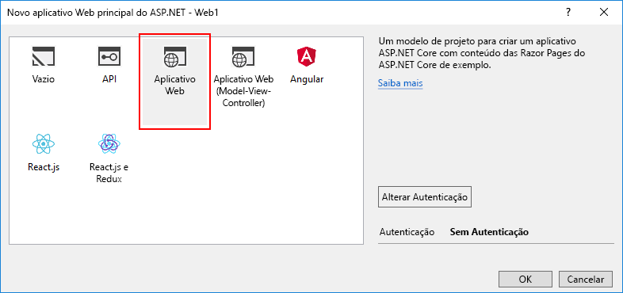
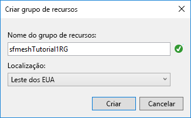
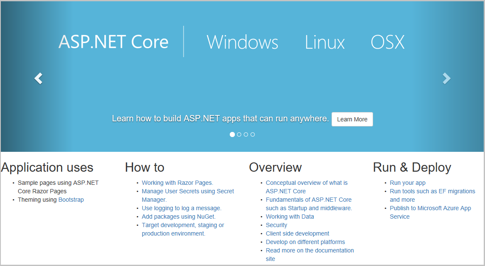

# <a name="quickstart-create-and-deploy-a-web-app-to-azure-service-fabric-mesh"></a>Início Rápido: Criar e implantar um aplicativo Web na Malha do Azure Service Fabric

A Malha do Microsoft Azure Service Fabric é um serviço totalmente gerenciado que permite aos desenvolvedores implantar aplicativos de microsserviços sem gerenciar máquinas virtuais, armazenamento ou rede.

Neste início rápido, você criará um novo aplicativo de Malha do Service Fabric que consiste em um aplicativo Web ASP.NET Core, o executará no cluster de desenvolvimento local e o publicará para executar no Azure.

É necessário ter uma assinatura do Azure. Se não tiver, é possível criar uma assinatura gratuita do Azure de maneira muito fácil, [crie uma conta gratuita](https://azure.microsoft.com/free/) antes de iniciar. Além disso, é necessário [configurar o ambiente de desenvolvedor](service-fabric-mesh-howto-setup-developer-environment-sdk.md)

[!INCLUDE [preview note](./includes/include-preview-note.md)]

## <a name="create-a-service-fabric-mesh-project"></a>Criar um projeto de malha do Service Fabric

Abra o Visual Studio e selecione **Arquivo** > **Novo** > **Projeto...**

No diálogo **Novo Projeto**, caixa **Pesquisar** na parte superior, digite `mesh`. Selecione o modelo **Aplicativo de Malha do Service Fabric**. (Se não for possível ver o modelo, verifique se você instalou o SDK de Malha e a versão prévia das ferramentas do VS, conforme descrito em [Configurar o ambiente de desenvolvimento](service-fabric-mesh-howto-setup-developer-environment-sdk.md). 

Na caixa **Nome**, digite **ServiceFabricMesh1** e na caixa **Local** defina o caminho da pasta onde os arquivos para o projeto serão armazenados.

Verifique se a opção **Criar diretório para solução** está selecionado e clique em **OK** para criar o projeto de malha do Service Fabric.


### <a name="create-a-service"></a>Criar um serviço

Após clicar em **OK**, a caixa de diálogo **Novo Serviço do Service Fabric** é exibida. Selecione o tipo de projeto **ASP.NET Core**, certifique-se de que **SO de Contêiner** está definido para **Windows** e clique em **OK** para criar o projeto ASP.NET Core. 


A caixa de diálogo **Novo Aplicativo Web ASP.NET Core** é exibida. Selecione **Aplicativo Web** e, em seguida, clique em **OK**.



O Visual Studio cria o projeto de aplicativo de Malha do Service Fabric e o projeto ASP.NET Core.

## <a name="build-and-publish-to-your-local-cluster"></a>Compilar e publicar no cluster local

Uma imagem do Docker será compilada e publicada automaticamente no cluster local assim que o projeto for carregado. Esse processo pode demorar algum tempo. Se quiser, é possível monitorar o progresso das ferramentas do Service Fabric na janela **Saída**, selecionando o item **Ferramentas do Service Fabric** no menu suspenso **Saída**. Você pode continuar trabalhando enquanto a imagem do docker estiver sendo implantada.

Depois que o projeto for criado, clique em **F5** para depurar o serviço localmente. Quando a implantação local for concluída e o Visual Studio estiver executando o projeto, uma janela do navegador será aberta com uma página da Web de exemplo.

Quando terminar de navegar pelo serviço implantado, pare de depurar o projeto pressionando **Shift+F5** no Visual Studio.

## <a name="publish-to-azure"></a>Publicar no Azure

Para publicar o projeto de Malha do Service Fabric no Azure, clique com o botão direito do mouse no **projeto de Malha do Service Fabric** no Visual Studio e selecione **Publicar...**


Você verá uma caixa de diálogo **Publicar Aplicativo do Service Fabric**.


Escolha a conta e assinatura do Azure. Escolha um **Local**. Este artigo usa **Leste dos EUA**.

Em **Grupo de recursos**, escolha **\<Criar Novo Grupo de Recursos...>** . A caixa de diálogo **Criar Grupo de Recursos** é exibida. Defina o **Nome do grupo de recursos** e o **Local**.  Este início rápido usa o local **Leste dos EUA** e nomeia o grupo **sfmeshTutorial1RG** (se sua organização tiver várias pessoas usando a mesma assinatura, escolha um nome de grupo de recursos exclusivo).  Clique em **Criar** para criar o grupo de recursos e retornar à caixa de diálogo de publicação.



De volta à caixa de diálogo **Publicar aplicativo do Service Fabric**, em **Registro de Contêiner do Azure**, escolha **\<Criar Novo Registro de Contêiner...>** . Na caixa de diálogo **Criar Registro de Contêiner**, use um nome exclusivo para o **Nome do registro de contêiner**. Especifique um **Local** (este início rápido usa **Leste dos EUA**). Escolha o **Grupo de recursos** que você criou na etapa anterior na lista suspensa, por exemplo, **sfmeshTutorial1RG**. Defina a **SKU** para **Básico** e, em seguida, clique em **Criar** para retornar à caixa de diálogo de publicação.


Na caixa de diálogo de publicação, clique no botão **Publicar** para implantar o aplicativo de Malha do Service Fabric no Azure.

Ao publicar no Azure pela primeira vez, a imagem do docker é enviada para o ACR (Registro de Contêiner do Azure) e isso demora, dependendo do tamanho da imagem. Publicações subsequentes do mesmo projeto serão mais rápidas. É possível monitorar o progresso da implantação, selecionando **Ferramentas do Service Fabric** no menu suspenso da janela **Saída** do Visual Studio. Quando a implantação for concluída, a saída **Ferramentas do Service Fabric** exibirá o endereço IP e a porta do aplicativo na forma de uma URL.

```
Packaging Application...
Building Images...
Web1 -> C:\Code\ServiceFabricMesh1\Web1\bin\Any CPU\Release\netcoreapp2.0\Web1.dll
Uploading the images to Azure Container Registry...
Deploying application to remote endpoint...
The application was deployed successfully and it can be accessed at http://...
```

Abra um navegador da Web e navegue até a URL para ver o site em execução no Azure:



## <a name="clean-up-resources"></a>Limpar os recursos

Quando não forem mais necessários, exclua todos os recursos criados para este início rápido. Como um novo grupo de recursos foi criado para hospedar tanto os recursos do serviço de Malha do Service Fabric como o ACR, é possível excluir com segurança esse grupo de recursos, o que é uma maneira fácil de excluir todos os recursos associados ao grupo.

```azurecli
az group delete --resource-group sfmeshTutorial1RG
```

```powershell
Connect-AzureRmAccount
Remove-AzureRmResourceGroup -Name sfmeshTutorial1RG
```

Como alternativa, é possível excluir o grupo de recursos [do portal do Azure](https://portal.azure.com).

## <a name="next-steps"></a>Próximas etapas

Para saber mais sobre como criar e implantar aplicativos da Malha do Service Fabric, continue no tutorial.
> [!div class="nextstepaction"]
> [Criar, depurar e implantar um aplicativo Web de vários serviços para Malha do Service Fabric](service-fabric-mesh-tutorial-create-dotnetcore.md)
