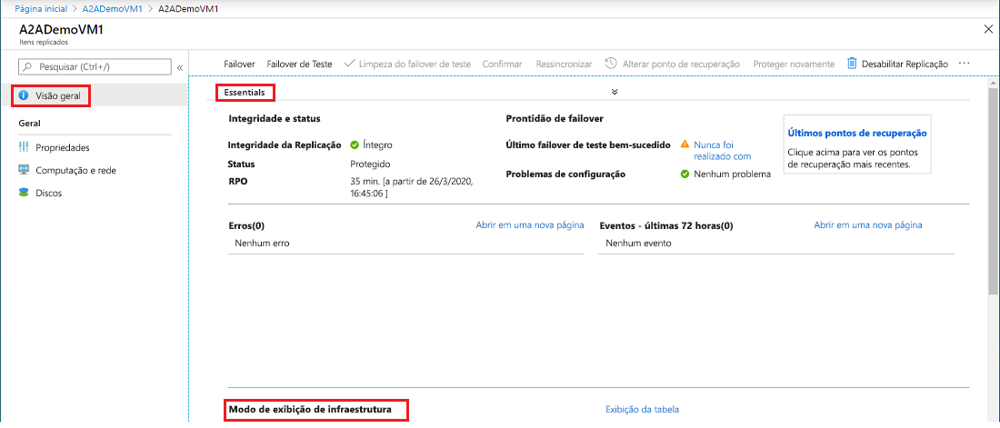

# Configurar a recuperação de desastre para uma região secundária do Azure para uma VM do Azure

O serviço [Azure Site Recovery](site-recovery-overview.md) contribui para sua estratégia de BCDR (continuidade de negócios e recuperação de desastre) mantendo seus aplicativos de negócios em execução durante interrupções planejadas e não planejadas. O Site Recovery gerencia e orquestra a recuperação de desastre de máquinas locais e de VMs (máquinas virtuais) do Azure, incluindo replicação, failover e recuperação.

Este início rápido descreve como configurar a recuperação de desastre para uma VM do Azure replicando-a para uma região do Azure diferente.

Se você não tiver uma assinatura do Azure, crie uma [conta gratuita](https://azure.microsoft.com/free/?WT.mc_id=A261C142F) antes de começar.

> [!NOTE]
> Este artigo é um passo a passo rápido para novos usuários. Ele usa o caminho mais simples, com as opções padrão e o mínimo de personalização. Para obter um passo a passo completo, examine o tutorial [Habilitar a replicação](azure-to-azure-tutorial-enable-replication.md).

## Fazer logon no Azure

Faça logon no [Portal do Azure](https://portal.azure.com).

## Habilitar a replicação para a VM do Azure

1. No menu do portal do Azure, selecione **Máquinas virtuais** ou pesquise e selecione *Máquinas virtuais* em qualquer página. Selecione a VM que você deseja replicar.
2. Em **Operações**, clique em **Recuperação de desastre**.
3. Em **Configurar a recuperação de desastre** > **Região de destino**, selecione a região de destino para a qual você replicará.
4. Para este guia de início rápido, aceite as outras configurações padrão.
5. Selecione **Examinar + Iniciar replicação**. Em seguida, selecione **Iniciar replicação** para iniciar um trabalho para habilitar a replicação da VM.

   

## Verificar as configurações

Após o trabalho de replicação, você poderá verificar o status de replicação, modificar as configurações de replicação e testar a implantação.

1. No menu do portal do Azure, selecione **Máquinas virtuais** ou pesquise e selecione *Máquinas virtuais* em qualquer página. Selecione a VM que você deseja verificar.
2. Em **Operações**, clique em **Recuperação de desastre**.

   Você pode verificar a integridade da replicação, os pontos de recuperação que foram criados e as regiões de origem e destino no mapa.

   

## Limpar os recursos

A VM na região primária deixa de replicar quando você desabilita a replicação para ela:

- As configurações de replicação de origem são limpas automaticamente. A extensão de Site Recovery instalada na VM como parte da replicação não é removida e precisa ser removida manualmente.
- A cobrança do Site Recovery para a VM é interrompida.

Interrompa a replicação da seguinte maneira:

1. No menu do portal do Azure, selecione **Máquinas virtuais** ou pesquise e selecione *Máquinas virtuais* em qualquer página. Selecione a VM que você deseja modificar.
2. Em **Recuperação de desastre**, selecione **Desabilitar Replicação**.

   

## Próximas etapas

Neste guia de início rápido, você replicou uma única VM para uma região secundária. Agora, tente replicar várias VMs do Azure usando um plano de recuperação.

> [!div class="nextstepaction"]
> [Configurar a recuperação de desastre para VMs do Azure](azure-to-azure-tutorial-enable-replication.md)
