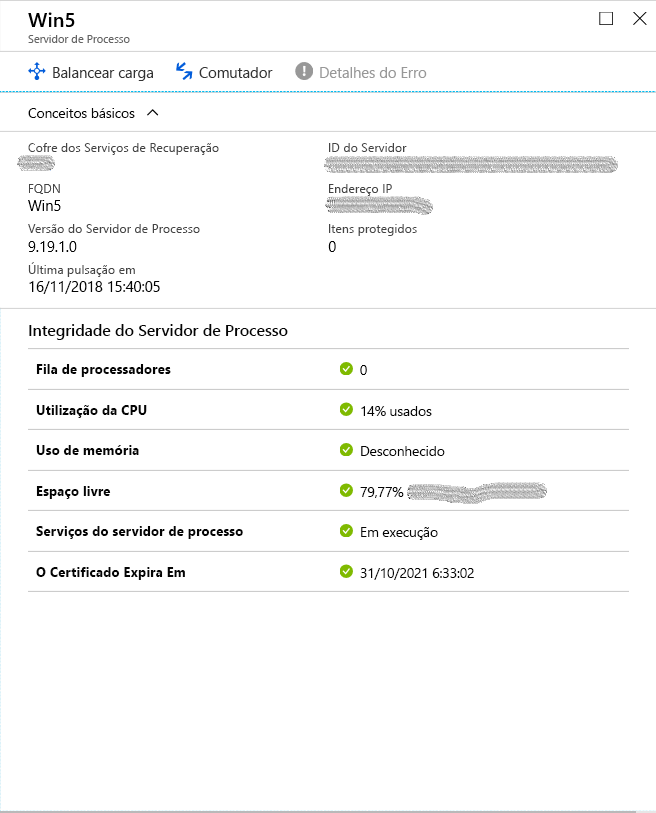

# <a name="manage-process-servers"></a>Gerenciar servidores de processo

Este artigo descreve as tarefas comuns para gerenciar o servidor de processo de Site Recovery.

O servidor de processo é usado para receber, otimizar e enviar dados de replicação para o Azure. Ele também executa uma instalação por push do serviço de mobilidade em VMs VMware e servidores físicos que você deseja replicar e executa a descoberta automática de máquinas locais. Para replicar VMs VMware locais ou servidores físicos para o Azure, o servidor de processo é instalado por padrão no computador do servidor de configuração. 

- Para implantações grandes, você pode precisar de servidores em processo locais adicionais para dimensionar a capacidade.
- Para o failback do Azure para o local, você deve configurar um servidor de processo temporário no Azure. Você pode excluir essa VM após o failback. 

Saiba mais sobre o servidor de processo.


## <a name="upgrade-a-process-server"></a>Atualizar um servidor em processo

Quando você implanta um servidor de processo local ou como uma VM do Azure para failback, a versão mais recente do servidor de processo é instalada. As equipes do Site Recovery liberam correções e melhorias regularmente, e recomendamos que você mantenha os servidores em processo atualizados. Você pode atualizar um servidor de processo da seguinte maneira:

[!INCLUDE [site-recovery-vmware-upgrade -process-server](../../includes/site-recovery-vmware-upgrade-process-server-internal.md)]


## <a name="move-vms-to-balance-the-process-server-load"></a>Mover VMs para balancear a carga do servidor de processo

Equilibre a carga movendo as VMs entre dois servidores de processo, da seguinte maneira:

1. No cofre, em **gerenciar** , clique em **infraestrutura de site Recovery**. Em **para VMware & máquinas físicas**, clique em **servidores de configuração**.
2. Clique no servidor de configuração com o qual os servidores de processo são registrados.
3. Clique no servidor de processo para o qual você deseja balancear a carga do tráfego.

    

4. Clique em **balanceamento de carga**, selecione o servidor de processo de destino para o qual você deseja mover computadores. Em seguida, clique em **OK**

    

2. Clique em **Selecionar computadores**e escolha os computadores que você deseja mover do atual para o servidor de processo de destino. Detalhes de alteração de dados médio são exibidos em cada máquina virtual. Em seguida, clique em **OK**. 
3. No cofre, monitore o progresso do trabalho em **monitoramento**  >  **site Recovery trabalhos**.

Levará cerca de 15 minutos para que as alterações sejam refletidas no Portal. Para um efeito mais rápido, [atualize o servidor de configuração](vmware-azure-manage-configuration-server.md#refresh-configuration-server).

## <a name="switch-an-entire-workload-to-another-process-server"></a>Mudar uma carga de trabalho inteira para outro servidor de processo

Mova toda a carga de trabalho tratada por um servidor de processo para um servidor de processo diferente, da seguinte maneira:

1. No cofre, em **gerenciar** , clique em **infraestrutura de site Recovery**. Em **para VMware & máquinas físicas**, clique em **servidores de configuração**.
2. Clique no servidor de configuração com o qual os servidores de processo são registrados.
3. Clique no servidor de processo do qual você deseja alternar a carga de trabalho.
4. Clique em **alternar**, selecione o servidor de processo de destino para o qual você deseja mover a carga de trabalho. Em seguida, clique em **OK**

    

5. No cofre, monitore o progresso do trabalho em **monitoramento**  >  **site Recovery trabalhos**.

Levará cerca de 15 minutos para que as alterações sejam refletidas no Portal. Para um efeito mais rápido, [atualize o servidor de configuração](vmware-azure-manage-configuration-server.md#refresh-configuration-server).

## <a name="register-a-master-target-server"></a>Registrar um servidor de destino mestre

O servidor de destino Mestre reside no servidor de configuração e nos servidores de processo de expansão. Ele deve ser registrado com o servidor de configuração. Caso haja uma falha nesse registro, ele pode afetar a integridade dos itens protegidos. Para registrar o servidor de destino mestre com o servidor de configuração, faça logon no servidor de configuração de servidor/processo de expansão específico no qual o registro é necessário. Navegue até a pasta **%ProgramData%\ASR\Agent**e execute o seguinte no prompt de comando do administrador.

   ```
   cmd
   cdpcli.exe --registermt

   net stop obengine

   net start obengine

   exit
   ```

## <a name="reregister-a-process-server"></a>Registrar um servidor em processo novamente

Registre novamente um servidor de processo em execução local ou em uma VM do Azure com o servidor de configuração da seguinte maneira:

[!INCLUDE [site-recovery-vmware-register-process-server](../../includes/site-recovery-vmware-register-process-server.md)]

Depois de salvar as configurações, faça o seguinte:

1. No servidor em processo, abra um prompt de comando do administrador.
2. Navegue para a pasta **%PROGRAMDATA%\ASR\Agent** e execute o comando:

    ```
    cdpcli.exe --registermt
    net stop obengine
    net start obengine
    ```

## <a name="modify-proxy-settings-for-an-on-premises-process-server"></a>Modificar as configurações de proxy de um servidor em processo local

Se um servidor de processo local usar um proxy para se conectar ao Azure, você poderá modificar as configurações de proxy da seguinte maneira:

1. Entre no computador do servidor de processo. 
2. Abra uma janela de comando do PowerShell de administrador e execute o comando a seguir:
   ```powershell
   $pwd = ConvertTo-SecureString -String MyProxyUserPassword
   Set-OBMachineSetting -ProxyServer http://myproxyserver.domain.com -ProxyPort PortNumber –ProxyUserName domain\username -ProxyPassword $pwd
   net stop obengine
   net start obengine
   ```
2. Navegue até a pasta **%ProgramData%\ASR\Agent**e execute este comando:
   ```
   cmd
   cdpcli.exe --registermt

   net stop obengine

   net start obengine

   exit
   ```

## <a name="remove-a-process-server"></a>Remover um servidor em processo

[!INCLUDE [site-recovery-vmware-unregister-process-server](../../includes/site-recovery-vmware-unregister-process-server.md)]

## <a name="exclude-folders-from-anti-virus-software"></a>Excluir pastas de software antivírus

Se o software antivírus estiver em execução em um servidor de processo de expansão (ou servidor de destino mestre), exclua as seguintes pastas de operações de antivírus:


- C:\Arquivos de Programas\Microsoft Azure Recovery Services Agent
- C:\ProgramData\ASR
- C:\ProgramData\ASRLogs
- C:\ProgramData\ASRSetupLogs
- C:\ProgramData\LogUploadServiceLogs
- C:\ProgramData\Microsoft Azure Site Recovery
- Diretório de instalação do servidor de processo. Por exemplo: C:\Arquivos de programas (x86) \Microsoft Azure Site Recovery