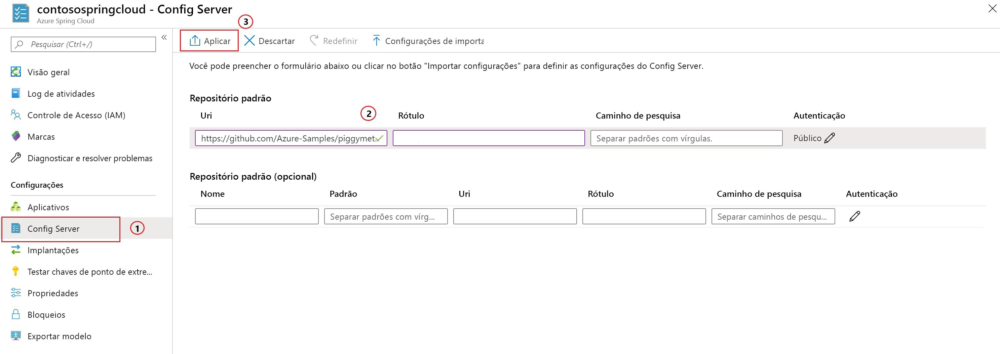

# <a name="quickstart-launch-an-azure-spring-cloud-app-using-the-maven-plug-in"></a>Início Rápido: Iniciar um aplicativo Azure Spring Cloud usando o plug-in do Maven

Usando o plug-in do Maven para Azure Spring Cloud, crie e atualize com facilidade seus aplicativos do Azure Spring Cloud. Ao predefinir uma configuração, você pode implantar aplicativos em seu serviço existente do Azure Spring Cloud. Neste artigo, você usará um aplicativo de exemplo chamado PiggyMetrics para demonstrar esse recurso.

Seguindo este início rápido, você aprenderá a:

> [!div class="checklist"]
> * Provisionar uma instância de serviço
> * Definir um servidor de configuração para uma instância
> * Clonar e criar o aplicativo de microsserviço localmente
> * Implantar cada microsserviço
> * Atribuir um ponto de extremidade público para seu aplicativo

>[!Note]
> Atualmente, o Azure Spring Cloud é oferecido como visualização pública. As ofertas de visualização pública permitem que os clientes experimentem os novos recursos antes do lançamento oficial.  Os serviços e recursos de visualização pública não são destinados ao uso em produção.  Para saber mais sobre o suporte durante as visualizações, confira as [Perguntas frequentes](https://azure.microsoft.com/support/faq/) ou envie uma [Solicitação de suporte](https://docs.microsoft.com/azure/azure-portal/supportability/how-to-create-azure-support-request) para saber mais.


>[!TIP]
> O Azure Cloud Shell é um shell interativo gratuito que pode ser usado para executar os comandos deste artigo. Ele tem ferramentas comuns do Azure pré-instaladas, incluindo as últimas versões do Git, do JDK (Java Development Kit), do Maven e da CLI do Azure. Se estiver conectado à sua assinatura do Azure, inicie o [Azure Cloud Shell](https://shell.azure.com). Para obter mais informações, consulte [Visão geral do Azure Cloud Shell](../cloud-shell/overview.md).

Para concluir este guia de início rápido:

1. [Instalar o Git](https://git-scm.com/).
2. [Instale o JDK 8](https://docs.microsoft.com/java/azure/jdk/?view=azure-java-stable).
3. [Instale o Maven 3.0 ou posterior](https://maven.apache.org/download.cgi).
4. [Inscreva-se em uma assinatura gratuita do Azure](https://azure.microsoft.com/free/).

## <a name="provision-a-service-instance-on-the-azure-portal"></a>Provisionar uma instância de serviço no portal do Azure

1. Em um navegador da Web, abra [este link para o Azure Spring Cloud no portal do Azure](https://ms.portal.azure.com/#create/Microsoft.AppPlatform) e entre na conta.

1. Forneça os **Detalhes do projeto** para o aplicativo de exemplo da seguinte maneira:

    1. Selecione a **Assinatura** à qual o aplicativo será associado.
    1. Selecione ou crie um grupo de recursos para o aplicativo. É recomendável criar um novo grupo de recursos.  O exemplo a seguir mostra um novo grupo de recursos chamado `myspringservice`.
    1. Forneça um nome para o novo serviço do Azure Spring Cloud.  O nome deve ter entre 4 e 32 caracteres e pode conter apenas letras minúsculas, números e hifens. O primeiro caractere do nome do serviço deve ser uma letra e o último caractere deve ser uma letra ou um número.  O serviço no exemplo abaixo foi nomeado `contosospringcloud`.
    1. Selecione um local para seu aplicativo nas opções fornecidas.  Neste exemplo, selecionamos `East US`.
    1. Selecione **Examinar + criar** para examinar um resumo do novo serviço.  Se tudo parecer correto, selecione **Criar**.

    > [!div class="mx-imgBorder"]
    > 

São necessários cerca de 5 minutos para o serviço ser implantado. Depois que o serviço for implantado, selecione **Ir para o recurso** e a página **Visão Geral** da instância de serviço será exibida.

> [!div class="nextstepaction"]
> [Encontrei um problema](https://www.research.net/r/javae2e?tutorial=asc-maven-quickstart&step=provision)

## <a name="set-up-your-configuration-server"></a>Definir seu servidor de configuração

1. Na página **Visão Geral** do serviço, selecione **Servidor de Configuração**.
1. Na seção **Repositório padrão**, defina **URI** como **https://github.com/Azure-Samples/piggymetrics-config** e, em seguida, selecione **Aplicar** para salvar as alterações.

    > [!div class="mx-imgBorder"]
    > 

> [!div class="nextstepaction"]
> [Encontrei um problema](https://www.research.net/r/javae2e?tutorial=asc-maven-quickstart&step=config-server)

## <a name="clone-and-build-the-sample-application-repository"></a>Clonar e criar o repositório do aplicativo de exemplo

1. Iniciar o [Azure Cloud Shell](https://shell.azure.com).

1. Clone o repositório Git executando o seguinte comando:

    ```console
    git clone https://github.com/Azure-Samples/PiggyMetrics
    ```
  
1. Altere o diretório e crie o projeto executando o seguinte comando:

    ```console
    cd piggymetrics
    mvn clean package -DskipTests
    ```

## <a name="generate-configurations-and-deploy-to-the-azure-spring-cloud"></a>Gerar configurações e implantar no Azure Spring Cloud

1. Gere configurações executando o seguinte comando na pasta raiz de PiggyMetrics que contém o POM pai:

    ```console
    mvn com.microsoft.azure:azure-spring-cloud-maven-plugin:1.1.0:config
    ```

    a. Selecione os módulos `gateway`, `auth-service` e `account-service`.

    b. Selecione sua assinatura e o cluster de serviço do Azure Spring Cloud.

    c. Na lista de projetos fornecidos, insira o número que corresponde ao `gateway` para fornecer acesso público a ele.
    
    d. Confirme a configuração.

1. Agora o POM contém as dependências e configurações do plug-in. Implante os aplicativos usando o seguinte comando:

   ```console
   mvn azure-spring-cloud:deploy
   ```

1. Após a conclusão da implantação, é possível acessar o PiggyMetrics usando a URL fornecida na saída do comando anterior.

> [!div class="nextstepaction"]
> [Encontrei um problema](https://www.research.net/r/javae2e?tutorial=asc-maven-quickstart&step=deploy)

## <a name="next-steps"></a>Próximas etapas

Neste início rápido, você implantou um aplicativo Spring Cloud em um repositório do Maven. Para saber mais sobre o Azure Spring Cloud, prossiga para o tutorial sobre como preparar seu aplicativo para implantação.

> [!div class="nextstepaction"]
> [Prepare seu aplicativo Azure Spring Cloud para implantação](spring-cloud-tutorial-prepare-app-deployment.md)
> [Saiba mais sobre os plug-ins do Maven para o Azure](https://github.com/microsoft/azure-maven-plugin)

Mais exemplos estão disponíveis no GitHub: [Exemplos do Azure Spring Cloud](https://github.com/Azure-Samples/Azure-Spring-Cloud-Samples/tree/master/service-binding-cosmosdb-sql).
