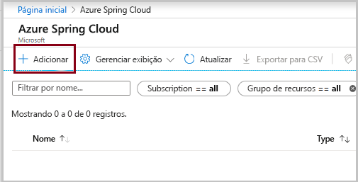
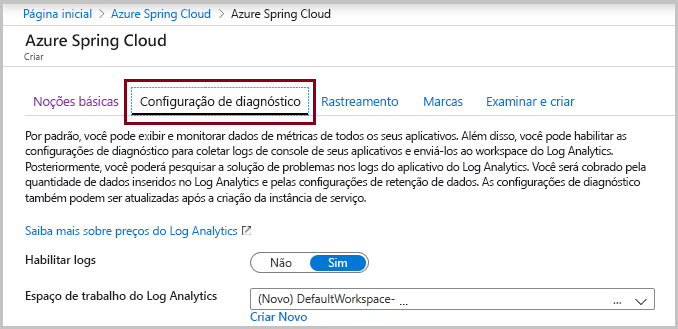

# <a name="quickstart-launch-an-existing-azure-spring-cloud-application-using-the-azure-portal"></a>Início Rápido: Iniciar um aplicativo existente do Azure Spring Cloud usando o portal do Azure

Este início rápido mostra como implantar um aplicativo do Spring Cloud existente no Azure. O Azure Spring Cloud permite que você execute facilmente aplicativos de microsserviço baseados no Spring Cloud no Azure. 

É possível encontrar o código do aplicativo de exemplo usado neste tutorial em nosso [repositório de exemplos do GitHub](https://github.com/Azure-Samples/PiggyMetrics). Quando você tiver terminado, o aplicativo de exemplo fornecido estará acessível online e pronto para ser gerenciado usando o portal do Azure.

Seguindo este início rápido, você aprenderá a:

> [!div class="checklist"]
> * Provisionar uma instância de serviço
> * Definir um servidor de configuração para uma instância
> * Criar um aplicativo de microsserviço localmente
> * Implantar cada microsserviço
> * Atribuir um ponto de extremidade público para seu aplicativo

## <a name="prerequisites"></a>Prerequisites

>[!Note]
> Atualmente, o Azure Spring Cloud é oferecido como visualização pública. As ofertas de visualização pública permitem que os clientes experimentem os novos recursos antes do lançamento oficial.  Os serviços e recursos de visualização pública não são destinados ao uso em produção.  Para saber mais sobre o suporte durante as visualizações, confira as [Perguntas frequentes](https://azure.microsoft.com/support/faq/) ou envie uma [Solicitação de suporte](https://docs.microsoft.com/azure/azure-portal/supportability/how-to-create-azure-support-request) para saber mais.

>[!TIP]
> O Azure Cloud Shell é um shell interativo grátis que pode ser usado para executar as etapas neste artigo.  Ele tem ferramentas comuns do Azure pré-instaladas, incluindo as versões mais recentes do Git, do JDK, do Maven e da CLI do Azure. Se você fez logon na assinatura do Azure, inicie o [Azure Cloud Shell](https://shell.azure.com) em shell.azure.com.  Você pode saber mais sobre o Azure Cloud Shell [lendo nossa documentação](../cloud-shell/overview.md)

Para concluir este guia de início rápido:

1. [Instalar o Git](https://git-scm.com/)
2. [Instalar o JDK 8](https://docs.microsoft.com/java/azure/jdk/?view=azure-java-stable)
3. [Instalar o Maven 3.0 ou posterior](https://maven.apache.org/download.cgi)
4. [Instalar a CLI do Azure versão 2.0.67 ou posterior](https://docs.microsoft.com/cli/azure/install-azure-cli?view=azure-cli-latest)
5. [Inscrever-se em uma assinatura do Azure](https://azure.microsoft.com/free/)

## <a name="install-the-azure-cli-extension"></a>Instalar a extensão da CLI do Azure

Instalar a extensão do Azure Spring Cloud para a CLI do Azure usando o seguinte comando

```Azure CLI
az extension add --name spring-cloud
```

## <a name="provision-a-service-instance-on-the-azure-portal"></a>Provisionar uma instância de serviço no portal do Azure

1. Em uma nova guia, abra o [portal do Azure](https://ms.portal.azure.com/). 

2. Na caixa de pesquisa superior, pesquise **Azure Spring Cloud**.

3. Selecione **Azure Spring Cloud** nos resultados.

 

4. Na página do Azure Spring Cloud, clique em **+ Adicionar**.

 

5. Preencha o formulário na página **Criar** do Azure Spring Cloud.  Considere as seguintes diretrizes:
    - **Assinatura**: selecione a assinatura da qual você deseja que este recurso seja cobrado.  Verifique se essa assinatura foi adicionada à nossa lista de permissões do Azure Spring Cloud.
    - **Grupo de recursos**: a criação de grupos de recursos para novos recursos é uma melhor prática.
    - **Nome/Detalhes do Serviço**: especifique o nome da instância de serviço.  O nome deve ter entre 4 e 32 caracteres e pode conter apenas letras minúsculas, números e hifens.  O primeiro caractere do nome do serviço deve ser uma letra e o último caractere deve ser uma letra ou um número.
    - **Localização**: selecione a localização de sua instância de serviço. No momento, os locais com suporte incluem o Leste dos EUA, Oeste dos EUA 2, Oeste da Europa e Sudeste Asiático.

    

6. Clique na guia **Configuração de Diagnóstico** para abrir a caixa de diálogo a seguir.

7. Você pode definir **Habilitar logs** como *sim* ou *não* de acordo com suas necessidades.

    

8. Clique na guia **Rastreamento**.

9. Você pode definir **Habilitar rastreamento** como *sim* ou *não* de acordo com seus requisitos.  Se você definir **Habilitar rastreamento** como sim, selecione também um insight de aplicativo existente ou crie um. Sem a especificação **Application Insights** haverá um erro de validação.


    

10. Clique em **Examinar e criar**.

11. Verifique suas especificações e clique em **Criar**.

Leva cerca de 5 minutos para o serviço ser implantado.  Depois de implantada, a página **Visão Geral** da instância de serviço será exibida.

> [!div class="nextstepaction"]
> [Encontrei um problema](https://www.research.net/r/javae2e?tutorial=asc-portal-quickstart&step=provision)


## <a name="set-up-your-configuration-server"></a>Definir seu servidor de configuração

1. Acesse a página **Visão Geral** do serviço e selecione o **Servidor de Configuração**.

2. Na seção **Repositório padrão**, defina **URI** como "https://github.com/Azure-Samples/piggymetrics-config".

3. Selecione **Aplicar** para salvar as alterações.

    

> [!div class="nextstepaction"]
> [Encontrei um problema](https://www.research.net/r/javae2e?tutorial=asc-portal-quickstart&step=config-server)

## <a name="build-and-deploy-microservice-applications"></a>Compilar e implantar aplicativos de microsserviço

1. Abra um [Azure Cloud Shell](https://shell.azure.com) e clone o repositório do aplicativo de exemplo em seu computador local.  Aqui, primeiro criamos um diretório temporário chamado `source-code`, antes de clonar o aplicativo.

    ```azurecli
    mkdir source-code
    cd source-code
    git clone https://github.com/Azure-Samples/piggymetrics
    ```

2. Crie o pacote clonado.

    ```azurecli
    cd piggymetrics
    mvn clean package -DskipTests
    ```
3. Atribua nomes ao seu grupo de recursos e ao seu serviço. Certifique-se de substituir os espaços reservados abaixo pelo nome do grupo de recursos e pelo nome do serviço que você provisionou anteriormente neste tutorial.

    ```azurecli
    az configure --defaults group=<resource group name>
    az configure --defaults spring-cloud=<service instance name>
    ```

4. Crie o aplicativo `gateway` e implante o arquivo JAR.

    ```azurecli
    az spring-cloud app create -n gateway
    az spring-cloud app deploy -n gateway --jar-path ./gateway/target/gateway.jar
    ```

5. Seguindo o mesmo padrão, crie os aplicativos `account-service` e `auth-service` e implante seus arquivos JAR.

    ```azurecli
    az spring-cloud app create -n account-service
    az spring-cloud app deploy -n account-service --jar-path ./account-service/target/account-service.jar
    az spring-cloud app create -n auth-service
    az spring-cloud app deploy -n auth-service --jar-path ./auth-service/target/auth-service.jar
    ```

6. São necessários alguns minutos para concluir a implantação dos aplicativos. Para confirmar que eles foram implantados, acesse a folha **Aplicativos** no portal do Azure. Você deverá ver uma linha de cada um dos três aplicativos.

> [!div class="nextstepaction"]
> [Encontrei um problema](https://www.research.net/r/javae2e?tutorial=asc-portal-quickstart&step=deploy)

## <a name="assign-a-public-endpoint-to-gateway"></a>Atribuir um ponto de extremidade público ao gateway

1. Abra a guia **Aplicativos** no menu à esquerda.

2. Selecione o aplicativo `gateway` para mostrar a página **Visão geral**.

3. Selecione **Atribuir Ponto de Extremidade** para atribuir um ponto de extremidade público ao gateway. Isso pode levar alguns minutos.

    

4. Insira o ponto de extremidade público atribuído (rotulado **URL**) em seu navegador para exibir o aplicativo em execução.

    

> [!div class="nextstepaction"]
> [Encontrei um problema](https://www.research.net/r/javae2e?tutorial=asc-portal-quickstart&step=public-endpoint)

## <a name="next-steps"></a>Próximas etapas

Neste guia de início rápido, você aprendeu a:

> [!div class="checklist"]
> * Provisionar uma instância de serviço
> * Definir um servidor de configuração para uma instância
> * Criar um aplicativo de microsserviço localmente
> * Implantar cada microsserviço
> * Atribuir um ponto de extremidade público para seu gateway de aplicativo

> [!div class="nextstepaction"]
> [Prepare seu aplicativo Azure Spring Cloud para implantação](spring-cloud-tutorial-prepare-app-deployment.md)

Mais exemplos estão disponíveis no GitHub: [Exemplos do Azure Spring Cloud](https://github.com/Azure-Samples/Azure-Spring-Cloud-Samples/tree/master/service-binding-cosmosdb-sql).
