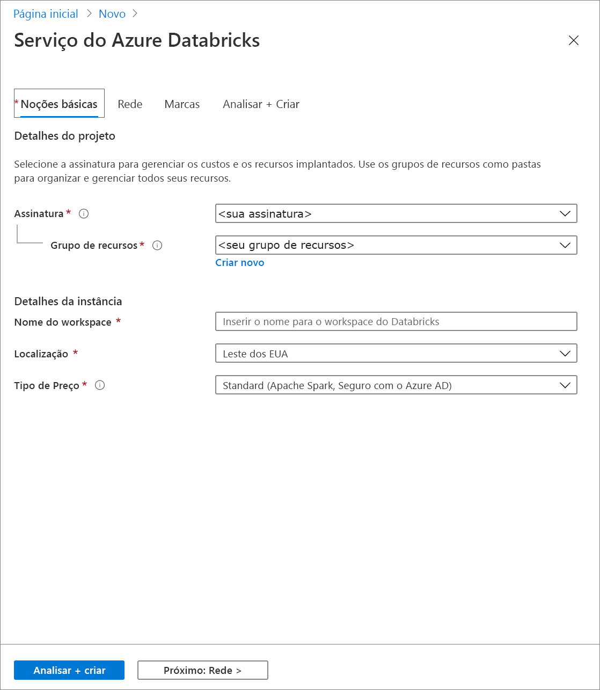
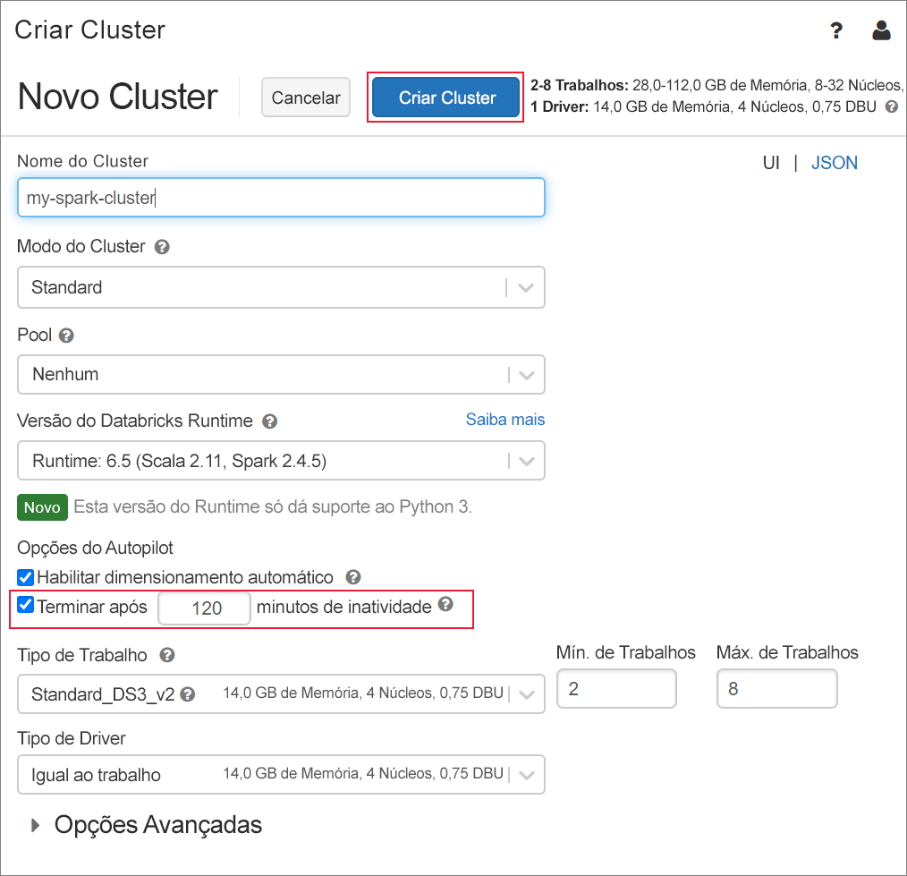

# <a name="quickstart-analyze-data-with-databricks"></a>Início Rápido: Analisar dados com o Databricks

Neste início rápido, execute um trabalho do Apache Spark usando o Azure Databricks para realizar análise nos dados armazenados em uma conta de armazenamento. Como parte do trabalho do Spark, você analisará dados de uma assinatura de canal de rádio para obter insights sobre o uso gratuito/pago com base em dados demográficos.

## <a name="prerequisites"></a>Pré-requisitos

* Uma conta do Azure com uma assinatura ativa. [Crie uma conta gratuitamente](https://azure.microsoft.com/free/?ref=microsoft.com&utm_source=microsoft.com&utm_medium=docs&utm_campaign=visualstudio).

* O nome da sua conta de armazenamento do Azure Data Lake Gen2. [Crie uma conta de armazenamento do Azure Data Lake Storage Gen2](data-lake-storage-quickstart-create-account.md).

* A ID do locatário, a ID do aplicativo e a senha de uma entidade de serviço do Azure com uma função atribuída de **Colaborador de Dados do Blob de Armazenamento**. [Crie uma entidade de serviço](../../active-directory/develop/howto-create-service-principal-portal.md).

  > [!IMPORTANT]
  > Atribua a função no escopo da conta de armazenamento do Data Lake Storage Gen2. Você pode atribuir uma função ao grupo de recursos pai ou à assinatura, mas receberá erros relacionados a permissões até que essas atribuições de função sejam propagadas para a conta de armazenamento.

## <a name="create-an-azure-databricks-workspace"></a>Criar um workspace do Azure Databricks

Nesta seção, você deve cria um workspace do Azure Databricks usando o Portal do Azure.

1. No Portal do Azure, selecione **Criar um recurso** > **Análise** > **Azure Databricks**.

    

2. Em **Serviço do Azure Databricks**, forneça os valores para criar um workspace do Databricks.

    

    Forneça os seguintes valores:

    |Propriedade  |Descrição  |
    |---------|---------|
    |**Nome do workspace**     | Forneça um nome para seu workspace do Databricks        |
    |**Assinatura**     | Na lista suspensa, selecione sua assinatura do Azure.        |
    |**Grupo de recursos**     | Especifique se deseja criar um novo grupo de recursos ou usar um existente. Um grupo de recursos é um contêiner que mantém os recursos relacionados a uma solução do Azure. Para obter mais informações, consulte [Visão geral do Grupo de Recursos do Azure](../../azure-resource-manager/management/overview.md). |
    |**Localidade**     | Selecione **Oeste dos EUA 2**. Fique à vontade para selecionar outra região pública se preferir.        |
    |**Tipo de preço**     |  Escolha entre o cluster **Standard** e o **Premium**. Para saber mais sobre essas camadas, confira [Página de preços do Databricks](https://azure.microsoft.com/pricing/details/databricks/).       |

3. A criação da conta leva alguns minutos. Para monitorar o status da operação, veja a barra de progresso na parte superior.

4. Selecione **Fixar no painel** e depois **Criar**.

## <a name="create-a-spark-cluster-in-databricks"></a>Criar um cluster Spark no Databricks

1. No portal do Azure, vá para o workspace do Databricks que você criou e selecione **Inicializar Workspace**.

2. Você é redirecionado para o portal do Azure Databricks. No portal, selecione **Novo** > **Cluster**.

    

3. Na página **Novo cluster**, forneça os valores para criar um cluster.

    

    Preencha os valores para os seguintes campos e aceite os valores padrão para os outros campos:

    - Insira um nome para o cluster.
     
    - Verifique se você marcou a caixa de seleção **Terminar depois de 120 minutos de inatividade**. Forneça uma duração (em minutos) para encerrar o cluster caso ele não esteja sendo usado.

4. Selecione **Criar cluster**. Quando o cluster está em execução, você pode anexar blocos de notas a ele e executar trabalhos do Spark.

Para obter mais informações sobre como criar clusters, consulte [Criar um cluster Spark no Azure Databricks](https://docs.azuredatabricks.net/user-guide/clusters/create.html).

## <a name="create-notebook"></a>Criar notebook

Nesta seção, você cria um bloco de anotações no workspace do Azure Databricks e executa snippets de código para configurar a conta de armazenamento.

1. No [Portal do Azure](https://portal.azure.com), vá para o workspace do Azure Databricks que você criou e selecione **Inicializar Workspace**.

2. No painel esquerdo, escolha **Workspace**. Na lista suspensa **Workspace**, selecione **Criar** > **Notebook**.

    

3. Na caixa de diálogo **Criar Bloco de Anotações**, digite um nome para o bloco de anotações. Selecione **Scala** como linguagem e selecione o cluster Spark criado anteriormente.

    

    Selecione **Criar**.

4. Copie e cole o bloco de código a seguir na primeira célula, mas não execute esse código ainda.

   ```scala
   spark.conf.set("fs.azure.account.auth.type.<storage-account-name>.dfs.core.windows.net", "OAuth")
   spark.conf.set("fs.azure.account.oauth.provider.type.<storage-account-name>.dfs.core.windows.net", "org.apache.hadoop.fs.azurebfs.oauth2.ClientCredsTokenProvider")
   spark.conf.set("fs.azure.account.oauth2.client.id.<storage-account-name>.dfs.core.windows.net", "<appID>")
   spark.conf.set("fs.azure.account.oauth2.client.secret.<storage-account-name>.dfs.core.windows.net", "<password>")
   spark.conf.set("fs.azure.account.oauth2.client.endpoint.<storage-account-name>.dfs.core.windows.net", "https://login.microsoftonline.com/<tenant-id>/oauth2/token")
   spark.conf.set("fs.azure.createRemoteFileSystemDuringInitialization", "true")
   dbutils.fs.ls("abfss://<container-name>@<storage-account-name>.dfs.core.windows.net/")
   spark.conf.set("fs.azure.createRemoteFileSystemDuringInitialization", "false")

   ```
5. Neste bloco de código, substitua os valores de espaço reservado `storage-account-name`, `appID`, `password` e `tenant-id` pelos valores coletados ao criar a entidade de serviço. Defina o valor de espaço reservado `container-name` com qualquer nome que deseja fornecer ao contêiner.

6. Pressione as teclas **SHIFT+ENTER** para executar o código nesse bloco.

## <a name="ingest-sample-data"></a>Ingerir dados de exemplo

Antes de iniciar esta seção, você deve concluir os pré-requisitos a seguir:

Insira o código a seguir em uma célula do bloco de anotações:

```bash
%sh wget -P /tmp https://raw.githubusercontent.com/Azure/usql/master/Examples/Samples/Data/json/radiowebsite/small_radio_json.json
```

Na célula, pressione **SHIFT + ENTER** para executar o código.

Agora, em uma nova célula abaixo dessa, insira o seguinte código e substitua os valores exibidos entre colchetes pelos mesmos valores usados anteriormente:

```python
dbutils.fs.cp("file:///tmp/small_radio_json.json", "abfss://<container-name>@<storage-account-name>.dfs.core.windows.net/")
```

Na célula, pressione **SHIFT + ENTER** para executar o código.

## <a name="run-a-spark-sql-job"></a>Executar um trabalho SQL do Spark

Execute as seguintes tarefas para executar um trabalho SQL do Spark nos dados.

1. Execute uma instrução SQL para criar uma tabela temporária usando dados do arquivo de dados JSON de exemplo, **small_radio_json.json**. No snippet de código a seguir, substitua os valores de espaço reservado pelo nome do seu contêiner e o nome da conta de armazenamento. Usando o bloco de notas criando anteriormente, cole o snippet de código em uma célula de código no bloco de notas e pressione SHIFT + ENTER.

    ```sql
    %sql
    DROP TABLE IF EXISTS radio_sample_data;
    CREATE TABLE radio_sample_data
    USING json
    OPTIONS (
     path  "abfss://<container-name>@<storage-account-name>.dfs.core.windows.net/small_radio_json.json"
    )
    ```

    Assim que o comando for concluído com êxito, você terá todos os dados do arquivo JSON como uma tabela no cluster do Databricks.

    O comando mágico de linguagem `%sql` permite que você execute um código SQL do bloco de notas, mesmo que o bloco seja de outro tipo. Para obter mais informações, consulte [Combinar linguagens em um bloco de notas](https://docs.azuredatabricks.net/user-guide/notebooks/index.html#mixing-languages-in-a-notebook).

2. Vamos examinar um instantâneo dos dados do JSON de exemplo para entender melhor a consulta que você executou. Cole o snippet de código a seguir em uma célula de código e pressione **SHIFT+ENTER**.

    ```sql
    %sql
    SELECT * from radio_sample_data
    ```

3. Você verá uma saída tabular como mostrado na seguinte captura de tela (somente algumas colunas são mostradas):

    

    Entre outros detalhes, os dados de exemplo capturam o gênero do público de um canal de rádio (nome da coluna: **gênero**) e se a sua assinatura é gratuita ou paga (nome da coluna: **nível**).

4. Agora crie uma representação visual dos dados para mostrar quantos usuários têm contas gratuitas e quantos são assinantes pagantes para cada gênero. Na parte inferior da saída tabular, clique no ícone de **Gráfico de barras** e depois em **Opções de plotagem**.

    

5. Em **Personalizar plotagem**, arraste e solte valores conforme mostrado na captura de tela.

    

    - Definir **Chaves** como **gênero**.
    - Definir **Agrupamentos de série** como **nível**.
    - Definir **Valores** como **nível**.
    - Definir **Agregação** como **CONTAGEM**.

6. Clique em **Aplicar**.

7. A saída mostra a representação visual, conforme ilustrado na seguinte captura de tela:

     

## <a name="clean-up-resources"></a>Limpar os recursos

Depois de terminar o artigo, você poderá encerrar o cluster. No workspace do Azure Databricks, selecione **Clusters** e localize o cluster que você deseja encerrar. Passe o cursor do mouse sobre o botão de reticências na coluna **Ações** e selecione o ícone **Terminar**.


Se você não encerrar o cluster manualmente, ele é interrompido automaticamente, desde que você tenha selecionado a caixa de seleção **Terminar depois de \_\_ minutos de inatividade** ao criar o cluster. Se você definir essa opção, o cluster será interrompido depois de ficar inativo durante o período de tempo designado.

## <a name="next-steps"></a>Próximas etapas

Neste artigo, você criou um cluster Spark no Azure Databricks e executou um trabalho do Spark usando os dados em uma conta de armazenamento com o Data Lake Storage Gen2 habilitado.

Siga até o próximo artigo para saber como executar uma operação de ETL (extração, transformação e carregamento de dados) usando o Azure Databricks.

> [!div class="nextstepaction"]
>[Extrair, transformar e carregar dados usando o Azure Databricks](../../azure-databricks/databricks-extract-load-sql-data-warehouse.md).

- Para saber como importar dados de outras fontes de dados para o Azure Databricks, confira [Fontes de dados do Spark](https://docs.azuredatabricks.net/spark/latest/data-sources/index.html).

- Para saber mais sobre outras maneiras de acessar o Azure Data Lake Storage Gen2 de um workspace do Azure Databricks, confira [Azure Data Lake Storage Gen2](https://docs.azuredatabricks.net/spark/latest/data-sources/azure/azure-datalake-gen2.html).
