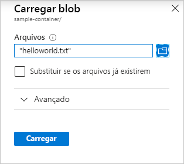

# Início Rápido: Carregar, baixar e listar blobs com o portal do Azure

Neste guia de início rápido, você aprenderá a usar o [portal do Azure](https://portal.azure.com/) para criar um contêiner no Armazenamento do Azure e a carregar e baixar blobs de blocos nesse contêiner.

## Prerequisites

[!INCLUDE [storage-quickstart-prereq-include](../../../includes/storage-quickstart-prereq-include.md)]

## Criar um contêiner

Para criar um contêiner no portal do Azure, siga estas etapas:

1. Navegue até sua nova conta de armazenamento no portal do Azure.
2. No menu à esquerda da conta de armazenamento, role a página até a seção **Serviço Blob** e, em seguida, selecione **Contêineres**.
3. Selecione o botão **+ Contêiner**.
4. Digite um nome para o novo contêiner. O nome do contêiner deve estar com letras minúsculas, começar com uma letra ou número e pode incluir apenas letras, números e o caractere traço (-). Para obter mais informações sobre nomes de contêiner e de blobs, confira [Nomeando e referenciando contêineres, blobs e metadados](https://docs.microsoft.com/rest/api/storageservices/naming-and-referencing-containers--blobs--and-metadata).
5. Defina o nível de acesso público ao contêiner. O nível padrão é **Privado (sem acesso anônimo)** .
6. Selecione **OK** para criar o contêiner.

    

## Carregar um blob de blocos

Blobs de bloco consistem em blocos de dados montados para criar um blob. A maioria dos cenários que usa o Armazenamento de blobs emprega blobs de blocos. Os blobs de blocos são ideais para armazenar texto e dados binários na nuvem, como arquivos, imagens e vídeos. Este guia de início rápido mostra como trabalhar com blobs de blocos. 

Para carregar um blob de blocos para seu novo contêiner no portal do Azure, siga estas etapas:

1. No portal do Azure, navegue até o contêiner que você criou na seção anterior.
2. Selecione o contêiner para mostrar uma lista de blobs que ele contém. Como esse contêiner é novo, ele ainda não contém blobs.
3. Selecione o botão **Carregar** para abrir a folha carregar
4. Procure seu sistema de arquivos local para encontrar um arquivo a ser carregado como um blob de blocos
     
    

5. Opcionalmente, expanda a seção avançada para definir outras configurações, como o tipo de autenticação, o nível de acesso ou o caminho da pasta virtual.
6. Selecione o botão **Carregar** para confirmar o upload
7. Carregue quantos blobs desejar usando essa maneira. Você verá que os novos blobs agora estão listados dentro do contêiner.

## Baixar um blob de blocos

Você pode baixar um blob de blocos para exibir no navegador ou salvar em seu sistema de arquivos local. Para baixar um blob de blocos, siga estas etapas:

1. Navegue até a lista de blobs que você carregou na seção anterior. 
2. Clique com botão direito do mouse no blob que você deseja baixar e selecione **Baixar**. 

## Limpar os recursos

Para remover os recursos criados neste guia de início rápido, você pode excluir o contêiner. Todos os blobs no contêiner também serão excluídos.

Para excluir o contêiner:

1. No portal do Azure, navegue até a lista de contêineres na sua conta de armazenamento.
2. Selecione o contêiner a ser excluído.
3. Selecione o botão **Mais** ( **...** ) e selecione **Excluir**.
4. Confirme que você realmente deseja excluir o contêiner.

## Próximas etapas

Neste início rápido, você aprendeu a transferir arquivos entre um disco local e o Armazenamento de Blobs do Azure com o portal do Azure. Para saber mais sobre como trabalhar com o Armazenamento de Blobs, prossiga para as instruções do Armazenamento de Blobs.

> [!div class="nextstepaction"]
> [Instruções de operações do Armazenamento de Blobs](storage-dotnet-how-to-use-blobs.md)

