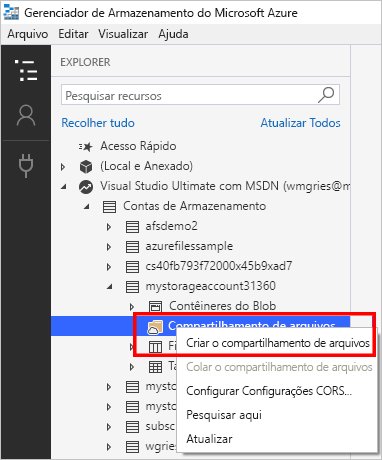
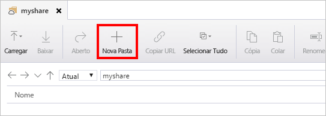

# Início Rápido: criar e gerenciar compartilhamentos de arquivos do Gerenciador de Armazenamento do Azure
Este guia percorre os fundamentos de trabalhar com [compartilhamentos de arquivos do Azure](storage-files-introduction.md) com o Gerenciador de Armazenamento do Azure. Os compartilhamentos de arquivos do Azure são iguais a outros compartilhamentos de arquivos, mas são armazenados na nuvem e compatíveis com a plataforma do Azure. Os compartilhamentos de Arquivos do Azure oferecem suporte ao protocolo SMB padrão do setor e habilitar o compartilhamento de arquivos entre vários computadores, aplicativos e instâncias. 

O Gerenciador de Armazenamento do Azure é uma ferramenta popular de cliente disponível para Windows, macOS e Linux. Você pode usar o Gerenciador de Armazenamento para gerenciar compartilhamentos de arquivo e outros recursos de armazenamento.

Se você não tiver uma assinatura do Azure, crie uma [conta gratuita](https://azure.microsoft.com/free/?WT.mc_id=A261C142F) antes de começar.

## Prerequisites
Este guia de início rápido requer que o Gerenciador de Armazenamento esteja instalado. Para baixá-lo e instalá-lo, vá até [Gerenciador de Armazenamento do Azure](https://azure.microsoft.com/features/storage-explorer/).

## Criar uma conta de armazenamento
Você não pode usar o Gerenciador de Armazenamento para criar novos recursos. Para esta demonstração, crie a conta de armazenamento no [Portal do Azure](https://portal.azure.com/). 

[!INCLUDE [storage-files-create-storage-account-portal](../../../includes/storage-files-create-storage-account-portal.md)]

## Conecte o Gerenciador de Armazenamento aos recursos do Azure
Quando você iniciar o Gerenciador de Armazenamento pela primeira vez, a janela **Gerenciador de Armazenamento do Microsoft Azure - Conectar** será exibida. O Gerenciador de Armazenamento fornece várias maneiras de se conectar às contas de armazenamento: 

- **Entre usando a sua conta do Azure**: Você pode entrar usando as credenciais do usuário para a sua organização ou a sua conta da Microsoft. 
- **Conecte-se a uma conta de armazenamento específica usando uma cadeia de conexão ou um token SAS**: Uma cadeia de conexão é uma cadeia de caracteres especial que contém um nome de conta de armazenamento e a chave da conta de armazenamento/token SAS. Com o token, o Gerenciador de Armazenamento acessa diretamente a conta de armazenamento (ao invés de simplesmente ver todas as contas de armazenamento em uma conta do Azure). Para saber mais sobre cadeias de conexão, confira [Configurar cadeia de conexão do Armazenamento do Azure](../common/storage-configure-connection-string.md?toc=%2fazure%2fstorage%2ffiles%2ftoc.json).
- **Conectar-se a uma conta de armazenamento específico usando um nome de conta de armazenamento e uma chave**: use o nome e a chave da conta de armazenamento para se conectar ao armazenamento do Azure.

Para os fins deste início rápido, entre com sua conta do Azure. Selecione **Adicionar uma Conta do Azure** e, em seguida, selecione **Entrar**. Siga os prompts para entrar na sua conta do Azure.

### Criar um compartilhamento de arquivos
Para criar seu primeiro compartilhamento de arquivos do Azure na conta de armazenamento `storageacct<random number>`:

1. Expanda a conta de armazenamento que você criou.
2. Clique duas vezes em **Compartilhamentos de Arquivos** e selecione **Criar Compartilhamento de Arquivos**.  
    

3. Para o compartilhamento de arquivos, insira *myshare* e pressione Enter.

Os nomes de compartilhamento podem conter somente letras em minúsculas, números e hifens (mas não podem começar com um hífen). Para obter detalhes completos sobre como nomear arquivos e compartilhamentos de arquivos, confira [Nomenclatura e referência de compartilhamentos, diretórios, arquivos e metadados](https://docs.microsoft.com/rest/api/storageservices/Naming-and-Referencing-Shares--Directories--Files--and-Metadata).

Após o compartilhamento de arquivos ter sido criado, uma guia para o seu compartilhamento de arquivos é exibida no painel à direita. 

## Usar o compartilhamento de arquivos do Azure
Agora que você criou um compartilhamento de arquivos do Azure, pode montar o compartilhamento de arquivos com SMB no [Windows](storage-how-to-use-files-windows.md), no [Linux](storage-how-to-use-files-linux.md) ou no [macOS](storage-how-to-use-files-mac.md). Como alternativa, você pode trabalhar com o compartilhamento de arquivos do Azure usando o Gerenciador de Armazenamento do Azure. A vantagem de usar o Gerenciador de Armazenamento do Azure em vez de montar o compartilhamento de arquivos usando SMB é que todas as solicitações feitas por meio do Gerenciador de Armazenamento do Azure são realizadas com o uso da API REST de arquivo. Você pode usar a API REST para criar, modificar e excluir arquivos e diretórios em clientes que não possuam acesso ao SMB.

### Criar um diretório
A adição de um diretório fornece uma estrutura hierárquica para gerenciar o compartilhamento de arquivos. Você pode criar vários níveis no seu diretório. No entanto, você deve garantir a existência de todos os diretórios pai antes de criar subdiretórios. Por exemplo, para o caminho myDirectory/mySubDirectory, você deve primeiro criar o diretório *myDirectory*. Em seguida, você deve criar o subdiretório *mySubDirectory*. 

1. Na guia para o compartilhamento de arquivos, no menu superior, selecione o botão **Nova pasta**. O painel **Criar novo diretório** é exibido.
    

2. Para o nome do diretório, insira *myDirectory*, e selecione **OK**. 

O diretório *myDirectory* será listado na guia para o compartilhamento de arquivos *myshare*.

### Carregar um arquivo 
Você pode carregar um arquivo do computador local para o novo diretório em seu compartilhamento de arquivos. Você pode carregar uma pasta inteira ou um único arquivo.

1. No menu superior, selecione **Carregar**. Essa operação dá a opção de carregar um arquivo ou uma pasta.
2. Selecione **Carregar arquivo** e selecione um arquivo do computador local a ser carregado.
3. Em **Carregar em um diretório**, insira *myDirectory* e selecione **Carregar**. 

Quando terminar, o arquivo é exibido em uma lista no painel *myDirectory*.

### Baixar um arquivo
Para baixar uma cópia de um arquivo do seu compartilhamento de arquios, clique com o botão direito no arquivo e, em seguida, selecione **Baixar**. Escolha onde deseja colocar o arquivo em seu computador local e selecione **Salvar**.

O andamento do download é exibido no painel **Atividades** na parte inferior da janela.

## Limpar os recursos
Você não pode usar o Gerenciador de Armazenamento para remover recursos. Para limpar com este guia de início rápido, você pode usar o [portal do Azure](https://portal.azure.com/). 

[!INCLUDE [storage-files-clean-up-portal](../../../includes/storage-files-clean-up-portal.md)]

## Próximas etapas

> [!div class="nextstepaction"]
> [O que Arquivos do Azure?](storage-files-introduction.md)
