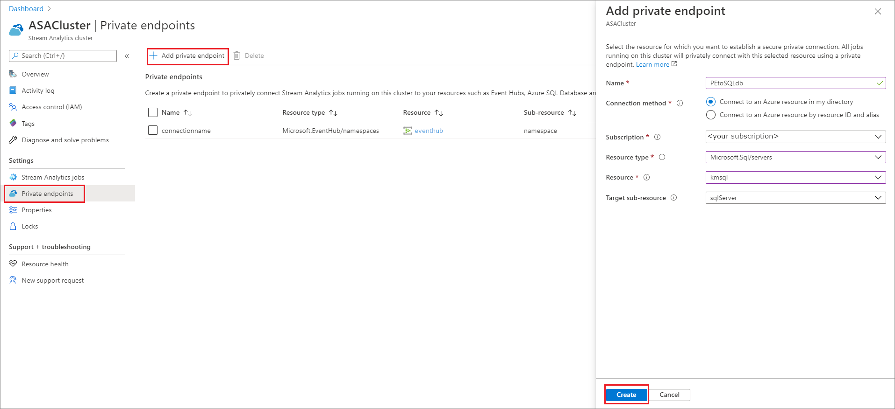

# Criar e excluir pontos de extremidade privados em um cluster do Azure Stream Analytics

Você pode conectar os seus trabalhos do Azure Stream Analytics em execução em um cluster para a entrada e a saída de recursos que são protegidos por um firewall ou por uma VNet (Rede Virtual) do Azure. Primeiro, você cria um ponto de extremidade privado para um recurso, como o Hub de Eventos do Azure ou o Banco de Dados SQL do Azure, no cluster do Stream Analytics. Em seguida, aprove a conexão de ponto de extremidade privado da entrada ou saída.

Depois de aprovar a conexão, qualquer trabalho em execução no cluster do Stream Analytics terá acesso ao recurso por meio do ponto de extremidade privado. Este artigo mostra como criar e excluir pontos de extremidade privados em um cluster do Stream Analytics.

## Criar um ponto de extremidade privado no cluster do Stream Analytics

Nesta seção, você aprenderá a criar um ponto de extremidade privado em um cluster do Stream Analytics.

1. No portal do Azure, localize e selecione seu cluster do Stream Analytics.

1. Em **Configurações**, selecione **Pontos de extremidade privados**.

1. Selecione **Adicionar ponto de extremidade privado** e insira as informações a seguir para escolher o recurso que você deseja acessar com segurança por meio de um ponto de extremidade privado.

   |Configuração|Valor|
   |---|---|
   |Nome|Insira qualquer nome para seu ponto de extremidade privado. Se esse nome já estiver sendo usado, crie um nome exclusivo.|
   |Método de conexão|Selecione **Conectar-se a um recurso do Azure em meu diretório**.  Você pode escolher um dos seus recursos para se conectar com segurança usando o ponto de extremidade privado ou pode se conectar ao recurso de outra pessoa usando uma ID do recurso ou um alias que ela compartilhou com você.|
   |Subscription|Selecione sua assinatura.|
   |Tipo de recurso|Escolha o [tipo de recurso que é mapeado para o seu recurso](../private-link/private-endpoint-overview.md#private-link-resource).|
   |Recurso|Selecione o recurso ao qual você deseja se conectar usando o ponto de extremidade privado.|
   |Sub-recurso de destino|O tipo de sub-recurso para o recurso selecionado acima que o seu ponto de extremidade privado será capaz de acessar.|

   

1. Aprove a conexão do recurso de destino. Por exemplo, se você criou um ponto de extremidade privado para uma instância do Banco de Dados SQL do Azure na etapa anterior, deverá acessar essa instância e ver uma conexão pendente que deve ser aprovada. Pode levar alguns minutos para que a solicitação de conexão seja exibida.

    

1. Você pode voltar para o cluster do Stream Analytics para ver a alteração de estado de **Aprovação de cliente pendente** para **Configuração de DNS Pendente** e para **Configuração completa** em alguns minutos.

## Excluir um ponto de extremidade privado no cluster do Stream Analytics

1. No portal do Azure, localize e selecione seu cluster do Stream Analytics.

1. Em **Configurações**, selecione **Pontos de extremidade privados**.

1. Selecione o ponto de extremidade privado que você deseja excluir e selecione **Excluir**.

   

## Próximas etapas

Agora você tem uma visão geral de como gerenciar pontos de extremidade privados em um cluster do Azure Stream Analytics. Em seguida, você pode aprender a escalar os seus clusters e executar trabalhos no seu cluster:

* [Escalar um cluster do Azure Stream Analytics](scale-cluster.md)
* [Gerenciar trabalhos do Stream Analytics em um cluster do Stream Analytics](manage-jobs-cluster.md)