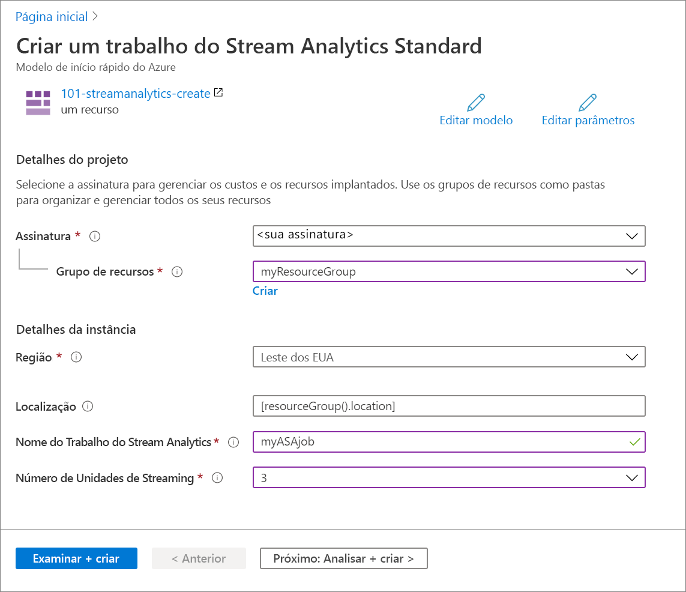

# <a name="quickstart-create-an-azure-stream-analytics-job-by-using-the-azure-resource-manager-template"></a>Início Rápido: Criar um trabalho do Azure Stream Analytics usando o modelo do Azure Resource Manager

Neste início rápido, você usará um modelo do Azure Resource Manager para criar um trabalho do Azure Stream Analytics. Depois que o trabalho for criado, você validará a implantação.

[!INCLUDE [About Azure Resource Manager](../../includes/resource-manager-quickstart-introduction.md)]

## <a name="prerequisites"></a>Pré-requisitos

Para concluir este artigo, você precisará:

* Ter uma assinatura do Azure: [crie uma gratuitamente](https://azure.microsoft.com/free/).

## <a name="create-an-azure-stream-analytics-job"></a>Criar um trabalho do Azure Stream Analytics

### <a name="review-the-template"></a>Examinar o modelo

O modelo usado neste início rápido é proveniente dos [modelos de Início Rápido do Azure](https://github.com/Azure/azure-quickstart-templates/tree/master/101-streamanalytics-create).

:::code language="json" source="~/quickstart-templates/101-streamanalytics-create/azuredeploy.json" range="1-66":::

O recurso do Azure definido no modelo é [Microsoft.StreamAnalytics/StreamingJobs](https://docs.microsoft.com/azure/templates/microsoft.streamanalytics/2016-03-01/streamingjobs): criar um trabalho do Azure Stream Analytics. 

## <a name="deploy-the-template"></a>Implantar o modelo

Nesta seção, você criará um trabalho do Azure Stream Analytics usando o modelo do Azure Resource Manager.

1. Selecione a imagem a seguir para entrar no Azure e abrir um modelo. O modelo criar um trabalho do Azure Stream Analytics.

   [](https://portal.azure.com/#create/Microsoft.Template/uri/https%3A%2F%2Fraw.githubusercontent.com%2FAzure%2Fazure-quickstart-templates%2Fmaster%2F101-streamanalytics-create%2Fazuredeploy.json)

2. Forneça os valores necessários para criar seu trabalho do Azure Stream Analytics.

   

   Forneça os seguintes valores:

   |Propriedade  |Descrição  |
   |---------|---------|
   |**Assinatura**     | Na lista suspensa, selecione sua assinatura do Azure.        |
   |**Grupo de recursos**     | Especifique se deseja criar um novo grupo de recursos ou usar um existente. Um grupo de recursos é um contêiner que mantém os recursos relacionados a uma solução do Azure. Para obter mais informações, consulte [Visão geral do Grupo de Recursos do Azure](../azure-resource-manager/management/overview.md). |
   |**Região**     | Selecione **Leste dos EUA**. Para outras regiões disponíveis, consulte [serviços do Azure por região](https://azure.microsoft.com/regions/services/).        |
   |**Nome do Trabalho do Stream Analytics**     | Forneça um nome para o trabalho do Stream Analytics.      |
   |**Número de unidades de streaming**     |  Escolha o número de unidades de streaming necessário. Para saber mais, confira [Compreender e ajustar unidades de streaming](stream-analytics-streaming-unit-consumption.md).       |

3. Selecione **Examinar + Criar** e **Criar**.

## <a name="review-deployed-resources"></a>Examinar os recursos implantados

Use o portal do Azure para verificar o trabalho do Azure Stream Analytics ou use o script da CLI do Azure ou do Azure PowerShell a seguir para listar o recurso.

### <a name="azure-cli"></a>CLI do Azure

```azurecli-interactive
echo "Enter your Azure Stream Analytics job name:" &&
read streamAnalyticsJobName &&
echo "Enter the resource group where the Azure Stream Analytics job exists:" &&
read resourcegroupName &&
az stream-analytics job show -g $resourcegroupName -n $streamAnalyticsJobName
```

### <a name="azure-powershell"></a>Azure PowerShell

```azurepowershell-interactive
$resourceGroupName = Read-Host -Prompt "Enter the resource group name where your Azure Stream Analytics job exists"
(Get-AzResource -ResourceType "Microsoft.StreamAnalytics/StreamingJobs" -ResourceGroupName $resourceGroupName).Name
 Write-Host "Press [ENTER] to continue..."
```

## <a name="clean-up-resources"></a>Limpar os recursos

Se você pretende prosseguir com os tutoriais seguintes, mantenha esses recursos em vigor. Quando você não precisar mais do grupo de recursos, exclua-o, o que excluirá o trabalho do Azure Stream Analytics. Para excluir o grupo de recursos usando a CLI do Azure ou o Azure PowerShell:

### <a name="azure-cli"></a>CLI do Azure

```azurecli-interactive
echo "Enter the Resource Group name:" &&
read resourceGroupName &&
az group delete --name $resourceGroupName &&
echo "Press [ENTER] to continue ..."
```

### <a name="azure-powershell"></a>Azure PowerShell

```azurepowershell-interactive
$resourceGroupName = Read-Host -Prompt "Enter the Resource Group name"
Remove-AzResourceGroup -Name $resourceGroupName
Write-Host "Press [ENTER] to continue..."
```

## <a name="next-steps"></a>Próximas etapas

Neste início rápido, você criou um trabalho do Azure Stream Analytics usando um modelo do Azure Resource Manager e validou a implantação. Avance para o próximo artigo para saber como exportar um modelo do Azure Resource Manager de um trabalho existente usando o VS Code.

> [!div class="nextstepaction"]
> [Exportar um modelo do Azure Resource Manager de um trabalho do Azure Stream Analytics](resource-manager-export.md)
