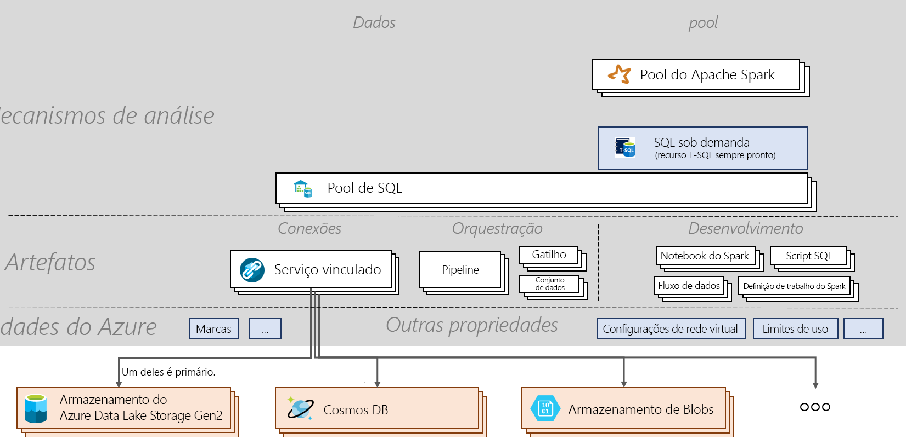

# Folha de referências do Azure Synapse Analytics

[!INCLUDE [preview](includes/note-preview.md)]

A folha de referências do Azure Synapse Analytics explicará os conceitos básicos do serviço e os comandos importantes. Este artigo é útil para os novos aprendizes e para aqueles que desejam conhecer os destaques dos tópicos essenciais do Azure Synapse.

## Arquitetura

> [!div class="mx-imgBorder"]
>

## Terminologia
| Termo                         | Definição      |
|:---                                 |:---                 |
| **Workspace do Synapse** | Um limite de colaboração protegível para fazer análises empresariais baseadas em nuvem no Azure. Um workspace é implantado em uma região específica e tem uma conta do ADLS Gen2 e um sistema de arquivos associados (para armazenar dados temporários). Um workspace está localizado em um grupo de recursos. |
| **SQL do Synapse**   | Execute análises com pools ou com funcionalidades sob demanda.  |
| **Pool de SQL**   | Os recursos provisionados do SQL de 0 a N com os bancos de dados correspondentes podem ser implantados em um workspace. Cada pool de SQL tem um banco de dados associado. Um pool de SQL pode ser escalado, colocado em pausa e retomado manual ou automaticamente. Um pool de SQL pode ser escalado de 100 DWUs até 30 mil DWUs.       |
| **SQL sob demanda**   | Sistema de processamento de dados distribuído criado para dados de grande escala que permite executar consultas T-SQL nos dados do data lake. Ele é sem servidor e, portanto, você não precisa gerenciar a infraestrutura.       |
|**Apache Spark para o Synapse** | Runtime do Spark usado em um Pool do Spark. A versão atual compatível é Spark 2.4 com Python 3.6.1, Scala 2.11.12, suporte do .NET para Apache Spark 0.5 e Delta Lake 0.3.  | 
| **Pool do Apache Spark**  | Os recursos provisionados do Spark de 0 a N com os bancos de dados correspondentes podem ser implantados em um workspace. Um Pool do Spark pode ser colocado em pausa automaticamente, retomado e escalado.  |
| **Aplicativo Spark**  |   Ele consiste em um processo de driver e em um conjunto de processos de executor. Um aplicativo Spark é executado em um Pool do Spark.            |
| **Sessão do Spark**  |   Ponto de entrada unificado de um aplicativo Spark. Ele fornece um modo de interagir com várias funcionalidades do Spark e com um número menor de constructos. Para executar um notebook, uma sessão precisará ser criada. Uma sessão pode ser configurada para ser executada em um número específico de executores de um tamanho específico. A configuração padrão de uma sessão de notebook é a execução em dois executores de tamanho médio. |
| **Solicitação do SQL**  |   Operação como uma execução de consulta por meio do pool de SQL ou do SQL sob demanda. |
|**Integração de dados**| Fornece a capacidade de ingerir dados entre várias fontes e orquestrar atividades em execução em um workspace ou fora dele.| 
|**Artefatos**| Conceito que encapsula todos os objetos necessários para que um usuário gerencie fontes de dados, desenvolva-as, orquestre-as e visualize-as.|
|**Notebook**| Interface interativa e reativa de Engenharia e Ciência de Dados que dá suporte ao Scala, ao PySpark, ao C# e ao SparkSQL. |
|**Definição de trabalho do Spark**|Interface usada para enviar um trabalho do Spark com o JAR do assembly contendo o código e as dependências.|
|**Fluxo de Dados**|  Fornece uma experiência totalmente visual sem nenhuma codificação necessária para fazer a transformação de Big Data. Toda a otimização e a execução são processadas sem servidor. |
|**Script SQL**| Conjunto de comandos SQL salvos em um arquivo. Um script SQL pode conter uma ou mais instruções SQL. Ele pode ser usado para executar solicitações do SQL por meio do pool de SQL ou do SQL sob demanda.|
|**Pipeline**| Agrupamento lógico de atividades que executam uma tarefa juntas.|
|**Atividade**| Define as ações a serem executadas nos dados, como copiar dados, executar um Notebook ou um script SQL.|
|**Gatilho**| Executa um pipeline. Pode ser executado manual ou automaticamente (agenda, janela em cascata ou baseada em evento).|
|**Serviço vinculado**| Cadeias de conexão que definem as informações de conexão necessárias para que o workspace se conecte a recursos externos.|
|**Conjunto de dados**|  Exibição nomeada de dados que apenas apontam para os dados ou referenciam os dados a serem usados em uma atividade como entrada e saída. Pertence a um serviço vinculado.|

## Próximas etapas

- [Criar um workspace](quickstart-create-workspace.md)
- [Usar o Synapse Studio](quickstart-synapse-studio.md)
- [Criar um pool de SQL](quickstart-create-sql-pool-portal.md)
- [Criar um Pool do Apache Spark](quickstart-create-apache-spark-pool-portal.md)
- [Usar o SQL sob demanda](quickstart-sql-on-demand.md)

