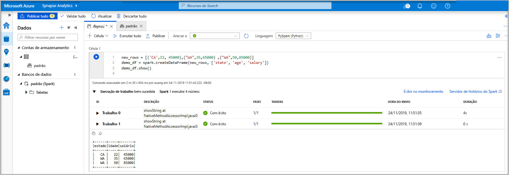
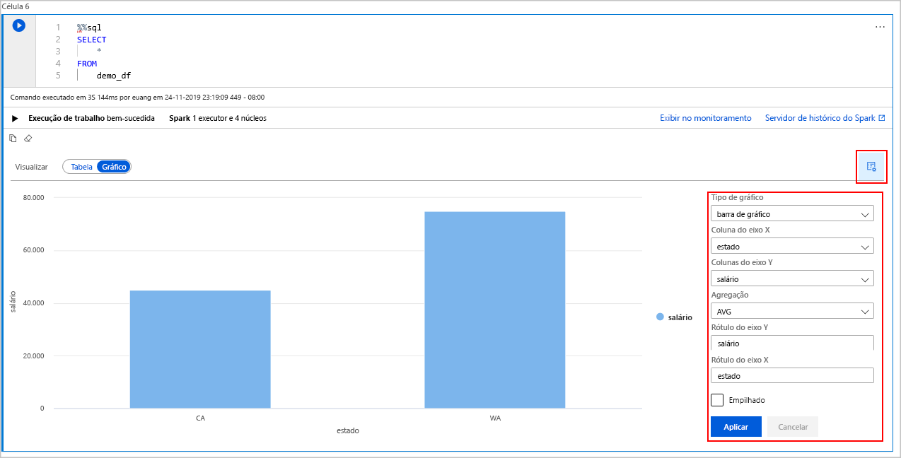

# <a name="quickstart-create-an-apache-spark-pool-preview-in-azure-synapse-analytics-using-web-tools"></a>Início Rápido: Criar um pool do Apache Spark (versão prévia) no Azure Synapse Analytics usando ferramentas da Web

Neste início rápido, você aprenderá a criar um Pool do Apache Spark (versão prévia) no Azure Synapse usando ferramentas da Web. Em seguida, você aprenderá a se conectar ao Pool do Apache Spark e executar consultas SQL do Spark em arquivos e tabelas. O Apache Spark permite análises rápidas de dados e computação de cluster usando processamento na memória. Para obter informações sobre o Spark no Azure Synapse, confira [Visão geral: Apache Spark no Azure Synapse](./spark/apache-spark-overview.md).

> [!IMPORTANT]
> A cobrança das instâncias do Spark será proporcional por minuto, independentemente de elas estarem sendo usadas ou não. Desligue a instância do Spark depois de terminar de usá-la ou defina um tempo limite curto. Para saber mais, confira a seção **Recursos de limpeza** deste artigo.

Se você não tiver uma assinatura do Azure, [crie uma conta gratuita antes de começar](https://azure.microsoft.com/free/).

## <a name="prerequisites"></a>Pré-requisitos

- Assinatura do Azure - [criar uma gratuitamente](https://azure.microsoft.com/free/)
- [Workspace do Synapse Analytics](quickstart-create-workspace.md)
- [Pool do Apache Spark](quickstart-create-apache-spark-pool.md)

## <a name="sign-in-to-the-azure-portal"></a>Entre no Portal do Azure

Entre no [portal do Azure](https://portal.azure.com/).

Se você não tiver uma assinatura do Azure, [crie uma conta gratuita](https://azure.microsoft.com/free/) antes de começar.

## <a name="create-a-notebook"></a>Criar um notebook

Um notebook é um ambiente interativo que dá suporte a várias linguagens de programação. O notebook permite que você interaja com seus dados, combine código com Markdown e texto e faça visualizações simples.

1. Na exibição do portal do Azure do workspace do Azure Synapse que deseja usar, selecione **Iniciar o Synapse Studio**.
2. Depois que o Synapse Studio for iniciado, selecione **Desenvolver**. Em seguida, posicione o cursor sobre a entrada **Notebooks**. Selecione as reticências ( **...** ).
3. Nessa opção, selecione **Novo notebook**. Um notebook será criado e aberto com um nome gerado automaticamente.
  

4. Na janela **Propriedades**, forneça um nome para o notebook.
5. Na barra de ferramentas, clique em **Publicar**.
6. Se houver apenas um Pool do Apache Spark no workspace, ele será selecionado por padrão. Use a lista suspensa para selecionar o Pool do Apache Spark correto se nenhum for selecionado.
7. Clique em **Adicionar código**. O idioma padrão é `Pyspark`. Você usará uma combinação do PySpark e do Spark SQL; portanto, a escolha padrão é boa.
8. Em seguida, você criará um objeto simples DataFrame do Spark para processamento. Nesse caso, você o criará com base no código. Há três linhas e três colunas:

   ```python
   new_rows = [('CA',22, 45000),("WA",35,65000) ,("WA",50,85000)]
   demo_df = spark.createDataFrame(new_rows, ['state', 'age', 'salary'])
   demo_df.show()
   ```

9. Agora, execute a célula usando um dos seguintes métodos:

   - Pressione **SHIFT+ENTER**.
   - Selecione o ícone de reprodução azul à esquerda da célula.
   - Selecione o botão **Executar todos** na barra de ferramentas.

   

10. Se a instância do Pool do Apache Spark ainda não estiver em execução, ela será iniciada automaticamente. Você poderá ver o status da instância do Pool do Apache Spark abaixo da célula que está sendo executada e também no painel de status na parte inferior do notebook. Dependendo do tamanho do pool, a inicialização deverá levar de 2 a 5 minutos. Quando o código terminar a execução, serão exibidas informações abaixo da célula, mostrando a duração da execução e a execução. Na célula de saída, você verá a saída.

    

11. Os dados agora existem em um DataFrame e, nele, você poderá usá-los de várias maneiras diferentes. Você precisará dele em formatos diferentes para o restante deste início rápido.
12. Insira o código abaixo em outra célula e execute-o; isso criará uma tabela do Spark, um CSV e um arquivo Parquet com as cópias dos dados:

    ```python
     demo_df.createOrReplaceTempView('demo_df')
     demo_df.write.csv('demo_df', mode='overwrite')
     demo_df.write.parquet('abfss://<<TheNameOfAStorageAccountFileSystem>>@<<TheNameOfAStorageAccount>>.dfs.core.windows.net/demodata/demo_df', mode='overwrite')
    ```

    Se você usar o gerenciador de armazenamento, poderá ver o impacto das duas maneiras diferentes de gravar um arquivo usadas acima. Quando nenhum sistema de arquivos for especificado, o padrão será usado, nesse caso, `default>user>trusted-service-user>demo_df`. Os dados são salvos na localização do sistema de arquivos especificada.

    Observe que, nos formatos "CSV" e "Parquet", as operações de gravação com a qual um diretório é criado com muitos arquivos particionados.

    

    

## <a name="run-spark-sql-statements"></a>Executar Instruções Spark SQL

A linguagem SQL (Structured Query Language) é a mais comum e amplamente usada para consultar e definição de dados. O Spark SQL funciona como uma extensão do Apache Spark para processar dados estruturados, usando a sintaxe SQL familiar.

1. Cole o código a seguir em uma célula vazia e, em seguida, execute o código. O comando lista as tabelas no pool.

   ```sql
   %%sql
   SHOW TABLES
   ```

   Ao usar um notebook com o pool do Apache Spark do Azure Synapse, você obtém um `sqlContext` predefinido que pode ser usado para executar consultas usando o Spark SQL. O `%%sql` instrui o notebook a usar o `sqlContext` predefinido para executar a consulta. A consulta recupera as dez primeiras linhas de uma tabela do sistema fornecida com todos os pools do Apache Spark do Azure Synapse por padrão.

2. Execute outra consulta para ver os dados em `demo_df`.

    ```sql
    %%sql
    SELECT * FROM demo_df
    ```

    O código produz duas células de saída: uma que contém os resultados de dados e a outra, que mostra a exibição do trabalho.

    Por padrão, a visualização dos resultados mostra uma grade. No entanto, há um seletor de exibição sob a grade que permite alternar entre as exibições de grade e de gráfico.

    

3. No seletor **Exibir**, escolha **Gráfico**.
4. Escolha o ícone **Exibir opções** no lado direito.
5. No campo **Tipo de gráfico**, selecione "gráfico de barras".
6. No campo de coluna do eixo X, selecione "estado".
7. No campo de coluna do eixo Y, selecione "salário".
8. No campo **Agregação**, selecione "MÉD".
9. Escolha **Aplicar**.

   

10. É possível obter a mesma experiência de executar o SQL, mas sem precisar alternar linguagens. Faça isso substituindo a célula SQL acima por esta célula do PySpark; a experiência de saída é a mesma porque o comando **display** é usado:

    ```python
    display(spark.sql('SELECT * FROM demo_df'))
    ```

11. Cada uma das células executadas anteriormente tinha a opção de acesso ao **Servidor de Histórico** e ao **Monitoramento**. Ao clicar nos links, você será levado a diferentes partes da experiência do usuário.

## <a name="clean-up-resources"></a>Limpar os recursos

O Azure Synapse salva os dados no Azure Data Lake Storage. Você pode deixar uma instância do Spark desligada com segurança quando ela não está em uso. Você é cobrado pelo pool do Apache Spark do Azure Synapse enquanto ele está em execução, mesmo quando não está em uso. O preço do pool é muito mais alto do que o do armazenamento. Sendo assim, em termos econômicos faz sentido deixar que as instâncias do Spark sejam desligadas quando não estão em uso.

Para garantir que a instância do Spark seja desligada, encerre todas as sessões conectadas (notebooks). O pool é desligado quando o **tempo ocioso** especificado no Pool do Apache Spark é atingido. Escolha também **Encerrar sessão** na barra de status na parte inferior do notebook.

## <a name="next-steps"></a>Próximas etapas

Neste início rápido, você aprendeu a criar um pool do Apache Spark do Azure Synapse e a executar uma consulta SQL básica do Spark.

- [Azure Synapse Analytics](overview-what-is.md)
- [Documentação do .NET para Apache Spark](/dotnet/spark?toc=/azure/synapse-analytics/toc.json&bc=/azure/synapse-analytics/breadcrumb/toc.json)
- [Documentação oficial do Apache Spark](https://spark.apache.org/docs/latest/)

>[!NOTE]
> Algumas das documentações oficiais do Apache Spark dependem do uso do console do Spark, que não está disponível no Azure Synapse Spark. Use as experiências de [notebook](quickstart-apache-spark-notebook.md) ou do [IntelliJ](./spark/intellij-tool-synapse.md).
