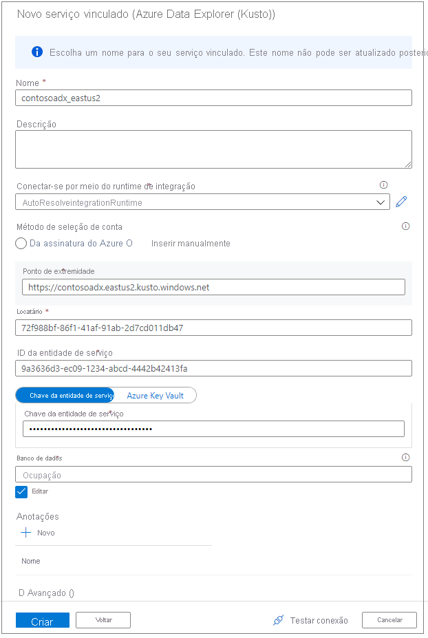

# Conectar ao Azure Data Explorer usando o Apache Spark do Synapse

Este artigo descreve como acessar um banco de dados do Azure Data Explorer por meio do Synapse Studio com o Apache Spark do Synapse. 

## Pré-requisitos

* [Criar um cluster e um banco de dados no Azure Data Explorer](/azure/data-explorer/create-cluster-database-portal).
* Espaço de trabalho Synapse existente ou criar um novo espaço de trabalho após este [início rápido](./quickstart-create-workspace.md) 
* Pool do Apache Spark do Synapse existente ou criar um pool seguindo este [início rápido](./quickstart-create-apache-spark-pool-portal.md)
* [Crie o aplicativo do Azure AD provisionando um aplicativo do Azure AD.](/azure/data-explorer/kusto/management/access-control/how-to-provision-aad-app)
* Conceder ao seu aplicativo do Azure AD acesso ao banco de dados seguindo [Gerenciar permissões de banco de dados do Azure Data Explorer](/azure/data-explorer/manage-database-permissions)

## Navegar até o Synapse Studio

Em um workspace do Azure Synapse, selecione **Inicializar Synapse Studio**. Na home page do Synapse Studio, selecione **Dados**, o que o levará ao **Pesquisador de Objetos de Dados**.

## Conectar um banco de dados do Azure Data Explorer a um workspace do Azure Synapse

A conexão de um banco de dados do Azure Data Explorer a um workspace é feita por meio de um serviço vinculado. Um serviço vinculado do Azure Data Explorer permite que os usuários naveguem e explorem dados, leiam e gravem do Apache Spark no Azure Synapse Analytics e executem trabalhos de integração em um pipeline.

No Pesquisador de Objetos de Dados, siga estas etapas para conectar diretamente um cluster do Azure Data Explorer:

1. Selecione o ícone **+** ao lado de Dados.
2. Selecione **Conectar** a dados externos
3. Selecione **Azure Data Explorer (Kusto)**
5. Selecione **Continuar**
6. Nomeie o serviço vinculado. O nome será exibido no Pesquisador de Objetos e usado pelos runtimes do Azure Synapse para conectar ao banco de dados. Recomendamos usar um nome amigável
7. Selecione o cluster do Azure Data Explorer da sua assinatura ou insira o URI.
8. Insira a "ID da entidade de serviço" e a "Chave da entidade de serviço" (essa entidade de serviço deve ter acesso de exibição no banco de dados para a operação de leitura e acesso de ingestão para ingestão de dados)
9. Insira o nome do banco de dados do Azure Data Explorer
10. Clique em **Testar conectividade** para verificar se você tem as permissões corretas
11. Escolha **Criar**

    

    > [!NOTE]
    > (Opcional) O teste de conexão não valida o acesso de gravação; verifique se a ID da entidade de serviço tem acesso de gravação ao banco de dados do Azure Data Explorer.

12. Os clusters e bancos de dados do Azure Data Explorer são visíveis na guia **Vinculado** na seção Azure Data Explorer. 

    

    > [!NOTE] 
    > Na versão atual, os objetos de banco de dados são populados com base nas permissões da sua conta do AAD nos banco de dados do Azure Data Explorer. Quando você executa notebooks do Apache Spark ou os trabalhos de integração, a credencial do serviço de link será usada (por exemplo, a Entidade de serviço).

## Interagir rapidamente com ações geradas por código

* Ao clicar com o botão direito do mouse em um banco de dados ou uma tabela, você terá uma lista de gestos que dispararão um exemplo de notebook do Spark para leitura de dados, gravação de dados, transmissão de dados para o Azure Data Explorer. 
    

* Veja um exemplo de leitura de dados. O Notebook foi anexado ao Pool do Spark e a célula  foi executada

   > [!NOTE] 
   > A execução pela primeira vez pode causar demora de mais de três minutos para iniciar a sessão do Spark. As execuções subsequentes serão significativamente mais rápidas.  

## Limitações
Atualmente, o conector do Azure Data Explorer não é compatível com VNET gerenciada do Azure Synapse.

## Próximas etapas

* [Código de exemplo com opções avançadas](https://github.com/Azure/azure-kusto-spark/blob/master/samples/src/main/python/SynapseSample.py)
* [Conector do Spark do Azure Data Explorer (Kusto)](https://github.com/Azure/azure-kusto-spark)