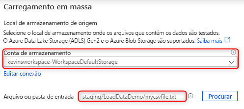
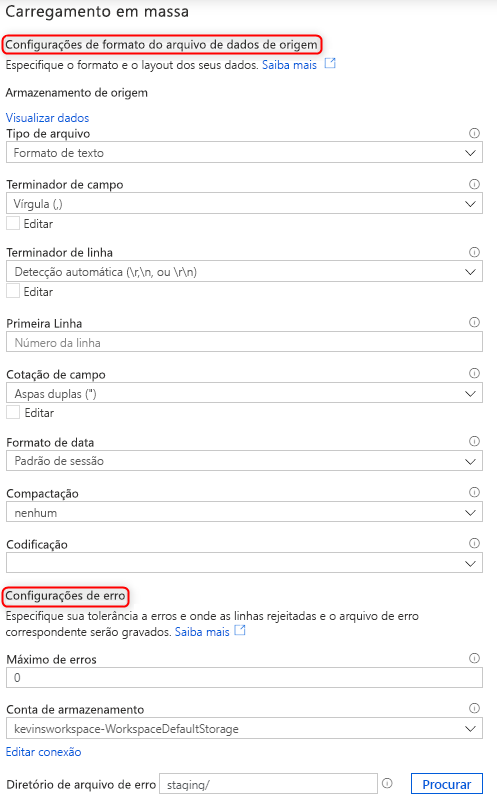
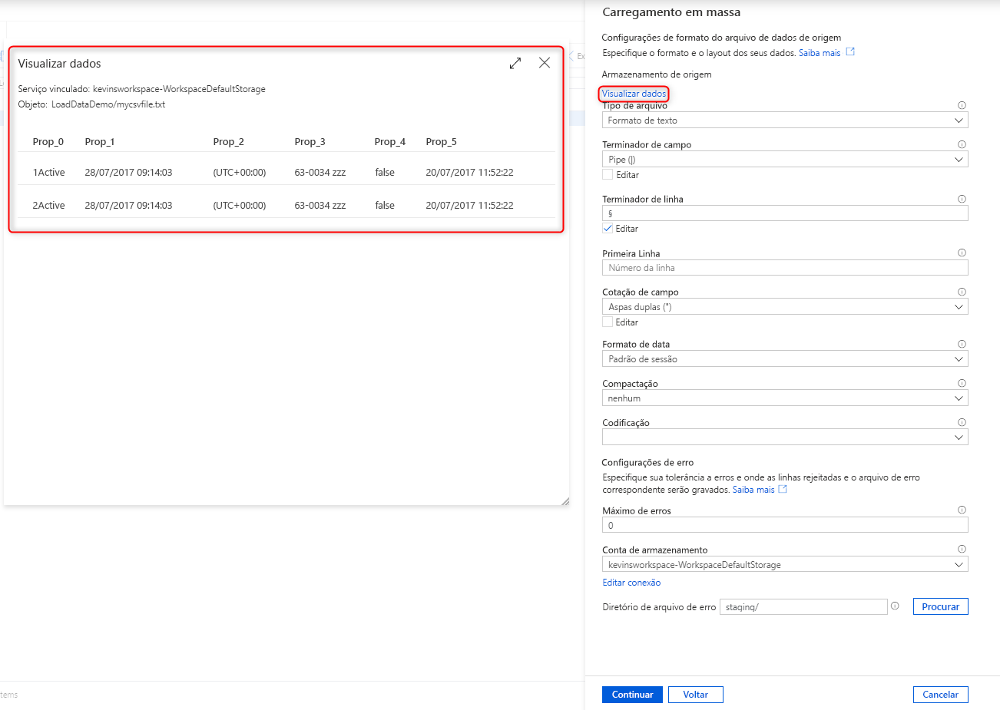
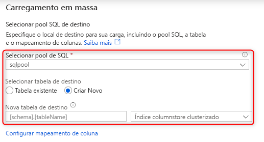
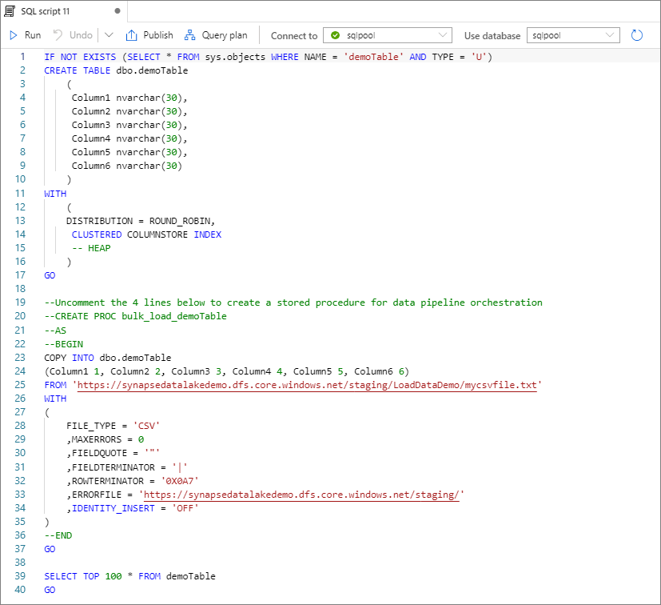

# Carregar em massa com o SQL do Synapse

Carregar dados nunca foi tão fácil usando o assistente de Carregamento em Massa no Synapse Studio. Este assistente orientará você na criação de um script T-SQL com a [instrução COPY](https://docs.microsoft.com/sql/t-sql/statements/copy-into-transact-sql?view=azure-sqldw-latest) para carregar dados em massa. 

## Pontos de entrada para o assistente de Carregamento em Massa

Agora você pode carregar dados em massa facilmente usando pools de SQL com um simples clique com o botão direito do mouse nas seguintes áreas dentro do Synapse Studio:

- Um arquivo ou pasta de uma conta de armazenamento do Azure anexada ao seu workspace 

## Pré-requisitos

- Este assistente gera uma instrução COPY que usa a passagem do AAD para autenticação. Seu [usuário do AAD deve ter acesso](https://docs.microsoft.com/azure/synapse-analytics/sql-data-warehouse/quickstart-bulk-load-copy-tsql-examples#d-azure-active-directory-authentication-aad) ao workspace com, pelo menos, a função do Azure de Colaborador de Dados do Blob de Armazenamento para a conta ADLS Gen2.

- Você deve ter as permissões [necessárias para usar a instrução COPY](https://docs.microsoft.com/sql/t-sql/statements/copy-into-transact-sql?view=azure-sqldw-latest#permissions) e as permissões Create Table se estiver criando uma tabela na qual carregar.

- O serviço vinculado associado à conta do ADLS Gen2 **deve ter acesso ao arquivo**/**à pasta** a ser carregada. Por exemplo, se o mecanismo de autenticação do serviço vinculado for uma Identidade Gerenciada, a identidade gerenciada do workspace deverá ter, pelo menos, a permissão Leitor de blob de armazenamento na conta de armazenamento.

- Se a VNet estiver habilitada em seu workspace, verifique se o runtime integrado associado aos serviços vinculados da Conta do ADLS Gen2 para a localização do arquivo de erro e dos dados de origem tem a criação interativa habilitada. A criação interativa é necessária para detecção de esquema automático, visualização do conteúdo do arquivo de origem e busca de contas de armazenamento do ADLS Gen2 no assistente.

### Etapas

1. No painel Local de armazenamento de origem, selecione a conta de armazenamento e o arquivo ou a pasta da qual você está carregando: 

2. Selecione as configurações do formato de arquivo, incluindo a conta de armazenamento em que você deseja escrever linhas rejeitadas (arquivo de erro). No momento, há suporte somente a arquivos CSV e Parquet.

    

3. Você pode clicar em “Visualizar dados” para ver como a instrução COPY analisará o arquivo para ajudar você a definir as configurações de formato de arquivo. Clique em "Visualizar dados" toda vez que você alterar uma configuração de formato de arquivo para ver como a instrução COPY analisará o arquivo com a configuração atualizada:  

4. Selecione o pool de SQL que você está usando para carregar, incluindo se a carga será para uma tabela nova ou existente: 

5. Clique em “Configurar mapeamento de coluna” para verificar se você tem o mapeamento de coluna apropriado. Para novas tabelas, configurar o mapeamento de coluna é crítico para atualizar os tipos de dados da coluna de destino: 

6. Clique em "Abrir script" e um script T-SQL será gerado com a instrução COPY a ser carregada do data lake: 

## Próximas etapas

- Confira o artigo sobre a [instrução COPY](https://docs.microsoft.com/sql/t-sql/statements/copy-into-transact-sql?view=azure-sqldw-latest#syntax) para obter mais informações sobre as funcionalidades dela
- Confira o artigo [visão geral do carregamento de dados](https://docs.microsoft.com/azure/synapse-analytics/sql-data-warehouse/design-elt-data-loading#what-is-elt)
