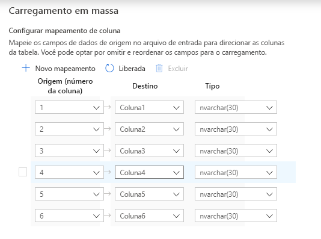

# Início Rápido: Carregar em massa com o SQL do Synapse

Carregar dados nunca foi tão fácil usando o assistente de Carregamento em Massa no Synapse Studio. Este assistente orientará você na criação de um script T-SQL com a [instrução COPY](/sql/t-sql/statements/copy-into-transact-sql?view=azure-sqldw-latest&preserve-view=true) para carregar dados em massa. 

## Pontos de entrada para o assistente de Carregamento em Massa

Agora você pode realizar com facilidade o carregamento em massa de dados usando pools de SQL dedicados com um simples clique com o botão direito do mouse nas seguintes áreas dentro do Synapse Studio:

- Um arquivo ou pasta de uma conta de armazenamento do Azure anexada ao seu workspace 

## Pré-requisitos

- O assistente gera uma instrução COPY, que usa a passagem do Azure AD para autenticação. Seu [usuário do Azure AD deve ter acesso](
./sql-data-warehouse/quickstart-bulk-load-copy-tsql-examples.md#d-azure-active-directory-authentication) ao workspace com pelo menos a função do Azure de Colaborador de Dados do Blob de Armazenamento para a conta do ADLS Gen2. 

- Será preciso ter as [permissões necessárias para usar a instrução COPY](/sql/t-sql/statements/copy-into-transact-sql?view=azure-sqldw-latest&preserve-view=true#permissions) e as permissões Create table se estiver criando uma tabela na qual carregar.

- O serviço vinculado associado à conta do ADLS Gen2 **deve ter acesso ao arquivo**/**à pasta** a ser carregada. Por exemplo, se o mecanismo de autenticação do serviço vinculado for uma Identidade Gerenciada, a identidade gerenciada do workspace deverá ter, pelo menos, a permissão Leitor de blob de armazenamento na conta de armazenamento.

- Se a VNet estiver habilitada em seu workspace, verifique se o runtime integrado associado aos serviços vinculados da Conta do ADLS Gen2 para a localização do arquivo de erro e dos dados de origem tem a criação interativa habilitada. A criação interativa é necessária para a detecção de esquema automático, visualização do conteúdo do arquivo de origem e busca de contas de armazenamento do ADLS Gen2 no assistente.

### Etapas

1. No painel Local de armazenamento de origem, selecione a conta de armazenamento e o arquivo ou a pasta da qual você está carregando. O assistente tentará detectar automaticamente os arquivos Parquet. Se o tipo de arquivo Parquet não puder ser confirmado, o texto delimitado (CSV) será usado por padrão.

   

2. Selecione as configurações do formato de arquivo, incluindo a conta de armazenamento em que você deseja escrever linhas rejeitadas (arquivo de erro). No momento, há suporte somente a arquivos CSV e Parquet.

    

3. Selecione "Visualizar dados" para ver como a instrução COPY analisará o arquivo para ajudar você a definir as configurações de formato de arquivo. Clique em "Visualizar dados" toda vez que você alterar uma configuração de formato de arquivo para ver como a instrução COPY analisará o arquivo com a configuração atualizada:  

> [!NOTE]  
>
> - Não há suporte para a visualização dos dados com terminadores de campo de vários caracteres no assistente de carregamento em massa. O assistente de carregamento em massa visualizará os dados em uma só coluna quando um terminador de campo de vários caracteres for especificado. 
> - Há suporte para a especificação de terminadores de linha de vários caracteres na instrução COPY; no entanto, não há suporte para ela no assistente de carregamento em massa, em que um erro será gerado.

4. Selecione o pool de SQL dedicado que você está usando para carregar, incluindo se a carga será para uma tabela nova ou existente: 

5. Clique em "Configurar mapeamento de coluna" para verificar se você tem o mapeamento de coluna apropriado. Observação: os nomes de colunas serão detectados automaticamente se a opção "Inferir nomes de colunas" estiver habilitada. Para novas tabelas, configurar o mapeamento de coluna é crítico para atualizar os tipos de dados da coluna de destino: 

6. Clique em "Abrir script" e um script T-SQL será gerado com a instrução COPY a ser carregada do data lake: 

## Próximas etapas

- Confira o artigo sobre a [instrução COPY](/sql/t-sql/statements/copy-into-transact-sql?view=azure-sqldw-latest&preserve-view=true#syntax) para obter mais informações sobre as funcionalidades dela
- Confira o artigo [visão geral do carregamento de dados](./sql-data-warehouse/design-elt-data-loading.md#what-is-elt)
