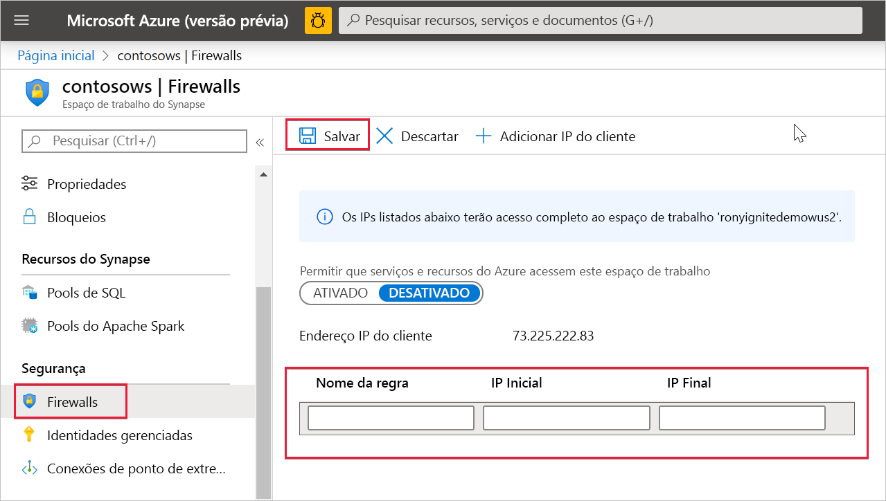

# Regras de firewall de IP do Azure Synapse Analytics (versão prévia)

Este artigo explicará as regras de firewall de IP e ensinará a configurá-las no Azure Synapse Analytics.

## Regras de firewall de IP

As regras de firewall de IP permitem ou negam acesso ao seu workspace do Synapse com base no endereço IP de origem de cada solicitação. Configure regras de firewall de IP para o seu workspace. As regras de firewall de IP configuradas no nível do workspace se aplicam a todos os pontos de extremidade públicos do workspace (pools de SQL, SQL sob demanda e desenvolvimento).

## Criar e gerenciar regras de firewall de IP

Há duas maneiras de adicionar regras de firewall de IP a um workspace do Synapse. Para adicionar um firewall de IP ao workspace, selecione **Segurança + Rede** e marque a opção **Permitir conexões de todos os endereços IP** durante a criação do workspace.

Adicione também regras de firewall de IP a um workspace do Synapse após a criação do workspace. Selecione **Firewalls** em **Segurança** no portal do Azure. Para adicionar uma nova regra de firewall de IP, dê a ela um nome, um IP inicial e um IP final. Selecione **Salvar** quando terminar.

## Conectar-se ao Synapse de sua própria rede

Conecte-se ao seu workspace do Synapse usando o Synapse Studio. Use também o SSMS (SQL Server Management Studio) para se conectar aos recursos do SQL (pools de SQL e SQL sob demanda) no workspace.

Verifique se o firewall na rede e no computador local permite a comunicação de saída nas portas TCP 80, 443 e 1443 do Synapse Studio.

Além disso, você precisa permitir a comunicação de saída na porta UDP 53 do Synapse Studio. Para se conectar usando ferramentas como o SSMS e o Power BI, você precisará permitir a comunicação de saída na porta TCP 1433.

Se você estiver usando a configuração de política de conexão de redirecionamento padrão, poderá precisar permitir a comunicação de saída em portas adicionais. Saiba mais sobre as políticas de conexão [aqui](https://docs.microsoft.com/azure/sql-database/sql-database-connectivity-architecture#connection-policy).

## Próximas etapas

Criar um [Workspace do Azure Synapse](../quickstart-create-workspace.md)

Criar um workspace do Azure Synapse com uma [Rede Virtual de workspace gerenciada](./synapse-workspace-managed-vnet.md)