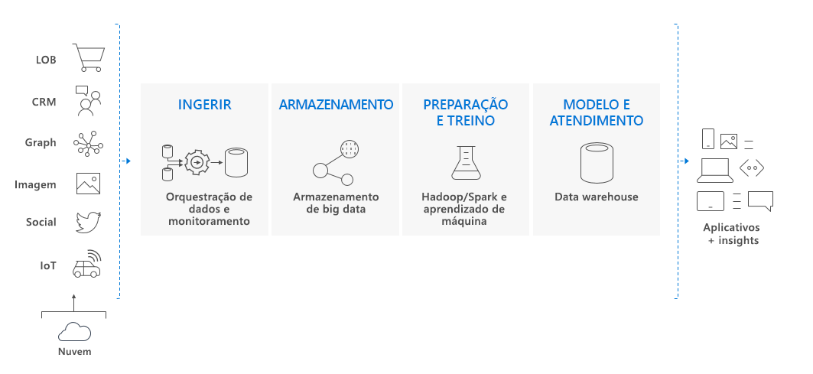

# O que é o Azure Synapse Analytics (antigo SQL DW)?

O Azure Synapse é um serviço de análise ilimitado que reúne data warehouse empresarial e análise de Big Data. Ele oferece a liberdade para consultar dados da forma que você quiser, usando recursos sob demanda sem servidor ou provisionados em escala. O Azure Synapse conecta esses dois mundos com uma experiência unificada para ingerir, preparar, gerenciar e fornecer dados para necessidades imediatas de BI e aprendizado de máquina

O Azure Synapse tem quatro componentes:

- SQL do Synapse: Análise baseada em T-SQL completa, disponibilidade geral
  - Pool do SQL (pagamento por DWU provisionado)
  - SQL sob demanda (pagamento por TB processado, versão prévia)
- Spark: Apache Spark profundamente integrado (versão prévia)
- Integração de dados: Integração de dados híbridos (versão prévia)
- Estúdio: Experiência de usuário unificada.  (Visualização)

> [!NOTE]
> Para acessar os recursos de versão prévia do Azure Synapse, solicite o acesso [aqui](https://aka.ms/synapsepreview). A Microsoft fará a triagem de todas as solicitações e responderá assim que possível.

## Pool de SQL do Synapse no Azure Synapse

O pool de SQL do Synapse refere-se aos recursos corporativos de data warehousing que estão em disponibilidade geral no Azure Synapse.

O pool de SQL representa uma coleção de recursos de análise que estão sendo provisionados ao usar o SQL do Synapse. O tamanho do pool do SQL é determinado pelas DWU (unidades de data warehouse).

Importe big data com consultas T-SQL simples do [PolyBase](/sql/relational-databases/polybase/polybase-guide?toc=/azure/synapse-analytics/sql-data-warehouse/toc.json&bc=/azure/synapse-analytics/sql-data-warehouse/breadcrumb/toc.json&view=azure-sqldw-latest) e, em seguida, use o poder do MPP para executar a análise de alto desempenho. À medida que você integrar e analisar, o pool de SQL do Synapse se tornará a única versão da verdade com que sua empresa poderá contar para obter informações mais rápidas e robustas.  

## Componente fundamental de uma solução de big data

Data warehouse é um componente fundamental de uma solução completa de big data baseada na nuvem.

Em uma solução de dados de nuvem, os dados são incluídos nos repositórios de big data de uma variedade de fontes. Uma vez em um repositório de big data, os algoritmos do Hadoop, do Spark e de machine learning preparam e treinam os dados. Quando os dados estiverem prontos para análises complexas, o pool de SQL do Synapse usará o PolyBase para consultar os armazenamentos de Big Data. O PolyBase usa consultas T-SQL padrão para trazer os dados para as tabelas do pool de SQL do Synapse.

O pool de SQL do Synapse armazena dados em tabelas relacionais com armazenamento em colunas. Esse formato reduz consideravelmente os custos de armazenamento de dados e melhora o desempenho da consulta. Depois que os dados forem armazenados, você poderá executar análises em grande escala. Em comparação aos tradicionais sistemas de banco de dados, as consultas de análise são concluídas em segundos em vez de minutos, ou em horas em vez de dias.

Os resultados da análise podem ir para aplicativos ou bancos de dados em todo o mundo. Os analistas de negócios podem então obter informações para tomar decisões de negócios bem informadas.

## Próximas etapas

- Explorar a [arquitetura do Azure Synapse](massively-parallel-processing-mpp-architecture.md)
- [Criar rapidamente um pool de SQL](create-data-warehouse-portal.md)
- [Carregue dados de exemplo](load-data-from-azure-blob-storage-using-polybase.md).
- Explore os [Vídeos](https://azure.microsoft.com/documentation/videos/index/?services=sql-data-warehouse)

Ou, dê uma olhada em alguns desses outros recursos do Azure Synapse.

- Pesquisar em [Blogs](https://azure.microsoft.com/blog/tag/azure-sql-data-warehouse/)
- Enviar [Solicitações de recurso](https://feedback.azure.com/forums/307516-sql-data-warehouse)
- [Criar um tíquete de suporte](sql-data-warehouse-get-started-create-support-ticket.md)
- Pesquisar no [Fórum do MSDN](https://social.msdn.microsoft.com/Forums/azure/home?forum=AzureSQLDataWarehouse)
- Pesquisar no [Fórum Stack Overflow](https://stackoverflow.com/questions/tagged/azure-sqldw)
