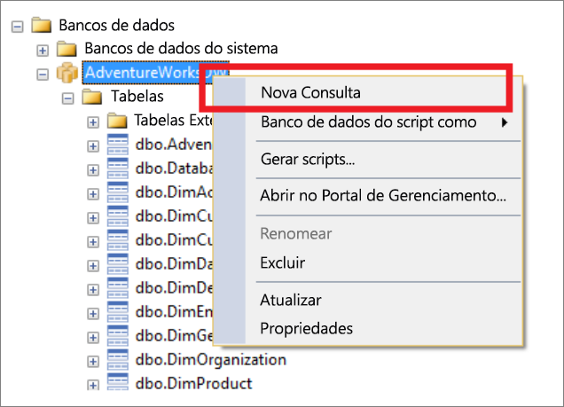

# <a name="connect-to-azure-synapse-analytics-with-sql-server-management-studio-ssms"></a>Conectar-se ao Azure Synapse Analytics com o SQL Server Management Studio (SSMS)

> [!div class="op_single_selector"]
>
> * [Power BI](sql-data-warehouse-get-started-visualize-with-power-bi.md)
> * [Azure Machine Learning](sql-data-warehouse-get-started-analyze-with-azure-machine-learning.md)
> * [Visual Studio](sql-data-warehouse-query-visual-studio.md)
> * [sqlcmd](sql-data-warehouse-get-started-connect-sqlcmd.md)
> * [SSMS](sql-data-warehouse-query-ssms.md)

Use o SQL Server Management Studio (SSMS) para se conectar e consultar um data warehouse no Azure Synapse.

## <a name="prerequisites"></a>Pré-requisitos

Para usar este tutorial, você precisará de:

* Um pool SQL existente. Para criar um, confira [Criar um pool de SQL](create-data-warehouse-portal.md).
* SSMS (SQL Server Management Studio) instalado. [Baixe o SSMS](/sql/ssms/download-sql-server-management-studio-ssms?toc=/azure/synapse-analytics/sql-data-warehouse/toc.json&bc=/azure/synapse-analytics/sql-data-warehouse/breadcrumb/toc.json&view=azure-sqldw-latest) gratuitamente se você ainda não o tiver.
* O nome de servidor SQL totalmente qualificado. Para encontrar essas informações, consulte [conectar-se ao pool do SQL](sql-data-warehouse-connect-overview.md).

## <a name="1-connect-to-your-sql-pool"></a>1. conectar-se ao seu pool do SQL

1. Abra o SSMS.
2. Abra o pesquisador de objetos selecionando **arquivo**conectar pesquisador de  >  **objetos**.

    
3. Preencha os campos na janela Conectar ao Servidor.

   

   * **Nome do servidor**. Insira o **nome do servidor** identificado anteriormente.
   * **Autenticação**. Selecione **Autenticação do SQL Server** ou **Autenticação Integrada do Active Directory**.
   * **Nome de usuário** e **senha**. Insira o nome de usuário e senha se a Autenticação do SQL Server foi selecionada acima.
   * Clique em **Conectar**.
4. Para explorar, expanda seu servidor do SQL Azure. Você pode exibir os bancos de dados associados ao servidor. Expanda o AdventureWorksDW para ver as tabelas no banco de dados de exemplo.

   

## <a name="2-run-a-sample-query"></a>2. Executar uma consulta de exemplo

Agora que uma conexão foi estabelecida com o banco de dados, escreveremos uma consulta.

1. Clique com o botão direito do mouse em seu banco de dados no Gerenciador de Objetos do SQL Server.
2. Selecione **Nova Consulta**. Uma janela de nova consulta é aberta.

   
3. Copie a seguinte consulta T-SQL na janela de consulta:

   ```sql
   SELECT COUNT(*) FROM dbo.FactInternetSales;
   ```

4. Execute a consulta clicando `Execute` ou use o seguinte atalho: `F5` .

   
5. Examine os resultados da consulta. Neste exemplo, a tabela FactInternetSales tem 60398 linhas.

   

## <a name="next-steps"></a>Próximas etapas

Agora que você pode se conectar e consultar, tente [visualizar os dados com o Power BI](sql-data-warehouse-get-started-visualize-with-power-bi.md). Para configurar seu ambiente para a autenticação do Azure Active Directory, confira [Autenticar no pool de SQL](sql-data-warehouse-authentication.md).
