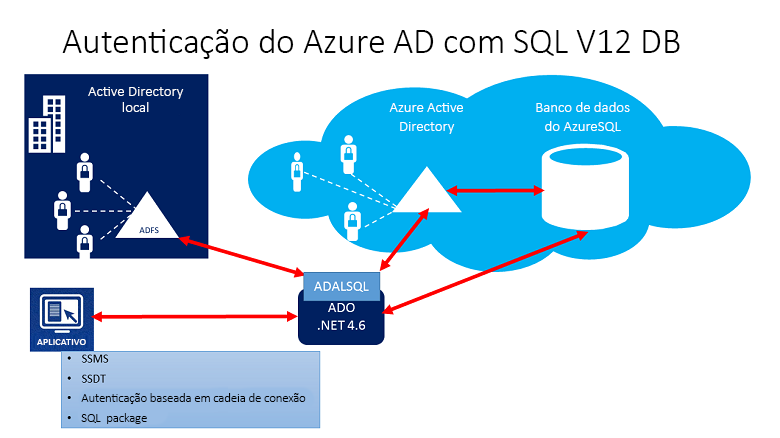
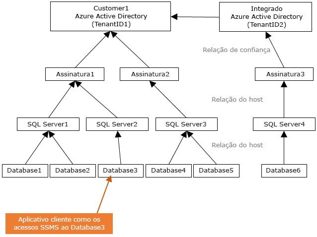
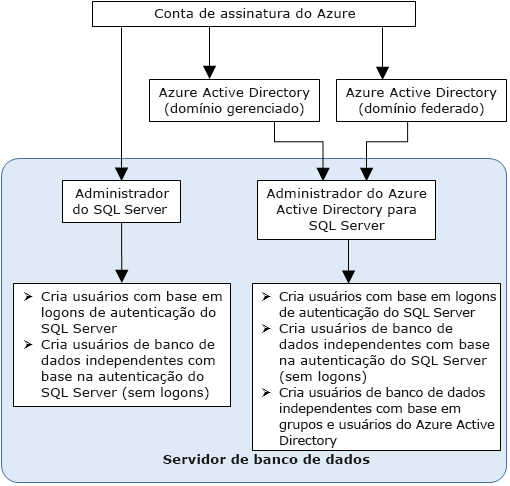

# Usar a Autenticação do Azure Active Directory para autenticação com o Synapse SQL

A Autenticação do Azure Active Directory é um mecanismo para se conectar ao [Azure Synapse Analytics](../overview-faq.md) usando identidades no Azure AD (Azure Active Directory).

Com a autenticação do Azure AD, você pode gerenciar de maneira centralizada as identidades do usuário que têm acesso ao Azure Synapse para simplificar o gerenciamento de permissões. Os benefícios incluem o seguinte:

- Ela fornece uma alternativa à autenticação convencional de nome de usuário e senha.
- Ajuda a impedir a proliferação de identidades de usuário entre servidores.
- Permite o rodízio de senhas em um único lugar.
- Os clientes podem gerenciar permissões usando grupos externos (Azure AD).
- Pode eliminar o armazenamento de senhas, permitindo a autenticação integrada do Windows e outras formas de autenticação às quais o Active Directory do Azure dá suporte.
- O Azure AD dá suporte à autenticação baseada em token em aplicativos que se conectam ao Azure Synapse.
- A autenticação do Azure AD dá suporte ao ADFS (federação de domínio) ou à autenticação nativa de senha/usuário para um local do Azure Active Directory sem a sincronização de domínio.
- O Azure AD dá suporte a conexões do SQL Server Management Studio que usam a Autenticação Universal do Active Directory, que inclui o MFA (Autenticação Multifator).  A MFA inclui autenticação eficiente com uma variedade de opções de verificação fáceis como chamada telefônica, mensagem de texto, cartões inteligentes com PIN ou notificação por aplicativos móveis. Para obter mais informações, confira [Suporte do SSMS para o MFA do Azure AD com o Synapse SQL](mfa-authentication.md).
- O Azure AD dá suporte a conexões semelhantes do SSDT (SQL Server Data Tools) que usa a Autenticação Interativa do Active Directory. Para obter mais informações, confira [Suporte do Azure Active Directory no SSDT (SQL Server Data Tools)](/sql/ssdt/azure-active-directory?toc=/azure/synapse-analytics/toc.json&bc=/azure/synapse-analytics/breadcrumb/toc.json&view=azure-sqldw-latest).

As etapas de configuração incluem os procedimentos a seguir para configurar e usar a autenticação do Active Directory do Azure.

1. Criar e popular o Azure AD.
2. Criar uma identidade do Azure Active Directory
3. Atribuir uma função à identidade criada do Azure Active Directory no workspace do Synapse (versão prévia)
4. Conecte-se ao Synapse Studio usando identidades do Azure AD.

## Passagem do AAD no Azure Synapse Analytics

O Azure Synapse Analytics permite que você acesse os dados do data lake usando sua identidade do Azure Active Directory.

A definição de direitos de acesso nos arquivos e nos dados respeitados em diferentes mecanismos de dados permite que o simplifique suas soluções de data lake tendo um só lugar no qual as permissões são definidas, em vez da necessidade de defini-las em vários locais.

## Confiar na arquitetura

O diagrama de alto nível a seguir resume a arquitetura da solução para o uso da autenticação do Azure AD com o Synapse SQL. Para dar suporte à senha de usuário nativo do Azure AD, apenas a parte da Nuvem e o Azure AD/Synapse SQL é considerada. Para dar suporte à Autenticação federada (ou a usuário/senha para as credenciais do Windows), será necessária a comunicação com o bloco do ADFS. As setas indicam caminhos para comunicação.

O diagrama a seguir indica as relações de federação, confiança e hospedagem que permitem que um cliente se conecte a um banco de dados enviando um token. O token é autenticado pelo Azure AD e é considerado confiável pelo banco de dados. 

O Cliente 1 pode representar um Azure Active Directory com usuários nativos ou um Azure AD com usuários federados. O Cliente 2 representa uma solução possível, incluindo os usuários importados; neste exemplo, provenientes de um Azure Active Directory federado com o ADFS sendo sincronizado com o Azure Active Directory. 

É importante entender que o acesso a um banco de dados com a autenticação do Azure AD exige que a assinatura de hospedagem esteja associada ao Azure AD. A mesma assinatura precisa ser usada para criar o SQL Server que hospeda o Banco de Dados SQL do Azure ou o pool de SQL.

## Estrutura do administrador

Ao usar a autenticação do Azure AD, haverá duas contas de administrador para o servidor do Synapse SQL: o administrador original do SQL Server e o administrador do Azure AD. Somente o administrador com base em uma conta do AD do Azure pode criar o primeiro usuário de banco de dados do AD do Azure contido em um banco de dados de usuário. 

O logon de administrador do AD do Azure pode ser um usuário ou um grupo do AD do Azure. Quando o administrador é uma conta de grupo, ele pode ser usado por qualquer membro do grupo, permitindo múltiplos administradores do Azure AD na instância do Synapse SQL. 

O uso da conta de grupo como um administrador aprimora a capacidade de gerenciamento, permitindo que você adicione e remova membros do grupo no Azure AD de maneira centralizada, sem alterar os usuários ou as permissões no workspace do Synapse Analytics. Somente um administrador do AD do Azure (um usuário ou grupo) pode ser configurado por vez, a qualquer momento.

## Permissões

Para criar novos usuários, você deve ter a permissão `ALTER ANY USER` no banco de dados. A permissão `ALTER ANY USER` pode ser concedida a qualquer usuário do banco de dados. A permissão `ALTER ANY USER` também é mantida pelas contas de administrador do servidor e usuários de banco de dados com a permissão `CONTROL ON DATABASE` ou `ALTER ON DATABASE` para esse banco de dados e por membros da função de banco de dados `db_owner`.

Para criar um usuário de banco de dados independente no Synapse SQL, você precisará se conectar ao banco de dados ou à instância usando uma identidade do Azure AD. Para criar o primeiro usuário de banco de dados independente, você deve se conectar ao banco de dados usando o administrador do AD do Azure (que é o proprietário do banco de dados). 

Qualquer autenticação do Azure AD só será possível se o administrador do Azure AD tiver sido criado para o Synapse SQL. Se o administrador do Azure Active Directory tiver sido removido do servidor, os usuários existentes do Azure Active Directory criados anteriormente no Synapse SQL não poderão mais se conectar ao banco de dados usando as respectivas credenciais do Azure Active Directory.
 
## Limitações e recursos do AD do Azure

- Os seguintes membros do Azure AD podem ser provisionados no Synapse SQL:

  - Membros nativos: Membro criado no Microsoft Azure Active Directory no domínio gerenciado ou em um domínio do cliente. Para saber mais, confira [Adicionar seu nome de domínio ao Azure AD](../../active-directory/fundamentals/add-custom-domain.md?toc=/azure/synapse-analytics/toc.json&bc=/azure/synapse-analytics/breadcrumb/toc.json).
  - Membros de domínio federado: Membro criado no Microsoft Azure Active Directory com um domínio federado. Para saber mais, confira [O Microsoft Azure agora dá suporte à federação com o Active Directory do Windows Server](https://azure.microsoft.com/blog/20../../windows-azure-now-supports-federation-with-windows-server-active-directory/).
  - Membros importados de outros Azure ADs que são membros de domínio nativo ou federado.
  - Grupos do Active Directory criados como grupos de segurança.

- Os usuários do Azure AD que fazem parte de um grupo que tenha a função de servidor `db_owner` não podem usar a sintaxe **[CREATE DATABASE SCOPED CREDENTIAL](/sql/t-sql/statements/create-database-scoped-credential-transact-sql?toc=/azure/synapse-analytics/toc.json&bc=/azure/synapse-analytics/breadcrumb/toc.json&view=azure-sqldw-latest)** no Synapse SQL. Você verá o seguinte erro:

    `SQL Error [2760] [S0001]: The specified schema name 'user@mydomain.com' either does not exist or you do not have permission to use it.`

    Conceda a função `db_owner` diretamente ao usuário individual do Azure AD para atenuar o problema de **CREATE DATABASE SCOPED CREDENTIAL**.

- Estas funções do sistema retornam valores NULL quando executadas em entidades de segurança do Azure AD:

  - `SUSER_ID()`
  - `SUSER_NAME(<admin ID>)`
  - `SUSER_SNAME(<admin SID>)`
  - `SUSER_ID(<admin name>)`
  - `SUSER_SID(<admin name>)`

## Conectar-se usando identidades do Azure AD

A autenticação do Active Directory do Azure dá suporte aos seguintes métodos de conexão a um banco de dados usando identidades do AD do Azure:

- Senha do Azure Active Directory
- Integrada do Azure Active Directory
- Universal do Azure Active Directory com o MFA
- Uso da autenticação de token do aplicativo

Os métodos de autenticação a seguir têm suporte para as entidades de segurança do servidor do Azure AD (logons) (**visualização pública**):

- Senha do Azure Active Directory
- Integrada do Azure Active Directory
- Universal do Azure Active Directory com o MFA

### Considerações adicionais

- Para aumentar a capacidade de gerenciamento, é recomendável que você provisione um grupo dedicado do Microsoft Azure AD como administrador.
- Somente um administrador do Azure AD (um usuário ou um grupo) pode ser configurado para o pool de SQL do Synapse a qualquer momento.
  - A adição de entidades de segurança do servidor do Azure AD (logons) ao SQL sob demanda (versão prévia) permite criar várias dessas entidades que podem ser adicionadas à função `sysadmin`.
- Somente um administrador do Azure AD do Synapse SQL pode inicialmente se conectar ao Synapse SQL usando uma conta do Azure Active Directory. O administrador do Active Directory pode configurar os próximos usuários do banco de dados do Azure AD.
- É recomendável configurar o tempo limite da conexão para 30 segundos.
- O SQL Server 2016 Management Studio e o SQL Server Data Tools para Visual Studio 2015 (versão 14.0.60311.1 de abril de 2016 ou posterior) dão suporte à autenticação do Azure Active Directory. (Há suporte para a autenticação do Azure AD no **Provedor de Dados .NET Framework para SqlServer**; é necessária, no mínimo, a versão 4.6 do .NET Framework). Portanto, as versões mais recentes dessas ferramentas e desses aplicativos da camada de dados (DAC e .BACPAC) podem usar a autenticação do Azure AD.
- Na versão 15.0.1 em diante, o [utilitário sqlcmd](/sql/tools/sqlcmd-utility?toc=/azure/synapse-analytics/toc.json&bc=/azure/synapse-analytics/breadcrumb/toc.json&view=azure-sqldw-latest) e o [utilitário bcp](/sql/tools/bcp-utility?toc=/azure/synapse-analytics/toc.json&bc=/azure/synapse-analytics/breadcrumb/toc.json&view=azure-sqldw-latest) dão suporte à autenticação Interativa do Active Directory com o MFA.
- O SQL Server Data Tools para Visual Studio 2015 requer pelo menos a versão de abril de 2016 do Data Tools (versão 14.0.60311.1). Atualmente, os usuários do Azure AD não são mostrados no Pesquisador de Objetos do SSDT. Como alternativa, exiba os usuários em [sys.database_principals](/sql/relational-databases/system-catalog-views/sys-database-principals-transact-sql?toc=/azure/synapse-analytics/toc.json&bc=/azure/synapse-analytics/breadcrumb/toc.json&view=azure-sqldw-latest).
- O [Microsoft JDBC Driver 6.0 para SQL Server](https://www.microsoft.com/download/details.aspx?id=11774) dá suporte à autenticação do Azure AD. Confira também [Configuração das propriedades de conexão](/sql/connect/jdbc/setting-the-connection-properties?toc=/azure/synapse-analytics/toc.json&bc=/azure/synapse-analytics/breadcrumb/toc.json&view=azure-sqldw-latest).

## Próximas etapas

- Para obter uma visão geral do acesso e do controle no Synapse SQL, confira [Controle de acesso do Synapse SQL](../sql/access-control.md).
- Para obter mais informações sobre objetos de banco de dados, confira [Entidades](/sql/relational-databases/security/authentication-access/principals-database-engine?toc=/azure/synapse-analytics/toc.json&bc=/azure/synapse-analytics/breadcrumb/toc.json&view=azure-sqldw-latest).
- Para obter mais informações sobre as funções de banco de dados, confira [Funções de banco de dados](/sql/relational-databases/security/authentication-access/database-level-roles?toc=/azure/synapse-analytics/toc.json&bc=/azure/synapse-analytics/breadcrumb/toc.json&view=azure-sqldw-latest).

 