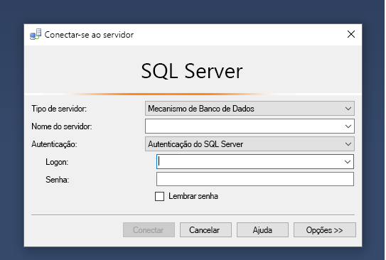
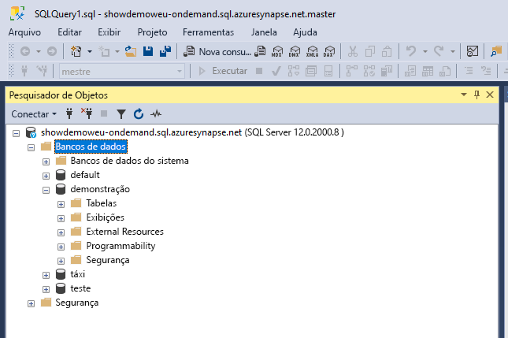
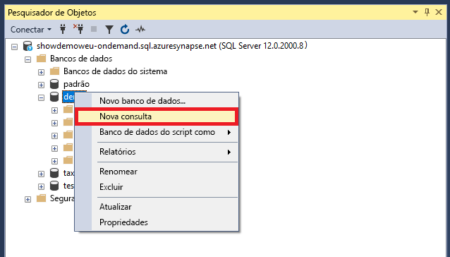

# <a name="connect-to-synapse-sql-with-sql-server-management-studio-ssms"></a>Conectar-se ao Synapse SQL com o SSMS (SQL Server Management Studio)
> [!div class="op_single_selector"]
> * [Azure Data Studio](get-started-azure-data-studio.md)
> * [Power BI](get-started-power-bi-professional.md)
> * [Visual Studio](../sql-data-warehouse/sql-data-warehouse-query-visual-studio.md?toc=/azure/synapse-analytics/toc.json&bc=/azure/synapse-analytics/breadcrumb/toc.json)
> * [sqlcmd](../sql/get-started-connect-sqlcmd.md)
> * [SSMS](get-started-ssms.md)
> 
> 

Você pode usar o [SSMS (SQL Server Management Studio)](/sql/ssms/download-sql-server-management-studio-ssms) para se conectar e consultar o Synapse SQL no Azure Synapse Analytics por meio dos recursos SQL sob demanda (versão prévia) ou pool de SQL. 

### <a name="supported-tools-for-sql-on-demand-preview"></a>Ferramentas compatíveis com o SQL sob demanda (versão prévia)

O [Azure Data Studio](/sql/azure-data-studio/download-azure-data-studio) tem total compatibilidade com a versão 1.18.0 em diante. O SSMS tem compatibilidade parcial da versão 18.5 em diante. Você pode usá-lo somente para se conectar e consultar.

> [!NOTE]
> Se o logon do AAD tiver uma conexão aberta por mais de 1 hora no momento da execução da consulta, qualquer consulta que depender do AAD falhará. Isso inclui consultar o armazenamento usando a passagem do AAD e instruções que interagem com o AAD (como CREATE EXTERNAL PROVIDER). Isso afeta todas as ferramentas que mantêm a conexão aberta, como no editor de consultas no SSMS e no ADS. As ferramentas que abrem novas conexões para executar consultas, como o Synapse Studio, não são afetadas.
> Você pode reiniciar o SSMS ou conectar-se e desconectar-se no ADS para atenuar esse problema. .
## <a name="prerequisites"></a>Pré-requisitos

Antes de iniciar, verifique se você cumpre os seguintes pré-requisitos:  

* [SQL Server Management Studio (SSMS)](/sql/ssms/download-sql-server-management-studio-ssms). 
* Para o pool de SQL, você precisa de um data warehouse existente. Para criar um, confira [Criar um pool de SQL](../quickstart-create-sql-pool-portal.md). Para o SQL sob demanda, um data warehouse já será provisionado em seu workspace no momento da criação. 
* O nome do SQL Server totalmente qualificado. Para encontrar isso, confira [Conectar-se ao Synapse SQL](connect-overview.md).

## <a name="connect"></a>Conectar

### <a name="sql-pool"></a>Pool de SQL

Para se conectar ao Synapse SQL usando o pool de SQL, siga estas etapas: 

1. Abra o SSMS (SQL Server Management Studio). 
1. Na caixa de diálogo **Conectar-se ao Servidor**, preencha os campos e, em seguida, selecione **Conectar**: 
  
    
   
   * **Nome do servidor**: Insira o **nome do servidor** identificado anteriormente.
   * **Autenticação**:  Escolha um tipo de autenticação, como **Autenticação do SQL Server** ou **Autenticação Integrada do Active Directory**.
   * **Nome de Usuário** e **Senha**: Insira seu nome de usuário e senha se a Autenticação do SQL Server foi selecionada acima.

1. Expanda o SQL Server do Azure no **Pesquisador de Objetos**. Você pode ver os bancos de dados associados ao servidor, como o banco de dados AdventureWorksDW de exemplo. Expanda o banco de dados para ver as tabelas:
   
    


### <a name="sql-on-demand-preview"></a>SQL sob demanda (versão prévia)

Para se conectar ao Synapse SQL usando o SQL sob demanda, siga estas etapas: 

1. Abra o SSMS (SQL Server Management Studio).
1. Na caixa de diálogo **Conectar-se ao Servidor**, preencha os campos e, em seguida, selecione **Conectar**: 
   
    
   
   * **Nome do servidor**: Insira o **nome do servidor** identificado anteriormente.
   * **Autenticação**: Escolha um tipo de autenticação, como **Autenticação do SQL Server** ou **Autenticação Integrada do Active Directory**:
   * **Nome de Usuário** e **Senha**: Insira seu nome de usuário e senha se a Autenticação do SQL Server foi selecionada acima.
   * Clique em **Conectar**.

4. Para explorar, expanda seu servidor do SQL Azure. Você pode exibir os bancos de dados associados ao servidor. Expanda *demonstração* para ver o conteúdo em seu banco de dados de exemplo.
   
    


## <a name="run-a-sample-query"></a>Executar uma consulta de exemplo

### <a name="sql-pool"></a>Pool de SQL

Agora que uma conexão de banco de dados foi estabelecida, você pode consultar os dados.

1. Clique com o botão direito do mouse em seu banco de dados no Gerenciador de Objetos do SQL Server.
2. Selecione **Nova Consulta**. Uma janela de nova consulta é aberta.
   
    
3. Copie esta consulta T-SQL na janela de consulta:
   
    ```sql
    SELECT COUNT(*) FROM dbo.FactInternetSales;
    ```
4. Executa a consulta. Para fazer isso, clique em `Execute` ou use o atalho a seguir: `F5`.
   
    
5. Examine os resultados da consulta. Neste exemplo, a tabela FactInternetSales tem 60398 linhas.
   
    

### <a name="sql-on-demand"></a>SQL sob demanda

Agora que você estabeleceu uma conexão de banco de dados, consulte os dados.

1. Clique com o botão direito do mouse em seu banco de dados no Gerenciador de Objetos do SQL Server.
2. Selecione **Nova Consulta**. Uma janela de nova consulta é aberta.
   
    
3. Copie a seguinte consulta T-SQL na janela de consulta:
   
    ```sql
    SELECT COUNT(*) FROM demo.dbo.usPopulationView
    ```
4. Executa a consulta. Para fazer isso, clique em `Execute` ou use o atalho a seguir: `F5`.
   
    
5. Examine os resultados da consulta. Neste exemplo, a exibição usPopulationView tem 3.664.512 linhas.
   
    

## <a name="next-steps"></a>Próximas etapas
Agora que você pode se conectar e consultar, tente [visualizar os dados com o Power BI](get-started-power-bi-professional.md).

Para configurar seu ambiente para a autenticação do Azure Active Directory, confira [Autenticar no Synapse SQL](../sql-data-warehouse/sql-data-warehouse-authentication.md?toc=/azure/synapse-analytics/toc.json&bc=/azure/synapse-analytics/breadcrumb/toc.json).

