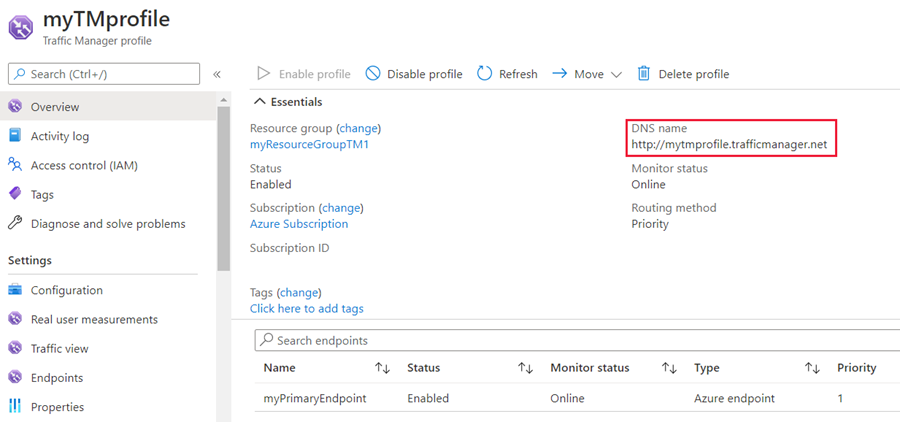
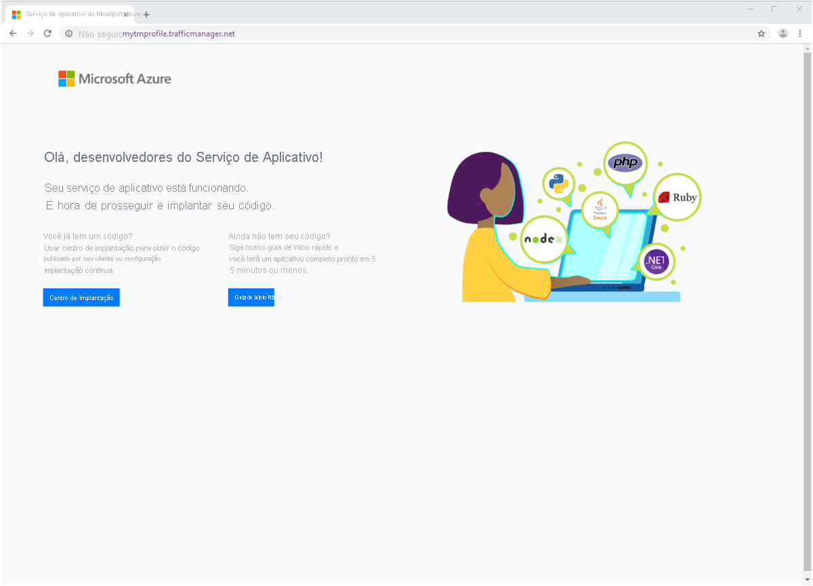

# Início Rápido: Criar um perfil do Gerenciador de Tráfego usando o portal do Azure

Este início rápido descreve como criar um perfil do Gerenciador de Tráfego que fornece alta disponibilidade para seu aplicativo Web.

Neste início rápido, você lerá sobre duas instâncias de um aplicativo Web. Cada uma delas está em execução em uma região diferente do Azure. Você criará um perfil do Gerenciador de Tráfego baseado na [prioridade de ponto de extremidade](traffic-manager-routing-methods.md#priority-traffic-routing-method). O perfil direciona o tráfego de usuário para o site primário executando o aplicativo Web. O Gerenciador de Tráfego monitora o aplicativo Web continuamente. Se o site primário estiver indisponível, ele fornece failover automático para o site de backup.

Caso não tenha uma assinatura do Azure, crie uma [conta gratuita](https://azure.microsoft.com/free/?WT.mc_id=A261C142F) agora.

## Entrar no Azure

Entre no [portal do Azure](https://portal.azure.com).

## Pré-requisitos

Para esse início rápido, você precisará implantar duas instâncias de um aplicativo Web em duas regiões diferentes do Azure (*Leste dos EUA* e *Europa Ocidental*). Cada uma servirá como os pontos de extremidade primário e de failover do Gerenciador de Tráfego.

1. No canto superior esquerdo da tela, selecione **Criar um recurso** > **Web** > **Aplicativo Web**.

1. Em **Criar um Aplicativo Web**, insira ou selecione os seguintes valores na guia **Configurações básicas**:

   - **Assinatura** > **Grupo de Recursos**: Selecione **Criar novo** e, em seguida, digite **myResourceGroupTM1**.
   - **Detalhes da Instância** > **Nome**: Digite *myWebAppEastUS*.
   - **Detalhes da Instância** > **Publicar**: Selecione **Código**.
   - **Detalhes da Instância** > **Pilha de runtime**: Selecione **ASP.NET v4.7**
   - **Detalhes da Instância** > **Sistema Operacional**: Selecione **Windows**.
   - **Detalhes da instância** > **Região**:  Selecione **Leste dos EUA**.
   - **Plano do Serviço de Aplicativo** > **Plano do Windows (Leste dos EUA)** : Selecione **Criar novo** e, em seguida, digite **myAppServicePlanEastUS**
   - **Plano do Serviço de Aplicativo** > **SKU e tamanho:** Selecione **Standard S1**.
   
3. Selecione a guia **Monitoramento** ou selecione **Avançar: Monitoramento**.  Em **Monitoramento**, defina **Application Insights** > **Habilitar Application Insights** para **Não**.

4. Selecione **Examinar e criar**

5. Examine as configurações e, em seguida, clique em **Criar**.  Quando o aplicativo Web é implantado com êxito, ele cria um site da Web padrão.

6. Execute as etapas para criar um segundo aplicativo Web chamado *myWebAppWestEurope*, com o nome de **Grupo de Recursos** *myResourceGroupTM2*, uma **Região** *Oeste da Europa*, um **Plano do Serviço de Aplicativo** de **myAppServicePlanWestEurope** e todas as outras configurações iguais às usadas em *myWebAppEastUS*.

## Criar um perfil do Gerenciador de Tráfego

Crie um perfil do Gerenciador de Tráfego que direciona o tráfego de usuário com base na prioridade de ponto de extremidade.

1. No canto superior esquerdo da tela, selecione **Criar um recurso** > **Rede** > **Perfil do Gerenciador de Tráfego**.
2. Em **Criar perfil do Gerenciador de Tráfego**, insira ou selecione as informações a seguir:

    | Configuração | Valor |
    | --------| ----- |
    | Nome | Insira um nome exclusivo para seu perfil do Gerenciador de Tráfego.|
    | Método de roteamento | Selecione **Prioridade**.|
    | Subscription | Selecione a assinatura à qual você deseja que o perfil do Gerenciador de Tráfego seja aplicado. |
    | Resource group | Selecione *myResourceGroupTM1*.|
    | Location |Essa configuração se refere ao local do grupo de recursos. Ela não tem efeito sobre o perfil do Gerenciador de Tráfego que será implantado globalmente.|

3. Selecione **Criar**.

## Adicionar pontos de extremidade do Gerenciador de Tráfego

Adicione o site no *Leste dos EUA* como ponto de extremidade primário para encaminhar todo o tráfego de usuários. Adicione o site na *Europa Ocidental* como um ponto de extremidade de failover. Quando o ponto de extremidade primário estiver indisponível, o tráfego será encaminhado automaticamente para o ponto de extremidade de failover.

1. Na barra de pesquisa do portal, insira o nome do perfil do Gerenciador de Tráfego criado na seção anterior.
2. Selecione o perfil nos resultados da pesquisa.
3. Em **Perfil do Gerenciador de Tráfego**, na seção **Configurações**, selecione **Pontos de Extremidade** e **Adicionar**.
4. Insira ou selecione estas configurações:

    | Configuração | Valor |
    | ------- | ------|
    | Type | Selecione **ponto de extremidade do Azure**. |
    | Nome | Insira *myPrimaryEndpoint*. |
    | Tipo de recurso de destino | Selecione **Serviço de Aplicativo**. |
    | Recurso de destino | Selecione **Escolher um serviço de aplicativo** > **Leste dos EUA**. |
    | Prioridade | Selecione **1**. Todo o tráfego vai para esse ponto de extremidade quando ele estiver íntegro. |

    

5. Selecione **OK**.
6. Para criar um ponto de extremidade de failover para sua segunda região do Azure, repita as etapas 3 e 4 com estas configurações:

    | Configuração | Valor |
    | ------- | ------|
    | Type | Selecione **ponto de extremidade do Azure**. |
    | Nome | Insira *myFailoverEndpoint*. |
    | Tipo de recurso de destino | Selecione **Serviço de Aplicativo**. |
    | Recurso de destino | Selecione **Escolher um serviço de aplicativo** > **Europa Ocidental**. |
    | Prioridade | Selecione **2**. Todo o tráfego vai para esse ponto de extremidade de failover se o ponto de extremidade primário não estiver íntegro. |

7. Selecione **OK**.

Ao terminar a adição de dois pontos de extremidade, eles são exibidos no **perfil do Gerenciador de Tráfego**. Observe que agora o status de monitoramento está como **Online**.

## Testar perfil de Gerenciador de Tráfego

Nesta seção, você verificará o nome de domínio do seu perfil do Gerenciador de Tráfego. Você também configurará o ponto de extremidade primário para ficar indisponível. Por fim, você poderá ver que o aplicativo Web ainda está disponível. É porque o Gerenciador de Tráfego envia o tráfego para o ponto de extremidade de failover.

### Verificar o nome do DNS

1. Na barra de pesquisa do portal, procure o nome do **Perfil do Gerenciador de Tráfego** criado na seção anterior.
2. Selecione o perfil do Gerenciador de Tráfego. A **Visão geral** é exibida.
3. O **Perfil do Gerenciador de Tráfego** exibe o nome DNS do perfil do Gerenciador de Tráfego criado recentemente.
  
   

### Ver o Gerenciador de Tráfego em ação

1. Em um navegador da Web, insira o nome DNS do perfil do Gerenciador de Tráfego para exibir o site da Web padrão do aplicativo Web.

    > [!NOTE]
    > Nesse cenário de início rápido, todas as solicitações são encaminhadas para o ponto de extremidade primário. Ele é definido como **Prioridade 1**.

    

2. Para ver o failover do Gerenciador de Tráfego em ação, desabilite o site primário:
    1. Na página de perfil do Gerenciador de Tráfego, da seção **Visão geral**, selecione **myPrimaryEndpoint**.
    2. Em *myPrimaryEndpoint*, selecione **Desabilitado** > **Salvar**.
    3. Feche **myPrimaryEndpoint**. Observe que o status está como **Desabilitado** agora.
3. Copie o nome DNS do seu perfil do Gerenciador de Tráfego da etapa anterior para exibir o site em uma nova sessão do navegador da Web.
4. Verifique se o aplicativo Web ainda está disponível.

O ponto de extremidade primário não está disponível, portanto, você foi encaminhado para o ponto de extremidade de failover.

## Limpar os recursos

Ao terminar, exclua os grupos de recursos, os aplicativos Web e todos os recursos relacionados. Para fazer isso, selecione cada item individual no seu painel e selecione **Excluir** na parte superior de cada página.

## Próximas etapas

Neste início rápido, você criou um perfil do Gerenciador de Tráfego. Ele permite direcionar o tráfego de usuário para aplicativos Web de alta disponibilidade. Para saber mais sobre o encaminhamento de tráfego, prossiga para os tutoriais do Gerenciador de Tráfego.

> [!div class="nextstepaction"]
> [Tutoriais do Gerenciador de Tráfego](tutorial-traffic-manager-improve-website-response.md)
