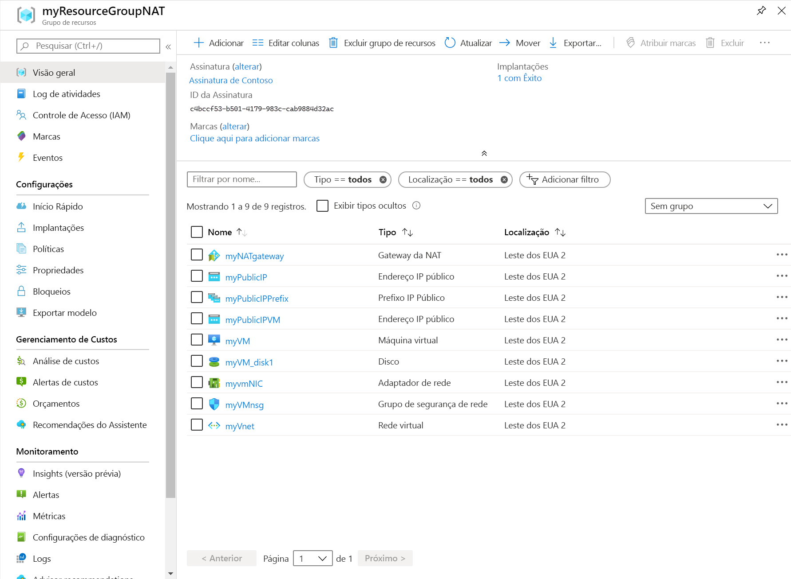

# <a name="create-a-nat-gateway---resource-manager-template"></a>Criar um gateway da NAT – modelo do Resource Manager

Comece a usar a NAT da Rede Virtual utilizando um Modelo do Azure Resource Manager.  Este modelo implanta uma rede virtual, um recurso de gateway da NAT e uma máquina virtual Ubuntu. A máquina virtual Ubuntu é implantada em uma sub-rede associada ao recurso de gateway da NAT.

[!INCLUDE [About Azure Resource Manager](../../includes/resource-manager-quickstart-introduction.md)]

Se você não tiver uma assinatura do Azure, crie uma [conta gratuita](https://azure.microsoft.com/free/?WT.mc_id=A261C142F) antes de começar.

## <a name="create-a-nat-gateway-and-supporting-resources"></a>Criar um gateway da NAT e recursos de suporte

Este modelo foi configurado para criar um 

* Rede virtual 
* Recurso de gateway da NAT
* Máquina virtual Ubuntu

A VM Ubuntu é implantada em uma sub-rede associada ao recurso de gateway da NAT.

### <a name="review-the-template"></a>Examinar o modelo

O modelo usado neste início rápido é proveniente dos [modelos de Início Rápido do Azure](https://raw.githubusercontent.com/Azure/azure-quickstart-templates/master/101-nat-gateway-1-vm/azuredeploy.json)

:::code language="json" source="~/quickstart-templates/101-nat-gateway-1-vm/azuredeploy.json" range="1-335" highlight="256-282":::

Nove recursos do Azure são definidos no modelo:

**Microsoft.Network**

* **[Microsoft.Network/natGateways](https://docs.microsoft.com/azure/templates/microsoft.network/natgateways)** : Cria um recurso de gateway da NAT.

* **[Microsoft.Network/networkSecurityGroups](https://docs.microsoft.com/azure/templates/microsoft.network/networksecuritygroups)** : Cria um grupo de segurança de rede.

    * **[Microsoft.Network/networkSecurityGroups/securityRules](https://docs.microsoft.com/azure/templates/microsoft.network/networksecuritygroups/securityrules)** : cria uma regra de segurança.

* **[Microsoft.Network/publicIPAddresses](https://docs.microsoft.com/azure/templates/microsoft.network/publicipaddresses)** : Cria um endereço IP público.

* **[Microsoft.Network/publicIPPrefixes](https://docs.microsoft.com/azure/templates/microsoft.network/publicipprefixes)** : cria um prefixo IP público.

* **[Microsoft.Network/virtualNetworks](https://docs.microsoft.com/azure/templates/microsoft.network/virtualnetworks)** : Cria uma rede virtual.

    * **[Microsoft.Network/virtualNetworks/subnets](https://docs.microsoft.com/azure/templates/microsoft.network/virtualnetworks/subnets)** : cria uma sub-rede de rede virtual.

* **[Microsoft.Network/networkinterfaces](https://docs.microsoft.com/azure/templates/microsoft.network/networkinterfaces)** : Cria um adaptador de rede.

**Microsoft.Compute**

* **[Microsoft.Compute/virtualMachines](https://docs.microsoft.com/azure/templates/Microsoft.Compute/virtualMachines)** : Cria uma máquina virtual.

### <a name="deploy-the-template"></a>Implantar o modelo

**CLI do Azure**

```azurecli-interactive
read -p "Enter the location (i.e. westcentralus): " location
resourceGroupName="myResourceGroupNAT"
templateUri="https://raw.githubusercontent.com/Azure/azure-quickstart-templates/master/101-nat-gateway-1-vm/azuredeploy.json" 

az group create \
--name $resourceGroupName \
--location $location

az group deployment create \
--resource-group $resourceGroupName \
--template-uri  $templateUri
```

**PowerShell do Azure**

```azurepowershell-interactive
$location = Read-Host -Prompt "Enter the location (i.e. westcentralus)"
$templateUri = "https://raw.githubusercontent.com/Azure/azure-quickstart-templates/master/101-nat-gateway-1-vm/azuredeploy.json"

$resourceGroupName = "myResourceGroupNAT"

New-AzResourceGroup -Name $resourceGroupName -Location $location
New-AzResourceGroupDeployment -ResourceGroupName $resourceGroupName -TemplateUri $templateUri
```

**Azure portal**

[](https://portal.azure.com/#create/Microsoft.Template/uri/https%3A%2F%2Fraw.githubusercontent.com%2FAzure%2Fazure-quickstart-templates%2Fmaster%2F101-nat-gateway-1-vm%2Fazuredeploy.json)

## <a name="review-deployed-resources"></a>Examinar os recursos implantados

1. Entre no [portal do Azure](https://portal.azure.com).

2. Escolha **Grupos de recursos** no painel esquerdo.

3. Selecione o grupo de recursos criado na seção anterior. O nome do grupo de recursos padrão é **myResourceGroupNAT**

4. Verifique se os seguintes recursos foram criados no grupo de recursos:

    

## <a name="clean-up-resources"></a>Limpar os recursos

**CLI do Azure**

Quando não for mais necessário, você poderá usar o comando [az group delete](/cli/azure/group#az-group-delete) para remover o grupo de recursos e todos os recursos contidos nele.

```azurecli-interactive 
  az group delete \
    --name myResourceGroupNAT
```

**PowerShell do Azure**

Quando não forem mais necessários, você poderá usar o comando [Remove-AzResourceGroup](https://docs.microsoft.com/powershell/module/az.resources/remove-azresourcegroup?view=latest) para remover o grupo de recursos e todos os recursos contidos nele.

```azurepowershell-interactive 
Remove-AzResourceGroup -Name myResourceGroupNAT
```

**Azure portal**

Quando não forem mais necessários, exclua o grupo de recursos, o gateway da NAT e todos os recursos relacionados. Selecione o grupo de recursos **myResourceGroupNAT** que contém o gateway da NAT e, em seguida, selecione **Excluir**.

## <a name="next-steps"></a>Próximas etapas

Neste início rápido, você criou:

* Um recurso de gateway da NAT
* Rede virtual
* Uma máquina virtual Ubuntu

A máquina virtual é implantada em uma sub-rede da rede virtual associada ao gateway da NAT. 

Para saber mais sobre a NAT da Rede Virtual e o Azure Resource Manager, prossiga para os artigos abaixo.

* Leia uma [Visão geral da NAT da Rede Virtual](nat-overview.md)
* Leia mais sobre o [Recurso do Gateway da NAT](nat-gateway-resource.md)
* Saiba mais sobre o [Azure Resource Manager](../azure-resource-manager/management/overview.md)
