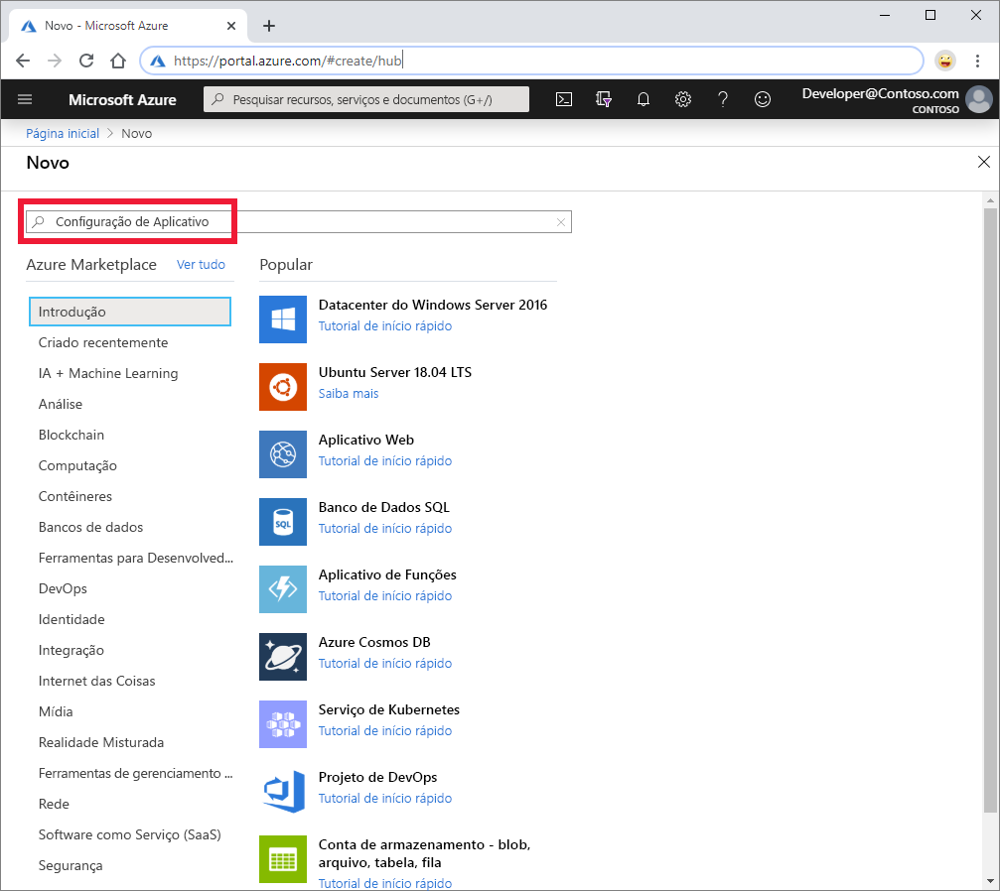

1. Para criar um novo repositório de Configurações de Aplicativo, entre no [portal do Azure](https://portal.azure.com). No canto superior esquerdo da Página Inicial, selecione **Criar um recurso**. Na caixa **Pesquisar no Marketplace**, insira *Configuração de Aplicativos* e selecione <kbd>Enter</kbd>.

    

1. Selecione **Configuração de Aplicativo** nos resultados da pesquisa e, em seguida, selecione **Criar**.

    

1. No painel **Criar Configuração de Aplicativos**, insira as configurações a seguir:

    | Configuração | Valor sugerido | DESCRIÇÃO |
    |---|---|---|
    | **Assinatura** | Sua assinatura | Selecione a assinatura do Azure que deseja usar para testar a Configuração de Aplicativo. Se a conta tiver apenas uma assinatura, ela será selecionada automaticamente e a lista **Assinatura** não será exibida. |
    | **Grupo de recursos** | *AppConfigTestResources* | Selecione ou crie um grupo de recursos para o recurso do repositório de Configurações de Aplicativo. Esse grupo é útil para organizar vários recursos que você pode querer excluir ao mesmo tempo, excluindo o grupo de recursos. Para saber mais, veja [Usar os grupos de recursos para gerenciar seus recursos do Azure](/azure/azure-resource-manager/resource-group-overview). |
    | **Nome do recurso** | Nome globalmente exclusivo | Insira um nome exclusivo do recurso a ser usado para o recurso do repositório de Configurações de Aplicativo. O nome deve ser uma cadeia de 5 a 50 caracteres e deve conter somente números, letras e o caractere `-`. O nome não pode começar nem terminar com o caractere `-`. |
    | **Localidade** | *Centro dos EUA* | Use **Localização** para especificar a localização geográfica na qual o repositório de configurações de aplicativo está hospedado. Para obter o melhor desempenho, crie o recurso na mesma região que outros componentes do aplicativo. |
    | **Tipo de preços** | *Gratuito* | Selecione o tipo de preço desejado. Para obter mais informações, confira a [página de preços da Configuração de Aplicativos](https://azure.microsoft.com/pricing/details/app-configuration). |

1. Selecione **Examinar + criar** para validar suas configurações.

1. Selecione **Criar**. A implantação pode levar alguns minutos.

1. Após a conclusão da implantação, navegue até o recurso de Configuração de Aplicativos. Selecione **Configurações** > **Chaves de acesso**. Anote a cadeia de conexão de chave somente leitura primária. Você usará essa cadeia de conexão posteriormente para configurar o aplicativo a comunicar-se com o repositório de Configurações de Aplicativo que você criou.
