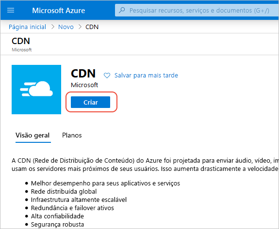
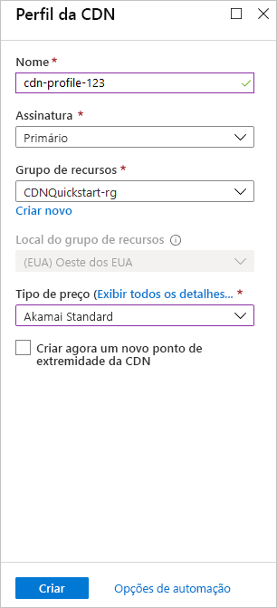

## Criar um novo perfil CDN

Um perfil CDN é um contêiner para pontos de extremidade CDN e especifica um tipo de preço.

1. No portal do Azure, selecione **Criar um recurso** (no canto superior esquerdo). O **Novo** painel é exibido.
   
1. Pesquise e selecione **CDN** e selecione **Criar**:
   
    

    O painel **Perfil CDN** é exibido.

1. Insira os valores a seguir:
   
    | Configuração  | Valor |
    | -------- | ----- |
    | **Nome** | Insira *cdn-profile-123* como nome de perfil. Esse nome deve ser globalmente exclusivo. Caso ele já esteja em uso, insira um nome diferente. |
    | **Assinatura** | Selecione uma assinatura do Azure na lista suspensa. |
    | **Grupo de recursos** | Selecione **Criar** e insira *CDNQuickstart-RG* para o nome do grupo de recursos ou selecione **Usar existente** e escolha *CDNQuickstart-rg* se você já tiver o grupo. | 
    | **Localização do grupo de recursos** | Selecione uma localização perto de você na lista suspensa. |
    | **Tipo de preços** | Selecione uma opção **Akamai padrão** na lista suspensa. (O tempo de implantação para a camada Akamai é de cerca de um minuto. A camada da Microsoft leva cerca de 10 minutos e as camadas da Verizon demoram cerca de 90 minutos.) |
    | **Criar um novo ponto de extremidade CDN** | Deixe não selecionado. |  
   
    

1. Selecione **Criar** para criar o perfil.

