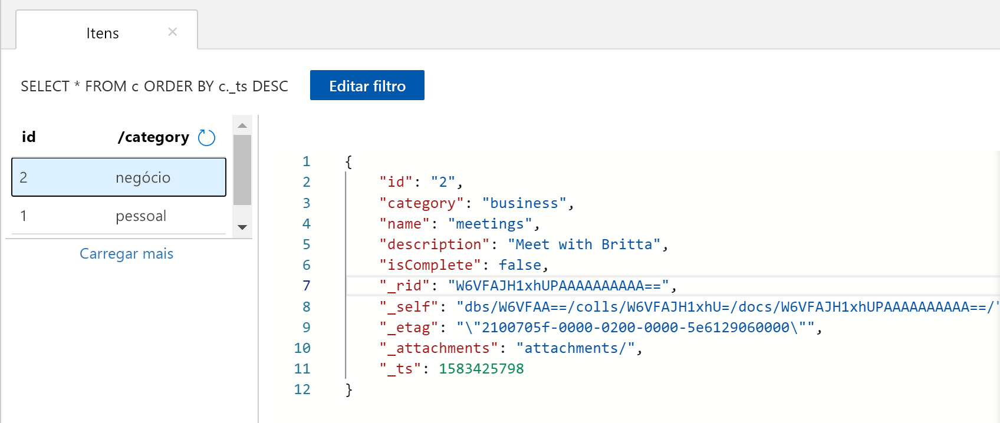

Você pode usar consultas no Data Explorer para recuperar e filtrar os dados.

1. Na parte superior da guia **Itens** no Data Explorer, examine a consulta padrão `SELECT * FROM c`. Essa consulta recupera e exibe todos os documentos na coleção na ordem da ID. 
   
   
   
1. Para alterar a consulta, selecione **Editar Filtro**, substitua a consulta padrão por `ORDER BY c._ts DESC` e selecione **Aplicar Filtro**.
   
   

   A consulta modificada exibe os documentos em ordem decrescente com base em seu carimbo de data/hora, portanto, agora o segundo documento é listado primeiro. 
   
   

Se você estiver familiarizado com a sintaxe SQL, poderá inserir qualquer [consulta SQL](../articles/cosmos-db/sql-api-sql-query.md) compatível na caixa de predicado de consulta. Você também pode usar o Data Explorer para criar procedimentos armazenados, UDFs e gatilhos para lógica de negócios do lado do servidor. 

O Data Explorer fornece acesso fácil ao portal do Azure para todos os recursos de acesso a dados programático interno por disponível nas APIs. Você também pode usar o portal para dimensionar a taxa de transferência, obter as chaves e as cadeias de conexão e examinar as métricas e os SLAs para sua conta do Azure Cosmos DB. 

