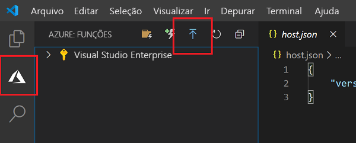

## Publicar o projeto no Azure

Nesta seção, você criará um aplicativo de funções e os recursos relacionados em sua assinatura do Azure e, em seguida, implantará seu código. 

> [!IMPORTANT]
> Publicar em um aplicativo de funções existente substitui o conteúdo desse aplicativo no Azure. 

1. Escolha o ícone do Azure na Barra de atividade e, em seguida, na área **Azure: Functions**, escolha o botão **Implantar no aplicativo de funções...** .

    

1. Forneça as seguintes informações nos prompts:

    + **Selecione a assinatura**: Escolha a assinatura a ser usada. Essa opção não será exibida caso você possua apenas uma assinatura.

    + **Selecione o aplicativo de funções no Azure**: Escolha `+ Create new Function App`. (Não escolha a opção `Advanced`, que não é abordada neste artigo.)
      
    + **Insira um nome exclusivo globalmente para o aplicativo de funções**: Digite um nome que seja válido em um caminho de URL. O nome que você digitar é validado para ter certeza de que ele é exclusivo no Azure Functions. 
    
    ::: zone pivot="programming-language-python"
    + **Selecione um runtime**: Escolha a versão do Python em que você está executando localmente. É possível usar o comando `python --version` para verificar sua versão.
    ::: zone-end

    ::: zone pivot="programming-language-javascript,programming-language-typescript"
    + **Selecione um runtime**: Escolha a versão do Node.js em que você está executando localmente. É possível usar o comando `node --version` para verificar sua versão.
    ::: zone-end

    + **Selecione uma localização para novos recursos**:  Para obter um melhor desempenho, escolha uma [região](https://azure.microsoft.com/regions/) perto de você. 
    
1.  Quando concluído, os seguintes recursos do Azure serão criados em sua assinatura, usando nomes baseados em seu nome do aplicativo de funções:
    
    + Um grupo de recursos, que é um contêiner lógico para recursos relacionados.
    + Uma conta de Armazenamento do Azure padrão, que mantém o estado e outras informações sobre seus projetos.
    + Um plano de consumo, que define o host subjacente para o aplicativo de funções sem servidor. 
    + Um aplicativo de funções, que fornece o ambiente para a execução do código de função. Um aplicativo de funções lhe permite agrupar funções como uma unidade lógica para facilitar o gerenciamento, a implantação e o compartilhamento de recursos dentro do mesmo plano de hospedagem.
    + Uma instância do Application Insights conectada ao aplicativo de funções, que controla o uso de sua função sem servidor.

    Uma notificação é exibida depois que seu aplicativo de funções é criado e o pacote de implantação é aplicado. 
    
1. Escolha **Exibir Saída** nessa notificação para exibir a criação e os resultados da implantação, incluindo os recursos do Azure que você criou. Se você perder a notificação, selecione o ícone de sino no canto inferior direito para vê-lo novamente.

    
