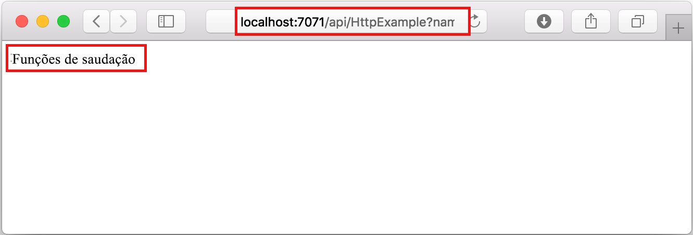

## Executar a função localmente

O Visual Studio Code integra-se ao [Azure Functions Core Tools](../articles/azure-functions/functions-run-local.md) para permitir que você execute esse projeto em seu computador de desenvolvimento local antes de publicar no Azure.

1. Para chamar sua função, pressione F5 para iniciar o projeto de aplicativo de funções. A saída do Core Tools é exibida no painel **Terminal**.

1. Se ainda não tiver instalado o Azure Functions Core Tools, selecione **Instalar** no prompt. Quando o Core Tools for instalado, seu aplicativo será iniciado no painel **Terminal**.

1. No painel **Terminal**, copie o ponto de extremidade de URL da sua função disparada por HTTP. 

    

1. Cole a URL para a solicitação HTTP na barra de endereços do navegador. Acrescente a cadeia de caracteres de consulta `?name=<yourname>` a essa URL e execute a solicitação GET. 

1. Uma resposta é retornada, semelhante ao seguinte em um navegador:

    

1. Pressione Shift + F5 para parar o Core Tools e desconectar o depurador.
