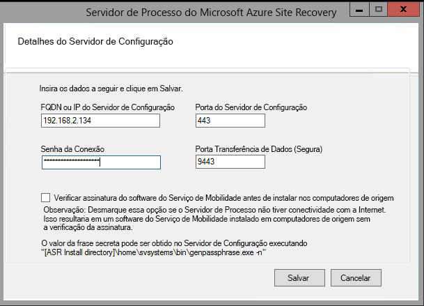

1. Estabeleça um Conexão de Área de Trabalho Remota para o computador que executa o servidor de processo. 
2. Execute cspsconfigtool. exe para iniciar a ferramenta de configuração do servidor Azure Site Recovery Process.
    - A ferramenta é iniciada automaticamente na primeira vez que você entra no servidor de processo.
    - Se ele não abrir automaticamente, clique em seu atalho na área de trabalho.

3. Em **FQDN do servidor de configuração ou IP**, especifique o nome ou endereço IP do servidor de configuração com o qual registrar o servidor de processo.
4. Em **porta do servidor de configuração**, verifique se 443 está especificado. Essa é a porta na qual o servidor de configuração escuta solicitações.
5. Em **senha da conexão**, especifique a senha que você especificou ao configurar o servidor de configuração. Para localizar a senha:
    -  No servidor de configuração, navegue até a pasta de instalação do Site Recovery **\home\svssystems\bin\**:
    ```
    cd %ProgramData%\ASR\home\svsystems\bin
    ```
    - Execute o comando abaixo para imprimir a senha atual:
    ```
    genpassphrase.exe -n
    ```

6. Na **porta transferência de dados**, deixe o valor padrão, a menos que você tenha especificado uma porta personalizada.

7. Clique em **salvar** para salvar as configurações e registrar o servidor de processo.

    
    
