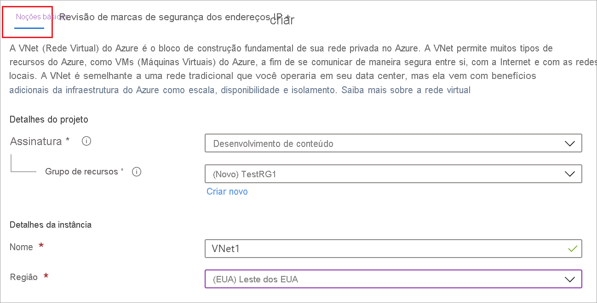

É possível criar uma VNet com um modelo de implantação do Resource Manager e com o portal do Azure seguindo estas etapas. Para obter mais informações sobre redes virtuais, confira [Visão geral da rede virtual](../articles/virtual-network/virtual-networks-overview.md).

>[!NOTE]
>Ao usar uma rede virtual como parte de uma arquitetura de premissas cruzadas, certifique-se de coordenar com o administrador de rede local para esculpir uma gama de endereços IP que você pode usar especificamente para esta rede virtual. Se houver um intervalo de endereços duplicado nos dois lados da conexão de VPN, o tráfego será roteado inesperadamente. Além disso, se você quiser conectar essa rede virtual a outra rede virtual, o espaço de endereço não pode se sobrepor à outra rede virtual. Planeje sua configuração de rede de forma adequada.
>
>

1. Faça login no [portal Azure](https://portal.azure.com).
1. Em **Pesquisar recursos, serviços e docs (G+/)**, digite *rede virtual*.

   
1. Selecione **Rede Virtual** a partir dos resultados **do Marketplace.**

   
1. Na página **Rede Virtual,** selecione **Criar**.

   
1. Depois de selecionar **Criar,** a página **criar rede virtual** é aberta.
1. Na guia **Noções** Básicas, configure **detalhes do Projeto** e **detalhes de instância das** configurações do VNet.

    Quando você preenche os campos, você vê uma marca de seleção verde quando os caracteres que você entra no campo são validados. Alguns valores são preenchidos automaticamente, que podem ser substituídos por seus próprios valores:

   - **Assinatura**: verifique se a assinatura listada é a correta. Você pode alterar as assinaturas usando o menu suspenso.
   - **Grupo de recursos**: Selecione um grupo de recursos existente ou clique **em Criar novo** para criar um novo. Para obter mais informações sobre grupos de recursos, consulte [a visão geral do Azure Resource Manager](../articles/azure-resource-manager/management/overview.md#resource-groups).
   - **Nome**: Digite o nome da sua rede virtual.
   - **Região**: Selecione o local do seu VNet. A localização determina onde ficarão os recursos que você implanta nessa rede virtual.

1. Na guia **Endereços IP,** configure os valores. Os valores mostrados nos exemplos abaixo são para fins de demonstração. Ajuste esses valores de acordo com as configurações necessárias.

     
   - **Espaço de endereço IPv4**: Por padrão, um espaço de endereço é criado automaticamente. Você pode clicar no espaço de endereço para ajustá-lo para refletir seus próprios valores. Você também pode adicionar espaços de endereço adicionais.
   - **IPv6**: Se a configuração exigir espaço de endereço IPv6, selecione a caixa **de espaço de endereço Adicionar IPv6** para inserir essas informações.
   - **Sub-rede**: Se você usar o espaço de endereço padrão, uma sub-rede padrão será criada automaticamente. Se você alterar o espaço do endereço, você precisa adicionar uma sub-rede. Selecione **+ Adicionar sub-rede** para abrir a janela **Adicionar sub-rede.** Configure as seguintes configurações e selecione **Adicionar** para adicionar os valores:
      - **Nome da sub-rede**: Neste exemplo, chamamos a sub-rede de "FrontEnd".
      - **Intervalo de endereço sub-net :** O intervalo de endereços para esta sub-rede.

1. Na guia **Segurança,** neste momento, deixe os valores padrão:

   - **Proteção DDos**: Básico
   - **Firewall**: Desativado
1. Selecione **'Revisar + criar'** para validar as configurações da rede virtual.
1. Depois que as configurações tiverem sido validadas, selecione **Criar**.
