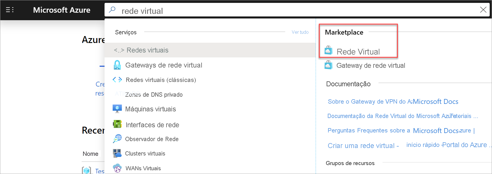

É possível criar uma VNet com um modelo de implantação do Resource Manager e com o portal do Azure seguindo estas etapas. Para obter mais informações sobre redes virtuais, confira [Visão geral da rede virtual](../articles/virtual-network/virtual-networks-overview.md).

>[!NOTE]
>Ao usar uma rede virtual como parte de uma arquitetura entre locais, lembre-se de coordenar com o administrador de rede local para que ele possa fazer o intervalo de endereços IP que você pode usar especificamente para essa rede virtual. Se houver um intervalo de endereços duplicado nos dois lados da conexão de VPN, o tráfego será roteado inesperadamente. Além disso, se você quiser conectar essa rede virtual a outra rede virtual, o espaço de endereço não poderá se sobrepor com a outra rede virtual. Planeje sua configuração de rede de forma adequada.
>
>

1. Entre no [portal do Azure](https://portal.azure.com).
1. Em **Pesquisar recursos, serviço e documentos (G +/)** , digite *rede virtual*.

   
1. Selecione **rede virtual** nos resultados do **Marketplace** .

   
1. Na página **rede virtual** , selecione **criar**.

   
1. Depois de selecionar **criar**, a página **criar rede virtual** é aberta.
1. Na guia **noções básicas** , configure **detalhes do projeto** e **detalhes da instância** configurações de VNet.

    Ao preencher os campos, você verá uma marca de seleção verde quando os caracteres inseridos no campo forem validados. Alguns valores são preenchidos automaticamente, que podem ser substituídos por seus próprios valores:

   - **Assinatura**: verifique se a assinatura listada é a correta. Você pode alterar as assinaturas usando o menu suspenso.
   - **Grupo de recursos**: selecione um grupo de recursos existente ou clique em **criar novo** para criar um novo. Para saber mais sobre os grupos de recursos, confira [Visão geral do Azure Resource Manager](../articles/azure-resource-manager/management/overview.md#resource-groups).
   - **Nome**: insira o nome de sua rede virtual.
   - **Região**: selecione o local para sua VNet. A localização determina onde ficarão os recursos que você implanta nessa rede virtual.

1. Na guia **endereços IP** , configure os valores. Os valores mostrados nos exemplos a seguir são para fins de demonstração. Ajuste esses valores de acordo com as configurações que você precisa.

     
   - **Espaço de endereço IPv4**: por padrão, um espaço de endereço é criado automaticamente. Você pode clicar no espaço de endereço para ajustá-lo para refletir seus próprios valores. Você também pode adicionar espaços de endereço adicionais.
   - **IPv6**: se sua configuração exigir espaço de endereço IPv6, selecione a caixa **adicionar espaço de endereço IPv6** para inserir essas informações.
   - **Sub-rede**: se você usar o espaço de endereço padrão, uma sub-rede padrão será criada automaticamente. Se você alterar o espaço de endereço, precisará adicionar uma sub-rede. Selecione **+ Adicionar sub-rede** para abrir a janela **Adicionar sub-rede** . Defina as seguintes configurações e, em seguida, selecione **Adicionar** para adicionar os valores:
      - **Nome da sub-rede**: neste exemplo, nomeamos a sub-rede "frontend".
      - **Intervalo de endereços de sub-rede**: o intervalo de endereços para essa sub-rede.

1. Na guia **segurança** , no momento, deixe os valores padrão:

   - **Proteção contra DDoS**: básica
   - **Firewall**: desabilitado
1. Selecione **examinar + criar** para validar as configurações de rede virtual.
1. Depois que as configurações forem validadas, selecione **criar**.
