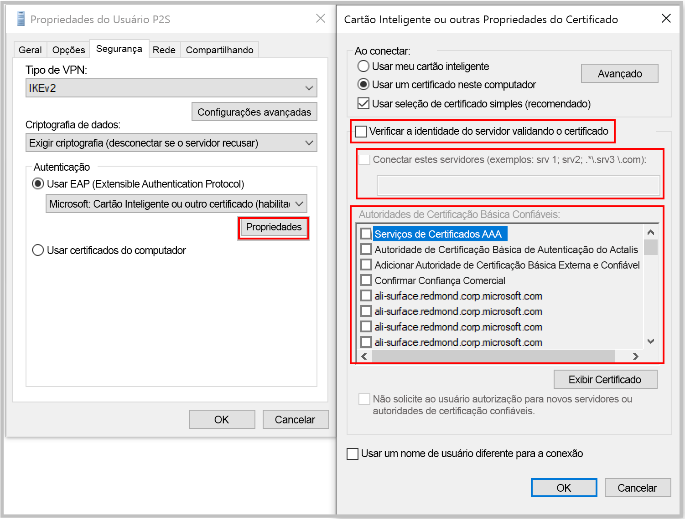

[!INCLUDE [P2S FAQ All](vpn-gateway-faq-p2s-all-include.md)]

### O que devo fazer se estiver recebendo uma incompatibilidade de certificado ao se conectar usando a autenticação de certificado?

Desmarque **"verificar a identidade do servidor Validando o certificado"** ou **adicione o FQDN do servidor junto com o certificado** ao criar um perfil manualmente. Você pode fazer isso executando o **Rasphone** em um prompt de comando e escolhendo o perfil na lista suspensa.

Não é recomendável ignorar a validação de identidade do servidor em geral, mas com a autenticação de certificado do Azure, o mesmo certificado está sendo usado para validação do servidor no protocolo IKEv2/SSTP e no protocolo EAP. Como o certificado do servidor e o FQDN já foram validados pelo protocolo de encapsulamento de VPN, ele é redundante para validar o mesmo novamente no EAP.

### Posso usar minha própria AC raiz de PKI interna para gerar certificados para conectividade ponto a site?

Sim. Anteriormente, somente os certificados raiz autoassinados podiam ser usados. Você ainda pode carregar 20 certificados raiz.

### Posso usar certificados de Azure Key Vault?

Não.

### Quais ferramentas posso usar para criar certificados?

Você pode usar sua solução de Enterprise PKI (sua PKI interna), Azure PowerShell, MakeCert e OpenSSL.

### Há instruções para configurações e parâmetros de certificado?

* **Solução PKI interna/Enterprise PKI** : ver as etapas para [Gerar certificados](../articles/vpn-gateway/vpn-gateway-howto-point-to-site-resource-manager-portal.md#generatecert).

* **Azure PowerShell:** consulte o artigo [Azure PowerShell](../articles/vpn-gateway/vpn-gateway-certificates-point-to-site.md) para ver as etapas.

* **MakeCert**: consulte o artigo [MakeCert](../articles/vpn-gateway/vpn-gateway-certificates-point-to-site-makecert.md) para ver as etapas.

* **OpenSSL:** 

    * Ao exportar certificados, verifique se converteu o certificado raiz em Base64.

    * Para o certificado do cliente:

      * Ao criar a chave privada, especifique o período como 4096.
      * Ao criar o certificado, para o parâmetro *-extensions*, especifique *usr_cert*.
